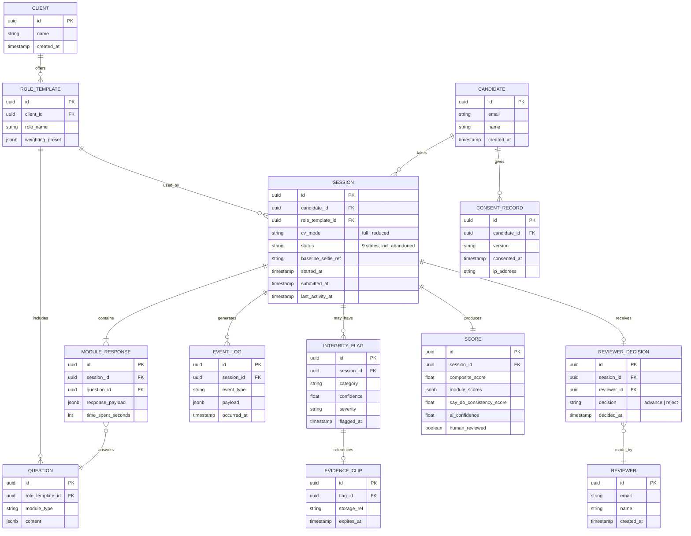

# CD-Recruit — Final MVP Data Model (ER Diagram)

Reflects `schema.prisma` after fixes/additions to the original doc's Section 4 model.

Changes vs. the original doc's diagram:
- Added `CLIENT` — scopes `ROLE_TEMPLATE` per client (CBE, or a future client)
- Added `CONSENT_RECORD` — linked to `CANDIDATE`, for the legal/consent track
- Added `REVIEWER` — was missing entirely; `REVIEWER_DECISION.reviewer_id` had no table to point at
- `SESSION` gained: `baseline_selfie_ref`, `status` (now 9 defined states incl. `abandoned`), `last_activity_at`

Everything else — the original 10 tables and their relationships — is unchanged.

