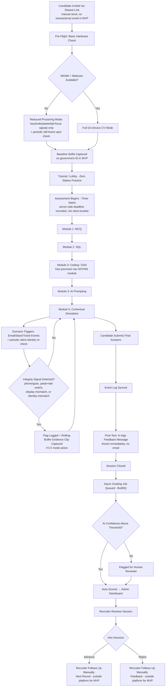
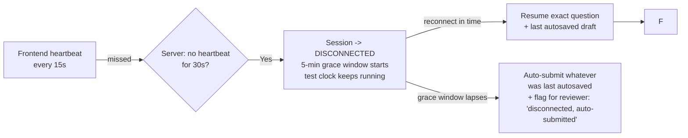
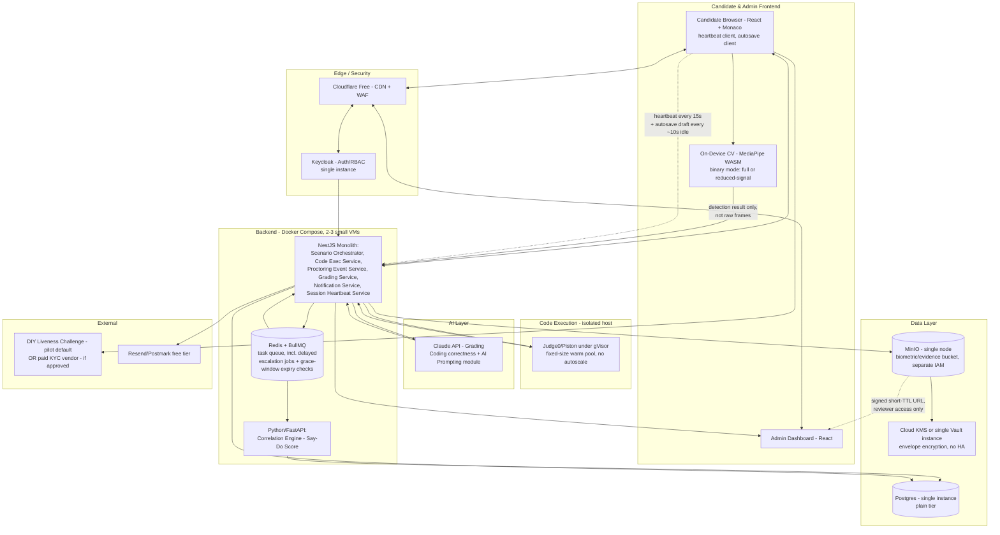
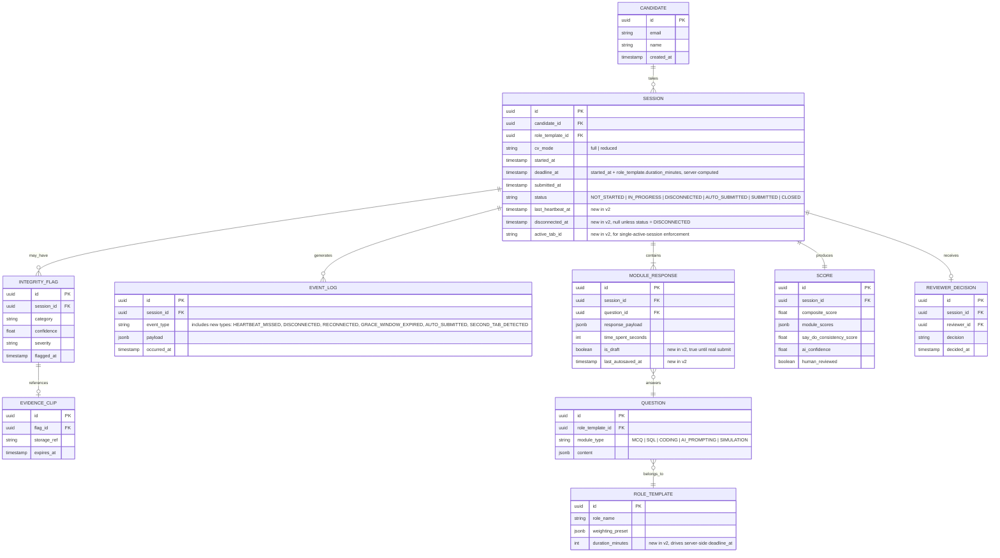
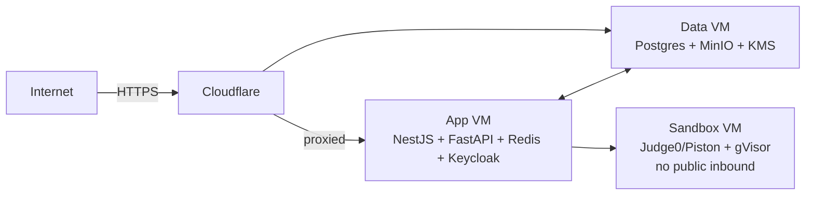

# CD-Recruit — MVP Architecture & Launch Plan (v2)

This document scopes the previously-confirmed full-scale architecture (Technical Architecture Document + Component Reference & Zero-Cost Build Guide + Tech Stack Comparison & Final Decision) down to a buildable MVP. It does not change any prior architectural decision — every tool named here is a subset or a lighter deployment of what's already been decided, not a different pick.

**v2 changelog (post-audit):** all five assessment modules (MCQ, SQL, Coding, AI Prompting, Simulation) are now confirmed in scope — v1's BUILD_GUIDE had a scoping error that only built Coding + Simulation. Also added: autosave, disconnect grace window, server-side timer enforcement, network-drop retry UX, within-module question navigation, invite-token rate limiting, and single-active-session (multi-tab/device) handling. See Section 12 for the full list of what changed and why.

Companion documents: `CD-Recruit_Technical_Architecture_Document.md`, `CD-Recruit_Component_Reference_and_OSS_Build_Guide.md`, `CD-Recruit_Tech_Stack_Comparison_and_Final_Decision.md`, `BUILD_GUIDE.md` (v2).

---

## 1. MVP Guiding Principle

The MVP has to do two things and can afford to do nothing else:

1. **Prove the Say-Do Consistency Score is real** — a candidate goes through the Contextual Simulation, the Correlation Engine produces a defensible score, a human reviewer trusts it enough to act on it.
2. **Not create a security or legal incident while doing it** — unsafe code execution, an unauthenticated path to candidate data, or an unreviewable AI reject decision would undermine the pilot regardless of how good the scoring is.

A third thing the audit surfaced: **not create a candidate-experience or integrity incident either.** A candidate losing their work to a crash, or a candidate being able to freely pause/reopen the test to look things up, both undermine the pilot almost as directly as a security hole would. Sections 2 and 6 below now treat these as day-one requirements, not later hardening.

Everything classified below as "operational hardening" (HA databases, autoscaling, full observability stack, workflow orchestration) is real and on the roadmap — it's just not what determines whether the pilot succeeds.

---

## 2. MVP System Flow — Candidate Journey

**Continuous, in parallel with every module (new in v2):**

Difference from the full-scale TAD flow: no adaptive Tier A/B/C benchmarking (collapsed to a binary "CV available or not"), no Temporal-driven escalation branch (handled by a simple queued reminder job — Section 6), no government-ID/liveness-vendor identity step (replaced by baseline selfie + continuous silent re-verification — Section 6), no transactional candidate-facing email (invite links and outcome follow-up are manual for MVP — Section 6), no self-serve "take a break" control (deliberately excluded — a break button during a live, timed integrity assessment undermines the thing being measured; see Section 12 for the reasoning).

---

## 3. MVP Architecture Diagram

**Deliberate topology choice:** the sandbox (Judge0/Piston + gVisor) sits on its own host with no inbound path from the public internet — candidate code reaches it only via the NestJS service. This costs one extra VM and is worth it at MVP stage; it's the one place a config mistake has the highest blast radius, so it gets isolated even before autoscaling exists.

**New in v2:** the Session Heartbeat Service (part of the NestJS monolith, not a separate deployable) tracks last-seen-at per session and relies on a BullMQ delayed job to check for grace-window expiry — no new infrastructure component, reuses the queue you already have.

---

## 4. MVP Data Model

This is a first pass, intended as the starting point for the Prisma schema — expect refinement once the FE/BE contract work happens, not a final spec.

---

## 5. MVP Component Reference

| Component | MVP Implementation | Tier* |
|---|---|---|
| Frontend (candidate + admin) | React + TS + Tailwind + Monaco, as designed | Full |
| State management | Zustand + React Query, as designed | Full |
| Backend (primary) | NestJS monolith — all core services as modules in one deployable, not yet split into separate microservices | Full |
| Backend (Correlation Engine) | Python/FastAPI, separate service from day one | Full |
| Real-time transport | Periodic client-driven submits (not WebSocket) — see Section 12 for why this was downgraded from the original "Full" tier call | Simplified |
| ORM | Prisma | Full |
| Database | Postgres, single self-hosted instance | Simplified (no HA/replica) |
| Auth | Keycloak, single instance | Simplified (no HA) |
| Task queue | Redis + BullMQ, also drives grace-window expiry checks (new in v2) | Full |
| Workflow orchestration | **BullMQ delayed jobs + a Postgres status column**, standing in for Temporal | Deferred |
| Code execution | Judge0 or Piston, under gVisor, fixed warm-pool size | Full |
| On-device CV | MediaPipe WASM, binary full/reduced mode (no adaptive benchmarking, no server-side fallback) | Simplified |
| Object storage | MinIO, single node, separate bucket + IAM boundary for biometric tier | Simplified (no replication) |
| KMS | Cloud-managed KMS or a single non-HA Vault instance | Simplified |
| CDN/WAF | Cloudflare Free | Full |
| Container orchestration | Docker Compose across 2-3 VMs | Deferred (no K3s) |
| Monitoring | Structured JSON logs + one minimal Grafana dashboard (or free-tier hosted logging) | Simplified |
| AI grading | Claude API — grades Coding correctness/quality AND AI Prompting module responses | Full |
| KYC/liveness | DIY MediaPipe blink/head-turn challenge (pilot default) — **needs your sign-off**, see Section 10 | Judgment call |
| Email delivery | Resend or Postmark, free tier | Full |
| SQL sandbox | sql.js, in-browser | Simplified |
| Session integrity (new in v2) | Heartbeat (15s interval) + 5-min disconnect grace window + server-side deadline enforcement + invite-token rate limiting + single-active-session lock | Full |

*Tier: **Full** = built exactly as the target-state architecture specifies. **Simplified** = same control, lighter operational maturity. **Deferred** = not present in MVP, revisit trigger defined in Section 9.

---

## 6. Security & Integrity Controls Embedded in MVP

These ship at full strength on day one, no exceptions:

- TLS 1.3 in transit, AES-256-GCM at rest, everywhere
- Sandboxed code execution with zero network egress (gVisor), isolated host
- Keycloak-backed RBAC gating all admin/recruiter access to candidate data
- Editor-transaction-level paste anomaly detection (behavioral layer, not the cosmetic paste-block)
- Tab-switch + external-insert correlation weighting
- Client-side watermark overlay
- Separate storage bucket + IAM boundary for biometric evidence vs. plain-tier data
- Pseudonymization via session UUID; no persistent biometric identity template ever built
- Automated lifecycle deletion policy on evidence clips (decision + appeal window)
- AI grading confidence gating with mandatory human-final-decision on low-confidence sessions
- **Server-side deadline enforcement** (new in v2) — the visible countdown timer is cosmetic only; every submit and the final close are checked against a server-computed `deadline_at`, so client-clock manipulation or a frozen JS timer can't extend a candidate's real time
- **Invite-token rate limiting** (new in v2) — `POST /sessions` capped per token/IP (same guard pattern as the existing event-log rate limit), closing the one authentication surface candidates have, since there's no password/OTP step by design
- **Single-active-session enforcement** (new in v2) — a second tab or device redeeming the same invite token attaches to the *existing* session rather than forking a new one, and the first tab is notified; prevents both accidental double-sessions and deliberate answer-comparison across two open tabs

These ship in a reduced but real form, with the gap to target-state tracked explicitly (Section 9):

- On-device CV (binary mode instead of three-tier adaptive)
- KMS (single instance / cloud-managed instead of rotated HA Vault)
- Escalation workflow (BullMQ delayed job instead of Temporal)
- Real-time transport (periodic submits instead of WebSocket — see Section 12)

One open item, not yet decided (Section 10):

- KYC/liveness verification approach for the pilot

---

## 7. Deployment Topology

Three small VMs is the recommended floor for MVP: separating the sandbox host is a security decision, not a scaling one, and costs one extra VM.

---

## 8. Suggested 3-Developer Ownership Split

Not mandatory, but the architecture divides cleanly along these lines if you want a starting allocation:

| Owner | Scope |
|---|---|
| **Dev A — Candidate Experience** | Candidate Browser, Monaco integration, on-device CV module, watermark, pre-flight diagnostics, autosave/heartbeat client, split-pane UI, MCQ/SQL/AI-Prompting frontends |
| **Dev B — Backend Core & Orchestration** | NestJS services (Scenario Orchestrator, Code Execution Service, Proctoring Event Service, Notification Service, Session Heartbeat Service), BullMQ jobs, Judge0/Piston integration, Keycloak wiring, Admin Dashboard backend endpoints, rate limiting |
| **Dev C — Correlation Engine, Grading & Data** | FastAPI Correlation Engine, Claude API grading integration (Coding + AI Prompting), Prisma schema/migrations, MinIO/KMS wiring, report schema, Admin Dashboard analytics views |

The FE/BE API contract (Section 11) is what lets these three work in parallel without blocking each other — it needs to exist before any of them start.

---

## 9. MVP → Target-State Upgrade Triggers

Each simplification has a defined condition for when to close the gap, so it doesn't quietly become permanent:

| Simplification | Revisit when... |
|---|---|
| Docker Compose (no K3s) | Concurrent session count during a hiring wave starts queueing candidates waiting on sandbox availability |
| BullMQ delayed jobs (no Temporal) | The flag→review→escalate flow needs more than one hop, or escalation failures start going unnoticed |
| Single Vault/cloud KMS (no HA, no rotation cadence) | Before any pilot client processes real hiring decisions at volume — this one should move early, budget permitting |
| Binary CV mode (no adaptive tiering) | Real Tier-C incidence data shows it's a meaningful share of sessions, not an edge case |
| Single Postgres instance (no HA) | Before this is anyone's system of record for actual hire/reject decisions at scale |
| Minimal logging (no full Prometheus/Grafana/Loki) | Once there's real production traffic worth alerting on |
| Periodic submits (no WebSocket) for Simulation | Pilot feedback shows the simulation feels laggy or unresponsive with polling-interval updates |
| 5-min disconnect grace window (fixed, not configurable) | Pilot data shows genuine tech-glitch disconnects regularly need longer, or are being abused and need to be shorter |

---

## 10. Open Decisions Requiring Your Sign-Off

These aren't engineering calls — they need an explicit decision before or during build:

1. **KYC approach for the pilot.** DIY liveness challenge (free, meaningfully weaker fraud resistance) vs. a paid vendor from day one (real cost, real integration time, stronger trust story). If DIY, design-partner clients should be told plainly this is a lighter check than production KYC.
2. **Pilot role selection.** Recommend scoping the initial scenario/question bank to one role (e.g., backend engineer) rather than building content breadth across many roles before the scoring model is validated on any of them.
3. **Hosting region / data residency**, which determines what compliance regime actually applies and where Postgres/MinIO physically live.
4. **Grace window duration.** Defaulted to 5 minutes in this doc — confirm this is the right balance between "genuine tech glitch tolerance" and "not long enough to look something up and get back."

*(v1's item 2, "module scope confirmation," is now resolved — all five modules ship. Removed from this list.)*

---

## 11. Next Steps — Before Touching Code

Grouped by track. Legal/compliance has the longest lead time and should start immediately, in parallel with everything else — it is not gated on engineering, and engineering should not treat it as optional background noise either.

**Legal / Compliance**
- Draft a DPIA covering biometric processing (webcam evidence, photo ID) with counsel, before proctoring code is written, not after
- Get counsel's read on the consent lawful-basis question for employment contexts (Art. 9(2)(a) is contested given the employer/applicant power imbalance)
- Decide data residency / region of operation — this determines which compliance regime applies and where Postgres/MinIO physically live
- Draft the candidate-facing privacy notice and consent-flow language
- If the DIY KYC path is chosen (Section 10), get written sign-off from pilot clients that they understand it's a lighter check than production KYC

**Product / Scope**
- Pick one pilot role to scope the initial scenario/question bank (Section 10, item 2)
- Confirm grace-window duration (Section 10, item 4)
- Define what "the pilot worked" means in advance — number of completed sessions, and what would make the Say-Do score credible enough to act on — so there's a clear stopping point for iteration rather than open-ended tuning

**Engineering Foundation**
- Finalize the data model from Section 4 into an actual Prisma schema, including the v2 session-integrity fields
- Write the FE/BE API contract (NestJS DTOs or an OpenAPI spec) before parallel work starts across the three ownership areas in Section 8, including the new draft-autosave, heartbeat, and question-navigation endpoints
- Decide repo structure — a monorepo is the natural fit given Prisma's shared types are load-bearing for the FE/BE contract
- Stand up environment strategy: local Docker Compose for dev, the topology in Section 7 for staging/MVP-prod
- Minimal CI/CD (lint + test + build on every PR) before the first feature branch, not retrofitted later
- Decide where secrets live on day one — even the simplified KMS in Section 5 needs a real home, not `.env` files committed by accident

**Team / Process**
- Confirm or adjust the ownership split in Section 8
- Add the Section 6 "full-strength" security and integrity controls to your Definition of Done, so a module can't be marked complete with the sandbox unisolated, RBAC unwired, or the heartbeat/deadline checks missing
- Keep the Section 9 upgrade-trigger table alive as a living log with an owner per row — the whole point of naming these tradeoffs explicitly is that they get revisited on purpose, not forgotten

---

## 12. v2 Changes — What Changed and Why

This section exists so the reasoning behind each v2 change is traceable later, not just the outcome.

1. **All 5 modules confirmed (MCQ, SQL, Coding, AI Prompting, Simulation).** v1's BUILD_GUIDE only implemented Coding and Simulation — a scoping error, not a deliberate trim. Corrected; see BUILD_GUIDE v2 Phase 5.5.
2. **Autosave added.** Without it, a crash or accidental refresh loses a candidate's in-progress answer entirely — a trust-breaking failure mode for a paid pilot. Drafts save periodically to the existing `MODULE_RESPONSE` row (`is_draft = true`) and are overwritten on real submit.
3. **Disconnect grace window added, self-serve break button explicitly rejected.** A "take a break" button during a live, timed, integrity-monitored assessment is a contradiction — it's not break time while the test is running, and a self-serve pause is an obvious way to game the timer or consult outside help. What candidates actually need protection from is *involuntary* disruption: a wifi drop, a laptop sleeping, a tab crashing. The fix is a heartbeat-driven, server-detected, automatic grace window — the candidate never clicks anything, the clock never stops, and if they don't reconnect in time the session auto-submits and gets flagged for reviewer awareness. This protects against real accidents without opening a deliberate-pause exploit.
4. **Server-side timer enforcement added.** The visible countdown was purely client-side in v1, meaning a candidate could manipulate it. `deadline_at` is now computed and enforced server-side at submit/close time.
5. **Network-drop retry UX added.** Submit calls now retry with backoff and show an explicit "reconnecting, don't close this tab" state instead of failing silently — paired with autosave as a safety net either way.
6. **Within-module question navigation added.** Candidates can move freely back and forth between questions inside a module (e.g., across Coding questions) to revisit or revise answers before moving to the next module. Navigation *across* modules remains forward-only, since allowing a candidate to return to an earlier module after seeing later ones creates a different, undesirable kind of retrospective advantage.
7. **Invite-token rate limiting added.** Candidates authenticate via invite token only (no password/OTP by design), making that token the entire auth boundary. It now gets the same rate-limit protection already planned for the event-log endpoint.
8. **Single-active-session enforcement added.** A second tab or device redeeming the same token attaches to the existing session instead of forking a new one, closing both an accidental-duplicate-session bug and a deliberate two-tab-comparison exploit.

