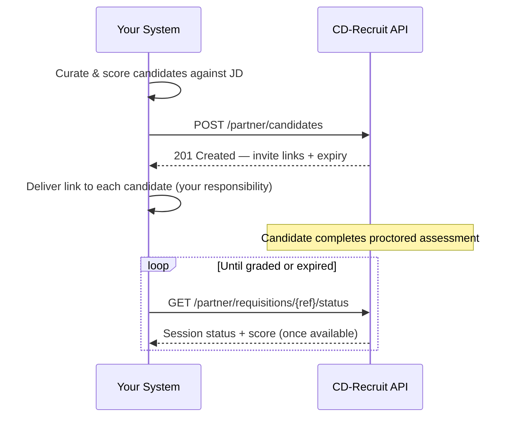

# CD-Recruit Partner API — Integration Requirements

**Audience:** Engineering team building the ATS candidate-sourcing system
**Status:** v1 — required for launch
**Base URL:** `https://api.cd-recruit.example.com/api/v1/partner` *(placeholder — final domain to be issued with your credentials)*

This document specifies what your system must implement to integrate with CD-Recruit's proctored assessment platform. Sections marked **Required** are non-negotiable for launch. Follow this document as the build spec — do not implement against assumptions.

---

## 1. Integration Overview

Your system curates and scores candidates against a job description. Once a candidate is shortlisted, your system calls CD-Recruit's Partner API to generate a proctored assessment for that candidate. CD-Recruit returns an assessment link. Your system is responsible for delivering that link to the candidate. CD-Recruit handles the assessment itself — proctoring, grading, and scoring — end to end. Your system retrieves results by polling a status endpoint.



**Terms used below:**
- **Requisition** — your stable identifier for a single job opening / JD. One requisition maps to one CD-Recruit "Drive" (a batch assessment event).
- **Candidate** — an individual shortlisted person you push to CD-Recruit.
- **Invite** — the assessment link + validity window issued for one candidate.

---

## 2. Authentication — Required

- All requests must include an `X-API-Key` header with the key issued to you at onboarding.
- Requests without a valid key return `401 Unauthorized`.
- Keys are scoped to your organization only — every candidate and requisition you push is attributed to your key and visible only to you via this API.
- Store the key server-side only. It must never appear in client-side code, logs, or version control.
- Keys can be rotated on request. Rotation has a 24-hour grace period during which both the old and new key are valid, to allow a safe cutover.
- All requests must use HTTPS. Plain HTTP requests are rejected.

---

## 3. `POST /partner/candidates` — Required

Creates or updates a requisition and issues assessment invites for the submitted candidates.

### Headers

| Header | Required | Notes |
|---|---|---|
| `X-API-Key` | Yes | Issued key |
| `Idempotency-Key` | Yes | UUID v4, generated by you per logical request — see Section 6 |
| `Content-Type` | Yes | `application/json` |

### Request Body

```json
{
  "requisition_ref": "string",
  "department_code": "string",
  "level": "string",
  "candidates": [
    {
      "external_candidate_ref": "string",
      "name": "string",
      "email": "string",
      "phone": "string"
    }
  ]
}
```

### Field Requirements

| Field | Type | Required | Rules |
|---|---|---|---|
| `requisition_ref` | string | Yes | 1–128 chars. Must be stable for the life of the requisition — reused on every subsequent push of new candidates to the same job opening. Determines Drive assignment (see Section 3.1). |
| `department_code` | string | Yes | Must be exactly one of the values in Section 4.1. Any other value returns `422`. |
| `level` | string | Yes | Must be exactly one of the values in Section 4.2. |
| `candidates` | array | Yes | 1–150 items per request. Larger batches must be split across multiple calls. |
| `candidates[].external_candidate_ref` | string | Yes | 1–128 chars. Must be unique and stable per candidate in your system — used as the retry/dedupe key on our side. |
| `candidates[].name` | string | Yes | 1–200 chars. |
| `candidates[].email` | string | Yes | Valid email format. Used to match against existing CD-Recruit candidate records — if this candidate already exists in our system (from any source), the existing record is reused rather than duplicated. |
| `candidates[].phone` | string | No | E.164 format recommended if provided. |

### 3.1 Requisition-to-Drive Mapping

The first candidate push for a given `requisition_ref` creates a new Drive. Every subsequent push using the same `requisition_ref` adds candidates to that same Drive rather than creating a new one. Do not generate a new `requisition_ref` for follow-up batches against the same job opening — this will fragment reporting on your side and ours.

### Response — `201 Created`

```json
{
  "drive_id": "uuid",
  "requisition_ref": "string",
  "results": [
    {
      "external_candidate_ref": "string",
      "invite_id": "uuid",
      "link": "https://...",
      "expires_at": "2026-08-11T09:00:00Z",
      "status": "created"
    }
  ],
  "drive_warnings": []
}
```

| Field | Meaning |
|---|---|
| `results[].status` | `created` — new invite issued. `duplicate_skipped` — this `external_candidate_ref` or email already has an active, non-expired invite for this requisition; no new invite was created, the existing `invite_id`/`link`/`expires_at` are returned instead. |
| `results[].expires_at` | Exactly 24 hours from the moment this response was generated — not from when you deliver the link. See Section 5. |
| `drive_warnings` | Non-blocking advisory strings — e.g. a concurrency warning if this batch pushes total scheduled starts above safe capacity for the window. The request still succeeds; treat these as "review this," not an error. |

---

## 4. Required Enums

### 4.1 `department_code`

```
SOFTWARE_ENGINEERING
DATA_ENGINEERING
PMO
QA
SYSOPS
ITOPS
SECOPS
SRE
```

Your JD categorization must resolve to exactly one of these eight values before calling this API. Any mapping from your internal taxonomy to this list happens on your side.

### 4.2 `level`

```
FRESHER
EXPERIENCED
```

Set at the requisition level. If your system needs to override level for an individual candidate within a requisition in the future, that is not supported in v1 — such a candidate must be pushed under a separate `requisition_ref`.

---

## 5. Delivery Responsibility — Required

**Your system is responsible for delivering the assessment link to the candidate.** CD-Recruit does not send the candidate-facing invitation email in this integration phase. The `link` field in the response is the complete, ready-to-use assessment URL — deliver it via your existing candidate communication channel.

The 24-hour validity window (`expires_at`) begins at API response time, not at delivery time. Deliver the link promptly after receiving it — any delay on your side reduces the candidate's usable window, not just the delivery lead time.

The candidate's assessment window is fully self-paced within those 24 hours: they may start at any point before `expires_at`. There is no fixed appointment time to communicate to the candidate for this integration path.

---

## 6. Idempotency — Required

Every `POST /partner/candidates` request must include an `Idempotency-Key` header (UUID v4).

- **Retry with the same key and same body:** returns the original response, no new invites are created.
- **Reuse a key with a different body:** returns `409 Conflict`. Generate a new key for a genuinely new request.
- **Generate a new key per logical request**, not per HTTP attempt — if you retry a failed call, reuse the same key you used on the first attempt.
- Idempotency keys are honored for 24 hours from first use.

---

## 7. `GET /partner/requisitions/{requisition_ref}/status` — Required

Poll this endpoint to retrieve session progress and results for every candidate under a requisition.

### Headers

| Header | Required |
|---|---|
| `X-API-Key` | Yes |

### Response — `200 OK`

```json
{
  "requisition_ref": "string",
  "drive_id": "uuid",
  "candidates": [
    {
      "external_candidate_ref": "string",
      "session_status": "not_started",
      "started_at": null,
      "submitted_at": null,
      "score_status": "not_graded",
      "composite_score_band": null,
      "decision": null
    }
  ]
}
```

| Field | Values / Notes |
|---|---|
| `session_status` | `not_started`, `in_progress`, `submitted`, `abandoned`, `expired` |
| `score_status` | `not_graded` or `graded`. Treat `not_graded` as "still processing" — this is expected for a period after `submitted`, not an error. |
| `composite_score_band` | `null` until `score_status` is `graded`. Never poll-treat a `null` value as a failure. |
| `decision` | `advance`, `reject`, `pending`, or `null` before a reviewer has acted. |

### Polling Guidance

- Poll no more frequently than every 15 minutes per requisition. Given the 24-hour candidate window, higher-frequency polling provides no additional information and will be rate-limited.
- A candidate's data remains available via this endpoint for 30 days after the requisition closes, matching CD-Recruit's standard evidence/data retention window. Persist any results you need beyond that on your side.

---

## 8. Error Handling — Required

All error responses share this shape:

```json
{
  "error": {
    "code": "string",
    "message": "string"
  }
}
```

| HTTP Status | When | Your system should |
|---|---|---|
| `400` | Malformed JSON or missing required field | Fix the request — do not retry unchanged |
| `401` | Missing or invalid `X-API-Key` | Check credentials — do not retry unchanged |
| `409` | `Idempotency-Key` reused with a different body | Use a new key for the new request |
| `422` | Invalid `department_code`/`level` combination, or field validation failure | Fix the request — this will fail identically on retry |
| `429` | Rate limit exceeded | Respect the `Retry-After` header before retrying |
| `500` / `503` | CD-Recruit internal error | Safe to retry with the same `Idempotency-Key` |

---

## 9. Rate Limits & Volume

- **60 requests per minute** per API key across all endpoints.
- **150 candidates per `POST /partner/candidates` call**, split larger batches across multiple calls.
- If a single requisition anticipates more than ~200 candidate starts within a short window (e.g. a campus-drive-style batch), notify CD-Recruit in advance of the push so assessment sandbox capacity can be confirmed. This is a current-phase limit tied to fixed infrastructure capacity, not a permanent ceiling — it will be revisited as volume grows.

---

## 10. Data Boundaries

This API surface is intentionally limited. The following are **not available** through this integration and should not be assumed or built against:

- No webhook/push notifications in v1 — status must be retrieved via polling (Section 7).
- No access to raw proctoring evidence, webcam clips, or biometric data of any kind, at any point, through this API or any other channel available to partners.
- No access to per-question responses, code submissions, or in-fiction communication content — only the aggregate `composite_score_band` and `decision` fields.
- No ability to modify, extend, or cancel an issued invite through this API in v1. If a candidate needs an extension, contact CD-Recruit support directly.

---

## 11. Versioning

This is `v1` of the Partner API, reflected in the base URL path. Breaking changes will be released as `v2` with a minimum 90-day overlap period before `v1` is deprecated. Non-breaking additions (new optional fields, new enum values) may be added to `v1` without notice — your integration should not fail on unrecognized additional fields in any response.

---

## 12. Support

Integration issues, key rotation requests, or capacity questions: **[support contact to be provided at onboarding]**.
