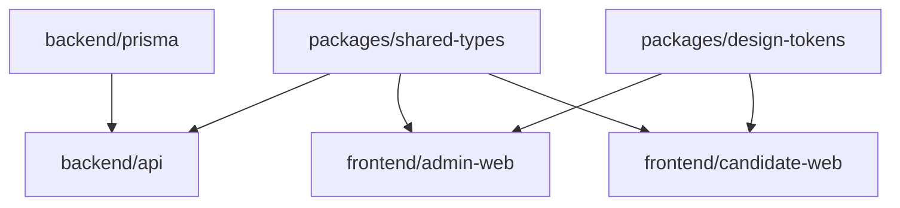
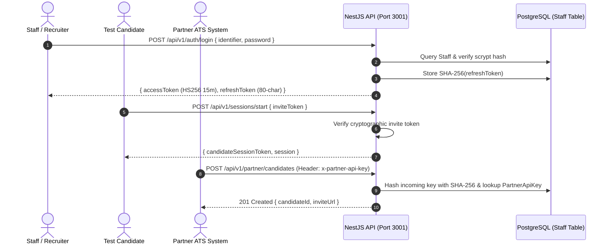
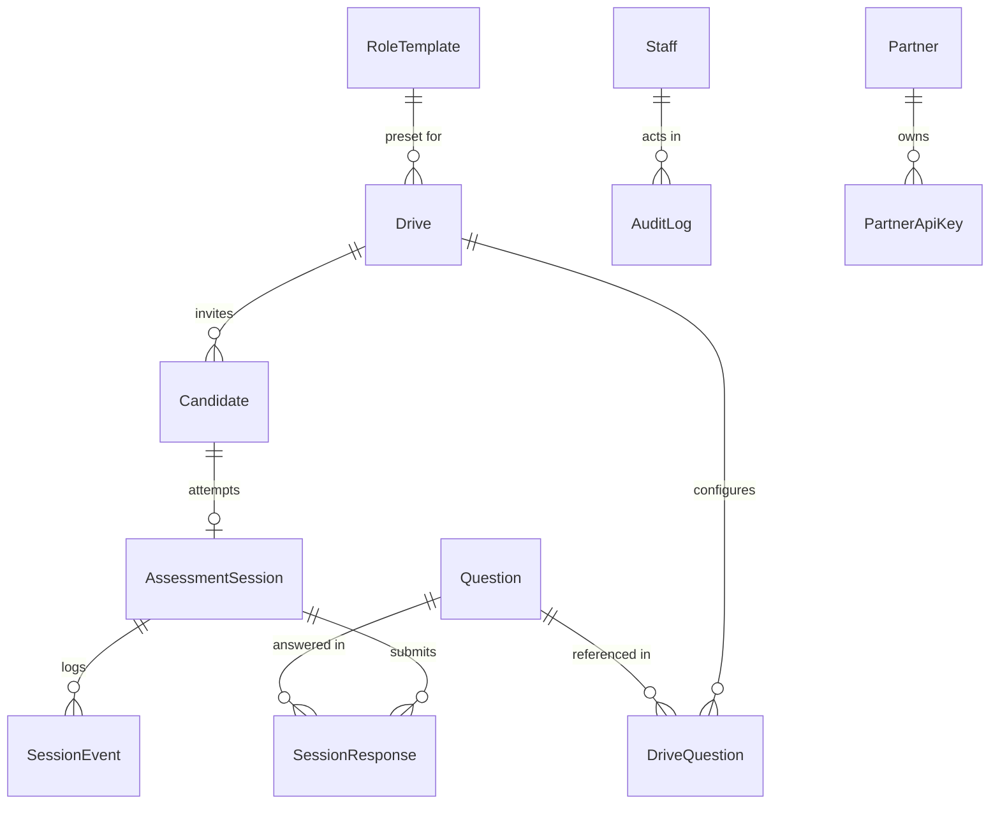
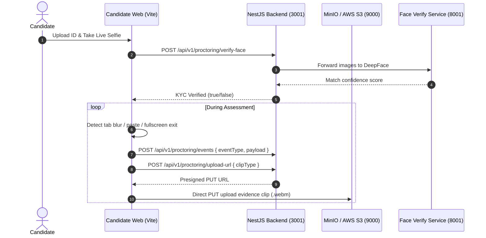

# CD-Recruit — Master Developer Architecture & Engineering Guide

Welcome to the **CD-Recruit** codebase. This guide is the authoritative, comprehensive technical manual for software engineers, platform architects, and developers maintaining, extending, or re-implementing the CD-Recruit platform.

---

## Table of Contents

1. [System Architecture & Monorepo Topology](#1-system-architecture--monorepo-topology)
2. [Development Environment & Infrastructure Modes](#2-development-environment--infrastructure-modes)
3. [Authentication & Authorization Deep Dive](#3-authentication--authorization-deep-dive)
4. [The 8 Assessment Modules Architecture](#4-the-8-assessment-modules-architecture)
5. [Database Architecture & Prisma Workflows](#5-database-architecture--prisma-workflows)
6. [Proctoring, Biometrics & Evidence Pipeline](#6-proctoring-biometrics--evidence-pipeline)
7. [Background Jobs, Queues & Resiliency](#7-background-jobs-queues--resiliency)
8. [Frontend Applications Architecture](#8-frontend-applications-architecture)
9. [Developer Extension Recipes (How-To)](#9-developer-extension-recipes-how-to)
10. [Testing, Benchmarking & Operations](#10-testing-benchmarking--operations)

---

## 1. System Architecture & Monorepo Topology

CD-Recruit is built as an **npm workspaces monorepo** designed for full type-safety across backend and frontend layers.

```
codebase/
├── backend/
│   ├── api/                   # NestJS 11 REST API monolith & in-process evaluation
│   └── prisma/                # PostgreSQL schema, migrations, seed scripts
├── frontend/
│   ├── admin-web/             # Recruiter Dashboard (TanStack Start + React 19)
│   └── candidate-web/         # Candidate Assessment Shell (Vite + React 19)
├── packages/
│   ├── shared-types/          # Canonical TypeScript interfaces & DTO contracts
│   └── design-tokens/         # Shared CSS tokens & styling variables
├── services/
│   └── face-verify/           # Python FastAPI + DeepFace biometric microservice
├── docker/                    # Docker Compose development and monitoring stacks
├── k6/                        # k6 load testing suites
└── docs/                      # Authoritative specifications & developer guides
```

### Workspace Dependency Order & Build Lifecycle



* **`packages/shared-types`**: Declares shared TypeScript interfaces, enums (`ModuleType`, `SessionStatus`, `StaffRole`), and polymorphic DTO definitions.
* **`packages/design-tokens`**: Compiles shared CSS design variables used by frontend apps.
* **Build Order Rule**: Before compiling the NestJS API or frontends, you must build the shared packages:
  ```bash
  npm run build:shared
  ```
  *(This is executed automatically during `npm install` via the `"postinstall"` hook).*

---

## 2. Development Environment & Infrastructure Modes

### Port Allocation Matrix

| Service / Container | Layer | Port | Environment Variable | Notes |
|---|---|---|---|---|
| **NestJS REST API** | Backend | `3001` | `API_PORT` | `http://localhost:3001/api/v1` (Swagger: `/api-docs`) |
| **Admin Web** | Frontend | `5173` | — | `http://localhost:5173` (TanStack Start) |
| **Candidate Web** | Frontend | `5174` | — | `http://localhost:5174` (Vite SPA) |
| **PostgreSQL 16** | Database | `5434:5432` | `DATABASE_URL` | User: `cdrecruit`, Pass: `cdrecruit123`, DB: `cdrecruit` |
| **Redis 7** | Queue/Cache | `6379:6379` | `REDIS_URL` | BullMQ queues and session heartbeats |
| **MongoDB 6.0** | Database | `27017:27017`| `MONGODB_URL` | User: `admin`, Pass: `adminpassword` |
| **MinIO Storage** | Object Store| `9000` / `9001`| `MINIO_PORT` | API: 9000, Console: 9001 (`minioadmin` / `minioadmin`) |
| **Judge0 CE Server**| Sandbox | `2358:2358` | `JUDGE0_API_URL` | Sandboxed code execution engine |
| **Judge0 Worker** | Sandbox | Internal | — | Consumes execution jobs from Redis |
| **Face Verify** | Biometrics | `8001:8000` | `FACE_VERIFY_SERVICE_URL` | Python FastAPI + DeepFace service |

---

### Dual Infrastructure Routing (`INFRA_MODE`)

The platform implements dual routing controlled by `INFRA_MODE`:

1. **`INFRA_MODE=local` (Zero-Dependency DX)**:
   - Ideal for rapid UI development without running 6+ Docker containers.
   - **Queues**: Redis is bypassed. Delayed jobs (grace-window auto-submission) and periodic jobs (heartbeat check) run via an in-memory Node.js scheduler (`LocalScheduler`).
   - **Storage**: MinIO is bypassed. `FakeStorageService` simulates successful uploads and returns static evidence URLs.
   - **Database**: Still requires PostgreSQL (via Docker or local Postgres 16).
2. **`INFRA_MODE=full` (Production / Real Containers)**:
   - Connects to real Redis (`6379`), MinIO S3 (`9000`), MongoDB (`27017`), Judge0 CE (`2358`), and Face Verify (`8001`).
   - Required for end-to-end integration testing and production deployments.

> [!CAUTION]
> `INFRA_MODE=local` is strictly blocked in production (`NODE_ENV=production`) during startup in `backend/api/src/main.ts`.

---

## 3. Authentication & Authorization Deep Dive

CD-Recruit operates three isolated authentication tiers:



### 1. In-House Staff JWT Authentication
- **Password Security**: Native Node.js `crypto.scrypt` with 16-byte random salt and 64-byte derived key (`scrypt$<salt>$<key>`). Constant-time comparison prevents timing attacks.
- **Access Tokens**: Symmetric HS256 JWTs signed with `JWT_SECRET` (minimum 32 characters), valid for 15 minutes.
- **Refresh Token Rotation**: Cryptographically secure 80-character random hex string (`crypto.randomBytes(40)`). The raw token is delivered once to the client; only the `SHA-256` hash is stored in PostgreSQL (`Staff.refreshTokenHash`).
- **Single-Use Replay Protection**: Each refresh operation (`POST /auth/refresh`) invalidates the old refresh token and issues a new pair.
- **Guards**: Protected via `JwtAuthGuard`, `RolesGuard` (`@Roles(...)`), and `PermissionsGuard` (`@RequirePermission(...)`).

### 2. Candidate Session Authentication
- **Invite Tokens**: 48-hour cryptographic tokens generated during candidate registration.
- **Session Tokens**: Tamper-proof HMAC tokens signed with `CANDIDATE_JWT_SECRET`.
- **Active Tab Guard**: `SessionOwnerGuard` validates session ownership and asserts that only one browser tab holds the active lease (`tabId`). Multi-tab access raises a `SessionConflict` state.

### 3. Partner ATS Authentication
- **API Keys**: Issued by administrators (`POST /admin/partners/:id/rotate-key`).
- **Validation**: `PartnerApiKeyGuard` hashes the incoming `x-partner-api-key` header with SHA-256 and validates against `PartnerApiKey` table in PostgreSQL.

---

## 4. The 8 Assessment Modules Architecture

CD-Recruit natively supports 8 assessment module types defined in `enum ModuleType`:

```prisma
enum ModuleType {
  MCQ
  SQL
  NOSQL
  CODING
  DEBUGGING
  AI_PROMPTING
  SIMULATION
  TEST_SCENARIOS
}
```

---

### Module 1: Multiple Choice Questions (`MCQ`)
- **Controller**: `backend/api/src/mcq/mcq.controller.ts`
- **Execution Flow**:
  1. Candidate requests questions (`GET /mcq/questions?sessionId=...`).
  2. Question content provides options with indices.
  3. Candidate submits selection (`POST /mcq/submit`).
  4. Scoring compares candidate `selectedIndex` against `correctIndex`.

---

### Module 2: SQL Sandbox (`SQL`)
- **Controller**: `backend/api/src/sql/sql.controller.ts`
- **Sandbox Isolation**: Queries execute against an isolated sandbox database connection (`SANDBOX_DB_URL`).
- **Security**: The database user has strict read-only permissions (`SELECT` only, no `DROP`, `ALTER`, `UPDATE`, `DELETE`).
- **Verification Engine**: `ResultComparatorService` compares the tabular result set of candidate's query with the expected output of canonical reference query, ignoring whitespace and column ordering variations where applicable.

---

### Module 3: NoSQL / MongoDB (`NOSQL`)
- **Controller**: `backend/api/src/modules/nosql/nosql.controller.ts`
- **Execution Flow**:
  1. `POST /nosql/start`: Automatically creates an ephemeral, isolated MongoDB database on port `27017` and seeds initial collections.
  2. `POST /nosql/run`: Validates candidate operation against blocklists (blocks `$where`, `function`, system commands) and executes query/aggregation pipeline.
  3. `POST /nosql/reset`: Re-seeds the sandbox collections to pristine state.
  4. `POST /nosql/submit`: Evaluates output using `OUTPUT_COMPARISON` (matching query output documents) or `STATE_COMPARISON` (asserting mutations across target collection).

---

### Module 4: Polyglot Coding (`CODING`)
- **Controller**: `backend/api/src/coding/coding.controller.ts`
- **Execution Engine**: **Judge0 CE** (`http://localhost:2358`).
- **Sandbox Security**:
  - Linux `isolate` sandbox with strict Linux cgroups.
  - `CPU_TIME_LIMIT=5.0` seconds, `MEMORY_LIMIT=262144` KB (256 MB), max processes/threads = 64.
- **Workflow**:
  - `POST /coding/run`: Compiles and executes code against candidate custom stdin.
  - `POST /coding/submit`: Dispatches test cases to Judge0. Results are collected asynchronously via Judge0 webhook (`POST /webhooks/judge0`) using atomic Redis Lua locks (`JUDGE0_ACCUMULATE_AND_LOCK_LUA`) to prevent race conditions.

---

### Module 5: Codebase Debugging (`DEBUGGING`)
- **Controller**: Integrated through coding execution pipeline.
- **Concept**: Candidate receives a realistic, defective code snippet alongside failing unit tests.
- **Evaluation**: Candidate submits patched code. Score is proportional to regression test cases passing in Judge0.

---

### Module 6: AI Prompt Engineering (`AI_PROMPTING`)
- **Controller**: `backend/api/src/ai-prompting/ai-prompting.controller.ts`
- **Execution Flow**:
  1. Candidate crafts prompt to solve complex multi-step instructions without hallucinations.
  2. Prompt is executed against target LLM (Anthropic Claude / Groq).
  3. Correlation Engine evaluates candidate prompt against an automated rubric: constraint adherence, zero-shot/few-shot formatting, token efficiency, and output correctness.

---

### Module 7: Contextual Workplace Simulation (`SIMULATION`)
- **Controller**: `backend/api/src/simulation/simulation.controller.ts`
- **Concept**: Interactive scenario replicating real workplace challenges (incident response, architecture trade-offs, stakeholder communication).
- **State Machine**: Candidate navigates stages, reviews mock emails, inspects logs, and makes decisions (`POST /sessions/:id/simulation/action`).
- **Evaluation**: 4-part scoring model:
  1. *Technical Rigor* (30%)
  2. *Decision Quality* (30%)
  3. *Communication Effectiveness* (20%)
  4. *Time & Resource Efficiency* (20%)

---

### Module 8: QA Test Scenarios (`TEST_SCENARIOS`)
- **Controller**: `backend/api/src/test-scenarios/test-scenarios.controller.ts`
- **Concept**: Evaluates QA engineering, test design, and edge-case discovery.
- **Workflow**: Candidate authors structured test cases (`testCases`: title, preconditions, steps, expected result, severity) for an ambiguous software specification. Evaluator scores edge-case coverage and test completeness.

---

## 5. Database Architecture & Prisma Workflows

The primary database is **PostgreSQL 16**, accessed through **Prisma ORM**.

### Core Entity Relationship Overview



### Migration Best Practices & Enum Idempotency

When creating or altering database enums in PostgreSQL migrations, always wrap the statements in PL/pgSQL idempotent blocks to prevent `type "X" already exists` errors during migration replays or shadow database operations:

```sql
DO $$ BEGIN
  CREATE TYPE "ModuleType" AS ENUM (
    'MCQ', 'SQL', 'NOSQL', 'CODING', 'DEBUGGING', 'AI_PROMPTING', 'SIMULATION', 'TEST_SCENARIOS'
  );
EXCEPTION WHEN duplicate_object THEN null; END $$;
```

### Applying Migrations
```bash
# Apply pending migrations to local Postgres
npm run db:migrate

# Reset database to fresh state and re-seed (Dev only!)
npm --workspace=backend/api run prisma migrate reset --force
```

### Seeding Workflows
Seeding (`npm run db:seed`) automatically initializes:
1. **Default Staff Accounts**: `admin@cdrecruit.local` (`password`), `recruiter@cdrecruit.local` (`password`).
2. **32 Canonical Role Templates**: 8 Departments $\times$ 4 Seniority Tiers:
   - *Departments*: Backend, Frontend, Fullstack, Mobile, DevOps, QA/SDET, Data, AI/ML.
   - *Tiers*: Fresher (0–1y), L1 (2–5y), L2 (6–10y), L3 (11–15y).
3. **Core Question Bank**: Seed questions across all 8 modules and seniority levels.

---

## 6. Proctoring, Biometrics & Evidence Pipeline



1. **Pre-Assessment KYC**: Candidate captures selfie and uploads ID document. FastAPI microservice (`services/face-verify`) runs DeepFace verification and returns confidence metrics.
2. **Telemetry Streaming**: Real-time listeners monitor DOM events (`visibilitychange`, `window.onblur`, `copy`, `paste`, `fullscreenchange`). Telemetry events are queued and posted in batches to `POST /api/v1/proctoring/events`.
3. **Evidence Storage**: Presigned S3 URLs (`POST /api/v1/proctoring/upload-url`) allow direct browser-to-S3 uploads, keeping media traffic off the NestJS API server. Clips are tagged with 90-day retention policies.
4. **Recruiter Review**: Admin deep-dive dashboard displays synchronized video playback alongside timestamped telemetry markers.

---

## 7. Background Jobs, Queues & Resiliency

### BullMQ Queue Configuration (Port 6379)
- **`session-timeout` Queue**: When a candidate disconnects, an auto-submission job is enqueued with a delayed grace window (default: `GRACE_WINDOW_SECONDS=300`). If the candidate fails to reconnect within 5 minutes, the session is transitioned to `AUTO_SUBMITTED`.
- **`heartbeat-check` Queue**: Repeatable job running every 30 seconds to flag stale sessions.
- **`grading` Queue**: Asynchronous processing queue for AI evaluation and code test case synthesis.

### Circuit Breaker Pattern (Opossum)
External network calls to Judge0 CE and AI LLM providers are guarded by Opossum circuit breakers:
- Error Threshold: `50%`
- Reset Timeout: `10,000ms`
- When tripped open, the system gracefully falls back or retries without blocking active candidate UI threads.

---

## 8. Frontend Applications Architecture

### 1. Admin Web (`frontend/admin-web`)
- **Framework**: TanStack Start + React 19 + Tailwind CSS.
- **Port**: `http://localhost:5173`.
- **State Management**: TanStack Query (`@tanstack/react-query`) for server state and caching.
- **UI Design System**:
  - Consistent **rounded-pill button styling** (`rounded-full`) across all interactive popups and modal actions.
  - Curated Lucide icons mapped in settings sidebars: `IdCard`, `UsersRound`, `ShieldCheck`, `LayoutGrid`, `Gauge`, `ScanFace`, `BrainCircuit`, `AlarmClock`, `Database`, `ClipboardList`, `PlugZap`.

### 2. Candidate Web (`frontend/candidate-web`)
- **Framework**: Vite + React 19 + Tailwind CSS v4.
- **Port**: `http://localhost:5174`.
- **State Machine**: Zustand store (`src/store/sessionMachine.ts`). The URL route stays locked on `/invite/:token` or `/start/:token` while screens render based on state:
  `Resolving` $\rightarrow$ `SystemCheck` $\rightarrow$ `Consent` $\rightarrow$ `Tutorial` $\rightarrow$ `Assessment` $\rightarrow$ `PreSubmitReview` $\rightarrow$ `Submitted`.
- **UI Consistency**: All candidate action buttons adhere to `rounded-pill` geometry. Question flagged markers use royal purple styling.

---

## 9. Developer Extension Recipes (How-To)

### Recipe 1: How to Add a New Assessment Module End-to-End

1. **Prisma Enum**: Add your module name to `enum ModuleType` in `backend/prisma/schema.prisma` and generate Prisma client (`npm run db:generate`).
2. **Shared Types**: Add the enum value and payload interface in `packages/shared-types/src/index.ts`. Run `npm run build:shared`.
3. **Backend Module**:
   - Create directory `backend/api/src/modules/<module-name>/`.
   - Implement `<module-name>.controller.ts` with route handlers (`@Post('run')`, `@Post('submit')`).
   - Register module in `backend/api/src/app.module.ts`.
4. **Frontend Candidate Component**:
   - Create screen component in `frontend/candidate-web/src/components/modules/<ModuleName>Module.tsx`.
   - Wire into assessment module switcher in `AssessmentShell.tsx`.
5. **Admin Review View**:
   - Add rendering card in `frontend/admin-web/src/routes/candidates.$id.tsx`.

---

### Recipe 2: How to Add a New Role Template

1. Open `backend/prisma/seed.ts`.
2. Locate the role template seeding loop.
3. Define the new template specifying `department`, `experienceTier`, module time distribution, and target question tags.
4. Run `npm run db:seed`.

---

### Recipe 3: How to Add a New Admin Route

1. Create a new route file in `frontend/admin-web/src/routes/<route-name>.tsx`.
2. Use TanStack Start file-based routing conventions.
3. Wrap your page content in `<AppShell activeNav="<key>">`.
4. Fetch data using TanStack Query hooks pointing to `apiClient.get('/admin/<endpoint>')`.

---

## 10. Testing, Benchmarking & Operations

### 1. Unit & Integration Tests
```bash
# Run backend Jest unit tests
npm run test:unit

# Run full test suite across workspaces
npm run test:all
```

### 2. Load Testing with k6
```bash
# Execute Judge0 load test scenario
npm run test:load
```

### 3. Code Linting & Formatting
```bash
# Format codebase with Prettier
npx prettier --write "backend/**/*.ts" "frontend/**/*.{ts,tsx}"

# Run ESLint
npm run lint
```

### 4. Health Check Verification
```bash
curl http://localhost:3001/api/v1/health
# Expected output: {"status":"ok","database":"healthy","storage":"healthy"}
```
