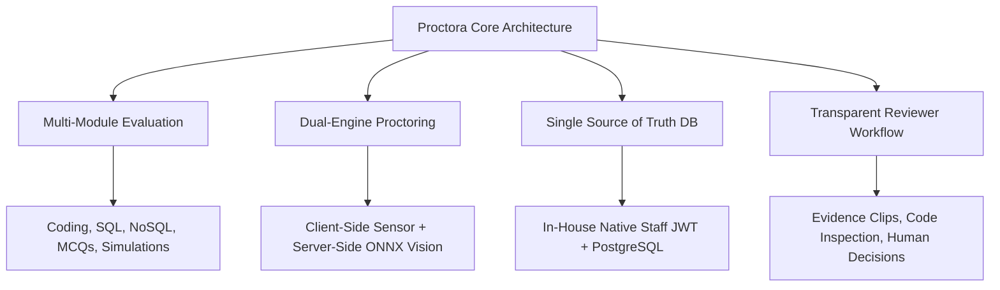
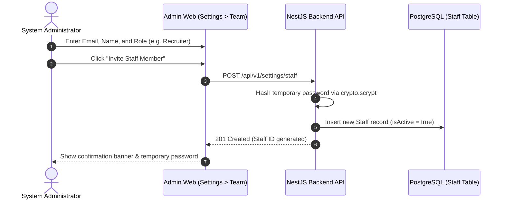
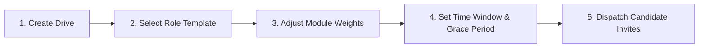
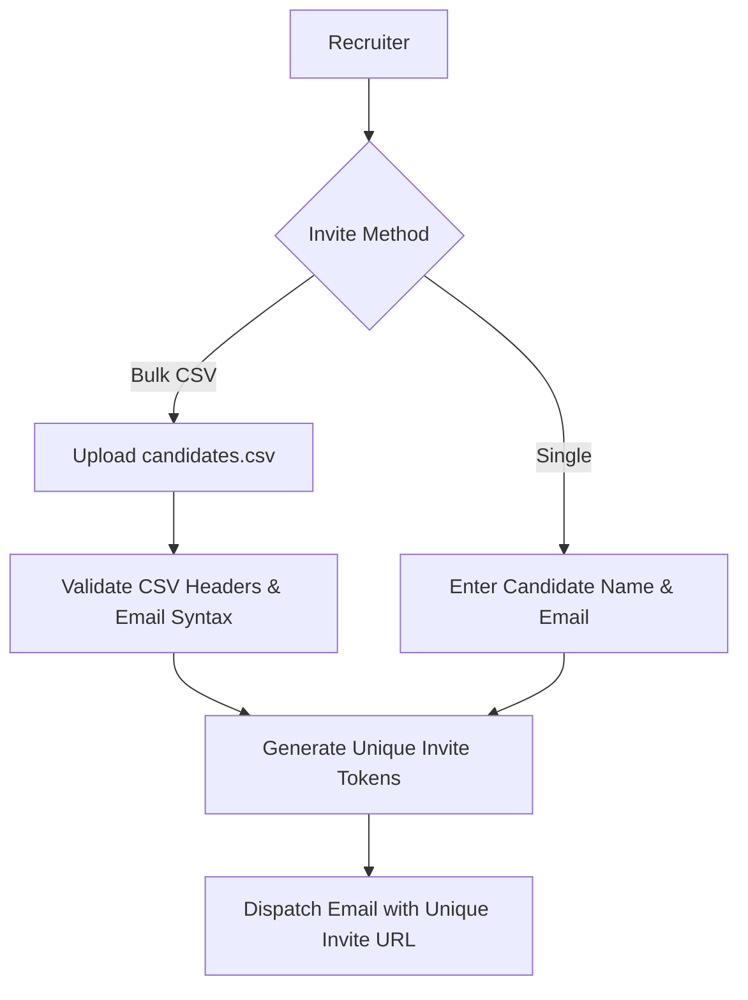
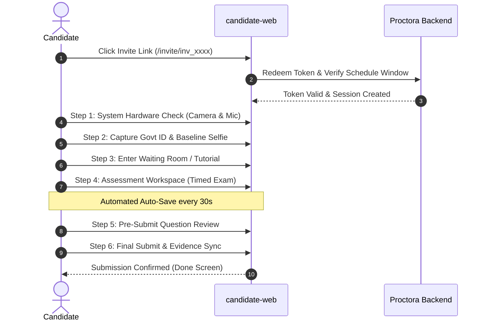
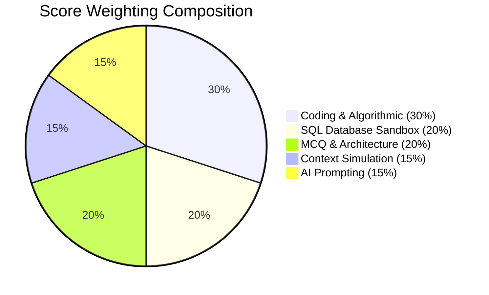
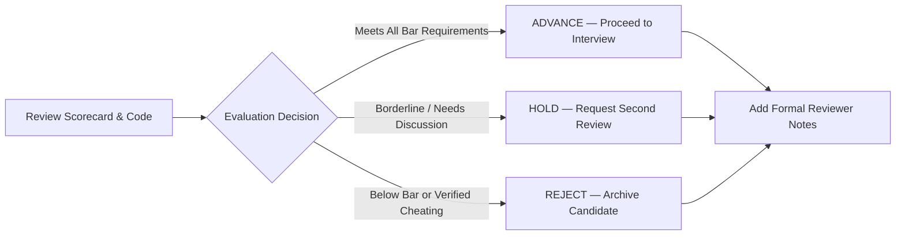

# Proctora (CD-Recruit) — Enterprise User Manual

**Document Version:** 1.0.0  
**Classification:** Enterprise Client & Operational Guide  
**Target Audience:** Enterprise Clients, System Administrators, Recruiters, Evaluators / Reviewers, and Test Candidates  

---

## Executive Summary

**Proctora** is an enterprise-grade, AI-augmented technical assessment and integrity governance platform. Designed to eliminate hiring friction, Proctora delivers rigorous, multi-module skill evaluations—spanning Coding, SQL, NoSQL, Debugging, AI Prompting, Contextual Simulations, and MCQs—backed by non-intrusive, automated proctoring and biometric verification.

This manual serves as the comprehensive, end-to-end operational guide for organizations licensing or deploying the Proctora platform. It contains role-specific workflows for administrators, hiring teams, and evaluators, alongside an exhaustive candidate handbook and technical integration reference.

---

## Table of Contents

1. [Part I: Platform Overview & Roles Matrix](#part-i-platform-overview--roles-matrix)
   - [1.1 Platform Architecture & Value Proposition](#11-platform-architecture--value-proposition)
   - [1.2 Role-Based Access Control (RBAC) Matrix](#12-role-based-access-control-rbac-matrix)
   - [1.3 Security, Privacy & Integrity Guardrails](#13-security-privacy--integrity-guardrails)
2. [Part II: System Administrator & HR Lead Guide](#part-ii-system-administrator--hr-lead-guide)
   - [2.1 Workspace Setup & Governance](#21-workspace-setup--governance)
   - [2.2 Team & Staff Management](#22-team--staff-management)
   - [2.3 Global Assessment Module Configuration](#23-global-assessment-module-configuration)
   - [2.4 Audit Logs & Compliance](#24-audit-logs--compliance)
3. [Part III: Recruiter & Drive Operations Guide](#part-iii-recruiter--drive-operations-guide)
   - [3.1 Recruitment Drives Management](#31-recruitment-drives-management)
   - [3.2 Role Templates & Seniority Presets](#32-role-templates--seniority-presets)
   - [3.3 Question Bank Operations](#33-question-bank-operations)
   - [3.4 Candidate Invite Management](#34-candidate-invite-management)
   - [3.5 Live Drive Monitoring & Attendance Tracking](#35-live-drive-monitoring--attendance-tracking)
4. [Part IV: Candidate Assessment Experience Guide](#part-iv-candidate-assessment-experience-guide)
   - [4.1 System & Hardware Requirements](#41-system--hardware-requirements)
   - [4.2 Step-by-Step Test-Taking Journey](#42-step-by-step-test-taking-journey)
   - [4.3 Proctoring Rules & Behavioral Guardrails](#43-proctoring-rules--behavioral-guardrails)
   - [4.4 Candidate Troubleshooting & FAQ](#44-candidate-troubleshooting--faq)
5. [Part V: Reviewer & Evaluation Guide](#part-v-reviewer--evaluation-guide)
   - [5.1 Results Dashboard & Candidate Ranking](#51-results-dashboard--candidate-ranking)
   - [5.2 Interpreting Composite & Module Scores](#52-interpreting-composite--module-scores)
   - [5.3 Deep-Dive Submission & Code Inspection](#53-deep-dive-submission--code-inspection)
   - [5.4 Investigating Proctoring Flags & Evidence Clips](#54-investigating-proctoring-flags--evidence-clips)
   - [5.5 Submitting Reviewer Decisions & Notes](#55-submitting-reviewer-decisions--notes)
6. [Part VI: Enterprise Client & ATS Integration Guide](#part-vi-enterprise-client--ats-integration-guide)
   - [6.1 Partner API Overview & Authentication](#61-partner-api-overview--authentication)
   - [6.2 Automated Invite & Drive Provisioning](#62-automated-invite--drive-provisioning)
   - [6.3 Webhook Notification Architecture](#63-webhook-notification-architecture)
   - [6.4 Exporting Scorecards & Analytics](#64-exporting-scorecards--analytics)
7. [Appendix: Screenshot & Visual Asset Matrix](#appendix-screenshot--visual-asset-matrix)

---

# Part I: Platform Overview & Roles Matrix

## 1.1 Platform Architecture & Value Proposition

Proctora bridges the gap between high-volume technical screening and human-centered hiring decisions through four architectural pillars:



1. **Multi-Module Assessment Engine**: Standardizes evaluations across 8 distinct technical domains (Software Engineering, Data, QA, SysOps, ITOps, SecOps, SRE, PMO) tailored across 4 seniority tiers (Fresher, L1, L2, L3).
2. **Zero-Friction Candidate Entry**: Candidates never need to create or remember passwords. Access is granted via cryptographically random, single-use invite tokens tied directly to isolated test sessions.
3. **Embedded Local AI Proctoring**: Uses embedded local ONNX runtimes for ArcFace facial verification, eliminating external vendor dependencies and keeping biometric data strictly confidential.
4. **Human-in-the-Loop Decisions**: The system flags potential anomalies (e.g., audio spikes, secondary voices, tab switches, anomalous paste actions), but empowers human recruiters and reviewers with signed video/audio evidence clips to make final advancing or rejection calls.

---

## 1.2 Role-Based Access Control (RBAC) Matrix

Proctora enforces strict Role-Based Access Control across 6 distinct user classifications:

| Capability / Resource | Super Admin | HR Lead | Recruiter | HR Associate | Reviewer | Candidate |
| :--- | :---: | :---: | :---: | :---: | :---: | :---: |
| **System Settings & Team Management** | Full | View Only | None | None | None | None |
| **Global Module Config & Weights** | Full | Full | View Only | View Only | None | None |
| **Create & Edit Recruitment Drives** | Full | Full | Full | None | None | None |
| **Create & Edit Role Templates** | Full | Full | Full | None | None | None |
| **Author / Edit Question Bank** | Full | Full | Full | None | None | None |
| **Issue Candidate Invites (Single / Bulk)** | Full | Full | Full | Full | None | None |
| **Live Attendance & Proctoring Stream** | Full | Full | Full | Full | View Only | None |
| **Review Candidate Code & Results** | Full | Full | Full | View Only | Full | None |
| **Submit Final Advance / Reject Decision** | Full | Full | Full | None | Full | None |
| **Access Assessment Workspace** | None | None | None | None | None | Full (Own Session) |

> 📸 **Screenshot Callout [UI-01]:** *Team Management Console showing staff roster with role chips (`ADMIN`, `HR_LEAD`, `RECRUITER`, `REVIEWER`).*

---

## 1.3 Security, Privacy & Integrity Guardrails

Proctora is engineered from the ground up to respect candidate data privacy while maintaining uncompromising exam integrity:
- **Biometric Isolation**: Candidate government ID cards and baseline facial embeddings are stored with restricted read access. Embeddings are stored as vector representations, preventing reverse-reconstruction of facial images.
- **Evidence Lifecycle Policies**: Webcam snapshot clips and flagged audio segments stored in Object Storage (MinIO) automatically expire after 90 days (`EVIDENCE_CLIP_RETENTION_DAYS=90`).
- **Session Sandboxing**: Candidates are sandboxed to their individual `sessionId`. SQL queries run in dynamically generated, isolated Postgres sandbox schemas, and code executions execute in secure Judge0 container sandboxes with memory, thread, and execution-time limits.

---

# Part II: System Administrator & HR Lead Guide

## 2.1 Workspace Setup & Governance

Administrators control the organizational environment upon initial onboarding:

1. **Navigating to Settings**: Click your user avatar in the bottom-left navigation bar and select **Settings**.
2. **Organization Profile**: Set the official company name, primary support email, default time zone (used for drive scheduling), and default brand logo.
3. **Session Retention Windows**: Configure maximum idle timeouts and candidate evidence retention policies.

> 📸 **Screenshot Callout [UI-02]:** *Settings Workspace Overview showing general preferences and brand customization.*

---

## 2.2 Team & Staff Management

Administrators maintain complete authority over team member credentials and platform permissions:



### Adding a New Team Member
1. Navigate to **Settings > Team Management**.
2. Click the **Add Staff Member** button.
3. Provide:
   - **Full Name**: (e.g., `Sarah Jenkins`)
   - **Work Email**: (e.g., `sarah.jenkins@company.com`)
   - **Assigned Role**: Select from `ADMIN`, `HR_LEAD`, `HR_ASSOCIATE`, `RECRUITER`, or `REVIEWER`.
4. Click **Create Member**. The platform provisions the account with a secure temporary password.

### Resetting Staff Passwords & Revoking Sessions
- If a team member forgets their password or a credential is compromised:
  1. Locate the user in the **Team Management** table.
  2. Click the three-dots action menu (`...`) and select **Reset Password**.
  3. Enter the new password and click **Confirm Reset**.
  4. The platform derives an updated `scrypt` hash and **immediately revokes all active refresh tokens**, invalidating any ongoing sessions across all devices.

> 📸 **Screenshot Callout [UI-03]:** *Staff Management Modal displaying password reset and role selection dialogs.*

---

## 2.3 Global Assessment Module Configuration

Administrators can toggle modules globally across the organization to align with company evaluation policies:

1. In **Settings**, open the **Assessment Modules** tab.
2. Toggle individual modules on or off:
   - **Coding (DSA & Algorithmic Problem Solving)**
   - **SQL Execution Sandbox (Relational Database Design)**
   - **NoSQL Execution Module (Document Store Queries)**
   - **System Debugging (Locating & Repairing Buggy Codebases)**
   - **AI Prompting & Engineering (LLM Optimization)**
   - **Contextual Simulation (Scenario-Based Decision Making)**
   - **Multiple Choice Questions (Theoretical Knowledge)**
3. When a module is disabled globally, it is excluded from all newly created Recruitment Drives.

---

# Part III: Recruiter & Drive Operations Guide

## 3.1 Recruitment Drives Management

A **Recruitment Drive** represents an active hiring campaign (e.g., *Campus Drive — July 2026* or *Senior Full-Stack Batch 4*).



### Creating a Recruitment Drive
1. From the left navigation menu, click **Drives**.
2. Click **Create Recruitment Drive** in the upper-right corner.
3. **General Information**:
   - **Drive Name**: Enter a descriptive campaign title.
   - **Target Department**: Select the target vertical (e.g., *Software Engineering*, *Data Engineering*).
   - **Role Template**: Choose one of the 32 standardized templates (e.g., *Software Engineering — Fresher*).
4. **Time & Schedule Window**:
   - **Schedule Start & End Dates**: The calendar span during which tests may be redeemed.
   - **Buffer Minutes (Default: 15 mins)**: Pre-test buffer window allowing candidates to complete hardware and ID verification before the exam clock starts.
   - **Grace Period (Default: 30 mins)**: Post-schedule window allowing late-arriving candidates to redeem invites if network delays occur.
5. **Module Weighting Configuration**:
   - Customize point distribution across modules (e.g., 20% MCQ, 30% Coding, 20% SQL, 15% AI Prompting, 15% Simulation).
6. Click **Publish Drive**.

> 📸 **Screenshot Callout [UI-04]:** *Recruitment Drive Creator showing schedule picker and module weighting sliders.*

---

## 3.2 Role Templates & Seniority Presets

Proctora includes **32 standardized, pre-calibrated role templates** covering 8 departments across 4 career tiers:

| Department | Fresher (0–1 Yrs) | Level 1 (2–5 Yrs) | Level 2 (6–10 Yrs) | Level 3 (11–15 Yrs) |
| :--- | :---: | :---: | :---: | :---: |
| **Software Engineering** | Basic DSA, Syntax, Easy SQL | Algorithms, APIs, Intermediate SQL | System Architecture, Concurrency | Distributed Systems, Scalability |
| **Data Engineering** | SQL Basics, Python, Schema | ETL Pipelines, Window Functions | Data Warehousing, Partitioning | Lakehouses, Stream Processing |
| **QA / Automation** | Test Cases, Manual Testing | Selenium, Playwright, API Testing | Framework Architecture, CI/CD | Performance Testing, Chaos Eng |
| **Site Reliability (SRE)** | Linux CLI, Networking Basics | Docker, K8s Basics, Prometheus | Incident Response, Terraform | Chaos Testing, High-Availability |
| **SysOps / ITOps** | OS Concepts, Bash Scripting | System Administration, DNS, SSL | Storage Networks, Hybrid Cloud | Enterprise Migration, Zero-Trust |
| **SecOps** | Web Vulnerabilities (OWASP) | Pen-Testing, IAM, Log Auditing | Threat Modeling, SIEM Analysis | Security Architecture, Zero-Trust |
| **PMO** | Agile Fundamentals, Backlogs | Sprint Planning, Velocity, Jira | Risk Management, Stakeholders | Enterprise Delivery, Budgeting |

Recruiters can also create **Custom Templates** by selecting target questions, adjusting total exam durations, and modifying module point shares.

---

## 3.3 Question Bank Operations

The platform features an extensive question repository with automated evaluation test harnesses:

1. Navigate to **Questions** in the navigation sidebar.
2. **Filtering & Search**:
   - Filter by **Module Type** (`CODING`, `SQL`, `MCQ`, etc.).
   - Filter by **Department** and **Seniority Tag** (`fresher`, `l1`, `l2`, `l3`).
   - Search by keyword or category tag (e.g., `binary-search`, `joins`, `recursion`).
3. **Previewing Questions**:
   - Click on any question to view the full prompt, visible test cases, hidden validation test cases, and starter code for JavaScript, Python, Java, and C++.
4. **Authoring Custom Questions**:
   - Click **Add Question**.
   - Input the problem statement in GitHub-flavored Markdown.
   - Define execution constraints (CPU time limit in seconds, memory limit in MB).
   - Provide starter code templates and define at least 2 visible test cases and 3 hidden test cases.

> 📸 **Screenshot Callout [UI-05]:** *Question Bank Browser displaying multi-language starter code editor and test case manager.*

---

## 3.4 Candidate Invite Management

Candidates can be invited individually or in batches via standard spreadsheet formats:



### Bulk CSV Upload Workflow
1. In the active Recruitment Drive, navigate to the **Invites** tab.
2. Click **Import CSV**.
3. Download the sample template or verify your CSV follows this exact column header structure:
   ```csv
   candidate_name,candidate_email,category,experience_tier
   Alice Johnson,alice.johnson@example.com,FRESHER,0-1
   Bob Smith,bob.smith@example.com,EXPERIENCED,2-5
   ```
4. Drag and drop the `.csv` file.
5. The platform previews valid rows, flags duplicate or improperly formatted email addresses, and prompts for confirmation.
6. Click **Generate Invites**. The platform creates unique, cryptographic invite tokens for every candidate.

### Managing Invite Statuses
The Invites table displays real-time lifecycle states:
- **`PENDING`**: Invite generated; candidate has not yet accessed the link.
- **`REDEEMED`**: Candidate has clicked the link and commenced hardware/ID verification.
- **`EXPIRED`**: The drive's scheduled end date plus grace period has passed without redemption.
- **`REVOKED`**: Manually cancelled by the recruiter.

> 💡 **Tip:** Need to re-invite a candidate? Click the action menu next to any `EXPIRED` or `PENDING` invite and select **Resend Link** or **Extend Time Window**.

---

# Part IV: Candidate Assessment Experience Guide

*(Hiring teams can share this section directly with candidates prior to assessment day)*

## 4.1 System & Hardware Requirements

To ensure an uninterrupted assessment experience, candidates must prepare the following equipment:

1. **Computer**: Desktop or laptop computer running Windows 10/11, macOS 11+, or modern Linux (Ubuntu/Debian). *Mobile phones and tablets are not supported.*
2. **Webcam**: Functioning integrated or USB webcam (minimum 720p resolution).
3. **Microphone**: Working internal or external microphone.
4. **Web Browser**: Latest version of **Google Chrome**, **Microsoft Edge**, or **Mozilla Firefox**. (Safari is not recommended for hardware proctoring).
5. **Internet Connection**: Stable broadband connection with minimum **2 Mbps download / 1 Mbps upload** speeds.
6. **Environment**: A quiet, well-lit, private room. Ensure no other persons are visible or audible in your testing area.

---

## 4.2 Step-by-Step Test-Taking Journey



### Step 1: Accessing the Assessment Link
Click the unique link received via your invitation email. You will arrive at the **Drive Welcome Screen**, which displays the exam duration, allowed programming languages, and test rules.

### Step 2: Automated Hardware & System Check
Click **Start System Check**. The browser will request permissions:
- Click **Allow** on the camera and microphone prompt.
- The platform runs automated checks:
  - **Camera Feed**: Ensures video frames are active.
  - **Microphone**: Checks that ambient audio levels can be registered.
  - **Fullscreen Capability**: Requests entry into distraction-free fullscreen mode.
  - **Network Latency**: Measures connectivity against platform servers.

> 📸 **Screenshot Callout [UI-06]:** *System Check Interface showing green checkmarks for Camera, Microphone, Browser, and Network.*

### Step 3: Identity & Consent Verification
1. Review the biometric consent declaration.
2. Hold your physical government photo ID (Driver's License, Passport, or National Identity Card) up to the camera and click **Capture ID**.
3. Position your face inside the on-screen oval and click **Capture Baseline Photo**.
4. The platform verifies facial alignment and matches the extracted text against your candidate profile.

### Step 4: Interactive Tutorial
Before the timer begins, candidates are guided through a sandbox workspace:
- How to write and run code against test cases.
- How to format SQL queries.
- How keyboard shortcuts operate in the Monaco code editor.

### Step 5: The Assessment Workspace
Once the exam starts, your test window is divided into clean, focused regions:
- **Header**: Active question countdown timer, section navigation tabs (MCQ, SQL, Coding), and proctoring status pill (`Camera Active`).
- **Left Panel**: Problem statement, constraints, example input/output blocks.
- **Right Panel**: Monaco code editor with language selector (Python, Java, JavaScript, C++), font controls, and theme toggles.
- **Bottom Panel**: **Run Code** (validates against visible test cases) and **Submit Section**.

> 📸 **Screenshot Callout [UI-07]:** *Assessment Workspace showing problem statement on the left, code editor on the right, and output console below.*

### Step 6: Pre-Submission Review & Completion
1. When all sections are complete, click **Review & Submit**.
2. An overview screen displays:
   - Total questions answered vs. unanswered.
   - Questions marked for review.
3. Click **Confirm Final Submission**.
4. Wait for the sync progress bar to reach 100%. Once you see the **Assessment Complete** checkmark, you may safely close your browser.

---

## 4.3 Proctoring Rules & Behavioral Guardrails

To protect the fairness of the assessment for all candidates, Proctora monitors the following integrity parameters:

1. **Fullscreen Enforcement**:
   - The test must remain in fullscreen mode throughout.
   - Exiting fullscreen or minimizing the browser triggers an immediate warning banner and logs a `FULLSCREEN_EXIT` event.
2. **Tab-Switching & Window Blurs**:
   - Clicking outside the assessment tab or switching applications triggers a `TAB_SWITCH` event. Frequent tab switches will be flagged for reviewer investigation.
3. **Copy-Paste Monitoring**:
   - External paste operations into the code editor or question responses are analyzed for velocity and length anomalies (`PASTE_ANOMALY`).
4. **Audio Environment**:
   - Background conversations or secondary voices are analyzed for potential unauthorized assistance (`SECOND_VOICE_SUSPECTED`).

---

## 4.4 Candidate Troubleshooting & FAQ

#### Q1: What happens if my internet connection drops during the test?
- **Do not panic.** Your code and responses are auto-saved locally every 30 seconds.
- Re-open your original invite link as soon as your connection recovers.
- If reconnected within the drive's grace period, you will resume exactly where you left off.

#### Q2: The camera check fails with "Permission Denied". How do I fix this?
- Click the padlock or camera icon on the left edge of your browser's address bar.
- Set **Camera** and **Microphone** to **Allow**.
- Refresh the page and restart the system check.

#### Q3: Can I use dual monitors?
- **No.** Secondary monitors must be unplugged or disabled before launching fullscreen mode to avoid automated display integrity flags.

---

# Part V: Reviewer & Evaluation Guide

## 5.1 Results Dashboard & Candidate Ranking

Reviewers and hiring managers access candidate performance analytics from the **Results** dashboard:

1. Navigate to **Results** from the main navigation menu.
2. **Filtering Capabilities**:
   - Filter by **Drive** and **Role Template**.
   - Filter by **Score Threshold** (e.g., Composite Score ≥ 75%).
   - Filter by **Review Status** (`Pending Review`, `Advanced`, `Held`, `Rejected`).
   - Filter by **Integrity Status** (`Clean`, `Flagged Anomalies`).
3. Click on any candidate record to open their comprehensive scorecard.

> 📸 **Screenshot Callout [UI-08]:** *Results Dashboard showing candidate table with composite score badges and integrity tags.*

---

## 5.2 Interpreting Composite & Module Scores

Every candidate scorecard features a multi-tiered performance breakdown:



- **Composite Score (0–100%)**: Weighted average across all configured assessment modules based on the drive's weighting preset.
- **Module-by-Module Scores**: Individual percentages achieved in Coding, SQL, NoSQL, MCQs, and Simulations.
- **Say/Do Consistency Metric (0.00–1.00)**: Evaluates alignment between self-reported seniority/approach and actual code execution performance.
- **AI Confidence Score (0.00–1.00)**: Platform confidence in the validity and human authenticity of the submission.

---

## 5.3 Deep-Dive Submission & Code Inspection

Reviewers can inspect every line of code submitted by the candidate:

1. In the candidate profile, click on the **Code Submissions** tab.
2. **Source Code Inspector**:
   - Displays exact submitted code with syntax highlighting for the selected language.
   - Shows total lines of code, cyclomatic complexity indicators, and execution time.
3. **Test Case Pass Matrix**:
   - Review how many visible test cases and hidden validation test cases passed.
   - View execution `stdout`, `stderr`, and compiler output diagnostics.
4. **SQL Query Sandbox Viewer**:
   - Inspect candidate SQL queries alongside execution tabular result sets and query cost plans.

> 📸 **Screenshot Callout [UI-09]:** *Code Review Inspector highlighting candidate submission diff and test case execution telemetry.*

---

## 5.4 Investigating Proctoring Flags & Evidence Clips

If a candidate was flagged for suspicious behavior, reviewers can audit verified evidence before making a hiring call:

1. Open the **Integrity & Proctoring** tab on the candidate's scorecard.
2. **Integrity Event Timeline**: Chronological log of all events registered during the test (e.g., `00:14:22 — TAB_SWITCH (Duration: 4s)`, `00:28:10 — SPEECH_DETECTED`).
3. **Evidence Video & Audio Clips**:
   - Signed, tamper-proof video snapshots captured during the anomalous window.
   - Side-by-side comparison between the baseline identity photo captured during check-in and webcam snapshots during the test.
4. **Paste Analysis**: Review the size and timestamp of any clipboard paste operations.

---

## 5.5 Submitting Reviewer Decisions & Notes

Once evaluation is complete, reviewers submit formal hiring dispositions:



1. In the upper-right corner of the scorecard, select a decision:
   - **`ADVANCE`**: Candidate passed technical bar and integrity checks; recommend for technical interview.
   - **`HOLD`**: Borderline performance; requires secondary evaluation or panel discussion.
   - **`REJECT`**: Failed technical threshold or verified proctoring breach.
2. Enter evaluation notes in the **Reviewer Feedback** textarea (e.g., *"Strong grasp of graph recursion and clean SQL indexing. Minor tab switch was verified to be a dual-monitor glitch."*).
3. Click **Submit Decision**. The candidate status updates across all recruitment dashboards.

---

# Part VI: Enterprise Client & ATS Integration Guide

## 6.1 Partner API Overview & Authentication

For enterprise clients integrating Proctora into their Applicant Tracking Systems (Workday, Greenhouse, Lever, BambooHR), the platform provides a high-throughput REST API.

### Authentication
Every enterprise client receives an API Key and Client Secret. Requests authenticate via Bearer token:
```bash
curl -X GET https://api.proctora.com/api/v1/partner/drives \
  -H "Authorization: Bearer <PARTNER_API_TOKEN>" \
  -H "Content-Type: application/json"
```

---

## 6.2 Automated Invite & Drive Provisioning

Enterprise systems can automate assessment dispatch directly when an applicant reaches a specific ATS interview stage:

### Automated Candidate Invite API
**Endpoint:** `POST /api/v1/partner/invites`

**Request Payload:**
```json
{
  "driveId": "4f5b91b6-f857-409d-a645-e80a70b7231a",
  "candidateName": "Marcus Vance",
  "candidateEmail": "marcus.vance@example.com",
  "category": "EXPERIENCED",
  "experienceTier": "2-5"
}
```

**Response Payload:**
```json
{
  "inviteId": "inv_9b8a7c6d5e4f3a2b1c0d",
  "candidateEmail": "marcus.vance@example.com",
  "inviteUrl": "https://assessment.proctora.com/invite/inv_9b8a7c6d5e4f3a2b1c0d",
  "status": "PENDING",
  "expiresAt": "2026-09-25T18:00:00.000Z"
}
```

---

## 6.3 Webhook Notification Architecture

Proctora dispatches signed HMAC-SHA256 webhooks to enterprise endpoints as candidates progress through their assessment lifecycle:

| Event Name | Trigger Condition | Common ATS Action |
| :--- | :--- | :--- |
| `candidate.invited` | Invite link generated and dispatched | Update ATS status to *Assessment Sent* |
| `session.started` | Candidate finishes check-in and starts exam | Update ATS status to *In Progress* |
| `session.submitted` | Exam completed and scores calculated | Ingest preliminary composite score |
| `integrity.flagged` | Critical proctoring anomaly detected | Alert recruiting coordinator |
| `review.completed` | Reviewer issues ADVANCE / REJECT decision | Advance or archive candidate in ATS |

---

## 6.4 Exporting Scorecards & Analytics

Hiring leads can export audit-ready reports directly for executive hiring committee reviews:
- **PDF Candidate Scorecard**: Single-click export of the complete candidate dossier, including photo verification, module charts, submitted code, and reviewer notes.
- **CSV Drive Performance Export**: Complete tabular summary of all candidate scores, test durations, and completion rates.

---

# Appendix: Screenshot & Visual Asset Matrix

For final publication and corporate PDF export, the following high-resolution UI screenshots should be captured and placed into the corresponding callout positions:

| Reference ID | Location / View | Key Elements to Showcase |
| :--- | :--- | :--- |
| **`[UI-01]`** | `Settings > Team Management` | Staff table with role tags (`ADMIN`, `RECRUITER`, `REVIEWER`) and action menus. |
| **`[UI-02]`** | `Settings > Organization` | Workspace settings, custom logo branding, default time zones. |
| **`[UI-03]`** | `Settings > Add Staff Modal` | Dialog with email, role selector, and temporary password confirmation. |
| **`[UI-04]`** | `Drives > Create Drive` | Schedule date picker, buffer/grace controls, and module weighting sliders. |
| **`[UI-05]`** | `Questions > Question Bank` | Question filtering chips, starter code editor, and hidden test case badges. |
| **`[UI-06]`** | `Candidate > System Check` | Webcam, microphone, network speed, and fullscreen hardware check cards. |
| **`[UI-07]`** | `Candidate > Assessment Workspace` | Left problem statement, Monaco code editor, console runner, timer header. |
| **`[UI-08]`** | `Results > Candidate Dashboard` | Candidate table with composite scores, percentile chips, and integrity tags. |
| **`[UI-09]`** | `Results > Candidate Scorecard` | Deep-dive code inspection diff, test pass matrix, and proctoring video timeline. |

---

*End of Enterprise User Manual — Proctora / CD-Recruit Platform.*
