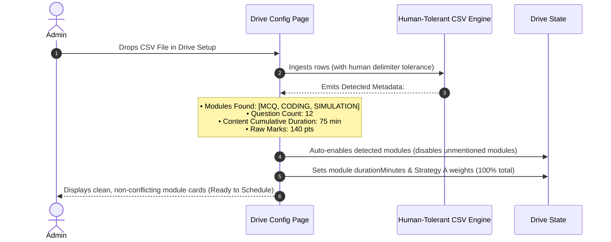
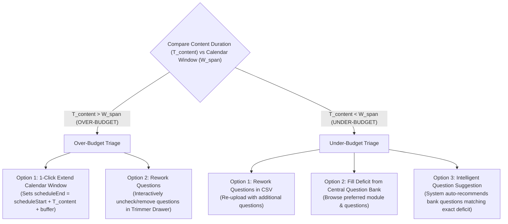

# Architectural Specification: Bulk Import Question Timing, Module Decoupling, and 100-Mark Normalization

**Status:** Approved Final Architecture Design  
**Author:** Pair Programming Session  
**Date:** September 2026  
**Target Areas:** `frontend/admin-web`, `backend/api`, `packages/shared-types`, `frontend/candidate-web`

---

## 1. Executive Summary

This specification establishes the final end-to-end architecture for:
1. **Introducing explicit question completion durations (`durationMinutes`) and raw marks (`points`) into a single, human-tolerant CSV template.**
2. **Eliminating multi-format user friction:** Sticking to **one single unified CSV format** that supports all 8 modules (including complex multi-file **SIMULATION** scenarios) using human-friendly delimiters (`|`, clean file blocks) with zero manual JSON-escaping required.
3. **Decoupling module selection from drive creation** by moving CSV bulk import directly into the Drive Configuration workflow ("Questions-First Ingestion").
4. **Solving timing mismatches without question shuffling**:
   - **Over-Budget ($T_{\text{content}} > W_{\text{span}}$):** 1-Click Auto-Extend Calendar Window OR Rework Questions (Interactive Trimming).
   - **Under-Budget ($T_{\text{content}} < W_{\text{span}}$):** Rework Questions OR Fill Deficit from Central Question Bank with Intelligent Time-Matching Suggestions.
5. **Normalizing module weightings strictly to 100 points (Strategy A: Proportional Points Share)**, ensuring seamless compatibility across all 4 drive creation channels.

---

## 2. Comparison of the 4 Drive Creation Channels

The platform supports 4 distinct mechanisms to configure an assessment drive. All 4 converge on the identical database entity and scoring contract:

| Drive Creation Channel | Question Source | Module Selection | Duration Source | Module Weight Calculation | Compliance with 100-Pt Contract |
| :--- | :--- | :--- | :--- | :--- | :--- |
| **1. Partner API** | Pre-calibrated in `RoleTemplate` | Defined by template | Template `durationMinutes` | Cloned from `RoleTemplate.weightingPreset` | Strictly 100% |
| **2. Direct Drive (Template)** | Pre-calibrated in `RoleTemplate` | Defined by template | Template `durationMinutes` (min 90m) | Cloned from `RoleTemplate.weightingPreset` | Strictly 100% |
| **3. Direct Drive (Manual Builder)** | Central Question Bank | Recruiter toggles modules in UI | Calculated via `timeMatrix` heuristics | Recruiter adjusts UI sliders until total is 100 | Strictly 100% |
| **4. Direct Drive (Bulk Import CSV)** | **External CSV file** | **Auto-detected from CSV rows** | **Sum of explicit CSV `durationMinutes`** | **Auto-normalized from points (Strategy A)** | **Strictly 100% (Via Normalization)** |

---

## 3. The 3-Tier Hierarchy of Timing Precedence

To prevent per-question CSV timing from corrupting or fighting the global Admin Settings matrix ([settings.tsx](file:///d:/Projects/cd-recruit/codebase/frontend/admin-web/src/routes/settings.tsx#L1850-L1940)), the platform adheres to a strict 3-tier cascade:

```mermaid
graph TD
    Q[Question to be Timed] --> B{Does question have explicit durationMinutes > 0?}
    B -- YES (From CSV or Bank) --> T1[Tier 1: Explicit Question Duration Ground Truth]
    B -- NO / Blank / Zero --> T2[Tier 2: Fallback to Settings timeMatrix[moduleType][difficulty]]
    T2 -- Missing Key in Settings --> T3[Tier 3: System Baseline Fallback Default]
```

### Mathematical Formula:
$$t_i = \begin{cases} q_i.\text{durationMinutes} & \text{if } q_i.\text{durationMinutes} \in [1, 180] \\ \text{timeMatrix}[q_i.\text{moduleType}][q_i.\text{difficulty}] & \text{if key exists in Settings} \\ \text{DEFAULT\_TIME\_MATRIX}[q_i.\text{moduleType}][q_i.\text{difficulty}] & \text{otherwise} \end{cases}$$

### Role of the Settings Page:
- **Default Baseline:** The global `timeMatrix` is the default benchmark for legacy questions, newly drafted questions without durations, and auto-assign estimation algorithms.
- **No Interference:** Explicit question times never mutate the global settings table; they take priority for that specific question only.

---

## 4. Questions-First Ingestion: Decoupling Module Selection

### The Decoupled Architecture:
In the Drive Creation wizard and Drive Config page, **Bulk Import is a primary entry point**:



---

## 5. Timing Mismatches & Resolvers (No Shuffling)

Timing discrepancies between Content Duration ($T_{\text{content}} = \sum t_i$) and Calendar Window ($W_{\text{span}} = \text{scheduleEnd} - \text{scheduleStart}$) are handled via two clear, deterministic paths without variant shuffling:



### 5.1 When Time Overflows ($T_{\text{content}} > W_{\text{span}}$):
The system hard-blocks scheduling until one of two actions is taken:
1. **1-Click Auto-Extend Schedule:**
   The admin clicks `[ Extend Schedule to Fit Questions (+X min) ]`.
   $$\text{drive.scheduleEnd} = \text{drive.scheduleStart} + T_{\text{content}} + \text{bufferMinutes}$$
2. **Rework Questions (Interactive Trimmer):**
   The admin opens a trimmer drawer to uncheck questions until the total drops to $\le W_{\text{span}}$.

### 5.2 When Time Underflows ($T_{\text{content}} < W_{\text{span}}$):
When questions total, say, 45 minutes for a 90-minute booked slot (a 45-minute deficit):
1. **Rework Questions:** The admin edits or uploads a revised CSV.
2. **Select Questions from Question Bank:** The admin browses the central bank by module to attach additional questions.
3. **Intelligent Suggestion Engine:**
   The system calculates the deficit ($\Delta = W_{\text{span}} - T_{\text{content}}$) and suggests matching bank questions:
   > *"You have 45 minutes remaining in this slot. Recommended additions:*  
   > *• 1 Hard Coding Problem (40 min, 50 pts)*  
   > *• OR 2 SQL Questions (20 min each, 20 pts)*  
   > *• OR 15 MCQs (30 min, 30 pts) + 1 Debugging (15 min, 15 pts)"*  
   Clicking `[ Add Suggested Questions ]` instantly bridges the gap.

---

## 6. Raw Points & Module Weightage: Strategy A (Proportional Points Share)

### 6.1 The Principle: Raw Marks $\ne$ Evaluative Weight %
- **Raw Marks (`points`):** Each question carries its own points (e.g. MCQ = 1 pt, Coding = 50 pts, Simulation = 100 pts). Total raw marks can equal 140, 250, or 60.
- **Module Weight (`weight`):** Evaluative contribution to the candidate's final 100% composite score.

### 6.2 Strategy A Formulation:
The weight of each module is auto-normalized based on its raw point contribution:
$$W_m = \text{round}\left( \frac{\sum_{q \in m} \text{Points}_q}{\sum_{\text{all } q} \text{Points}_q} \times 100 \right)$$

#### Integer Rounding & Remainder Balancing:
If the sum of rounded integer weights equals $99\%$ or $101\%$, the $1\%$ remainder is applied to the module with the largest point share.

#### Worked Example:
* **MCQ:** 20 questions $\times$ 1 pt = **20 pts**
* **SQL:** 2 questions $\times$ 10 pts = **20 pts**
* **CODING:** 2 questions $\times$ 50 pts = **100 pts**
* **Total Raw Marks:** $140\text{ pts}$ (exceeds 100).

$$W_{\text{MCQ}} = \text{round}\left(\frac{20}{140} \times 100\right) = 14\%$$
$$W_{\text{SQL}} = \text{round}\left(\frac{20}{140} \times 100\right) = 14\%$$
$$W_{\text{CODING}} = \text{round}\left(\frac{100}{140} \times 100\right) = 71\%$$
$$\text{Sum} = 14 + 14 + 71 = 99\% \xrightarrow{\text{balance remainder (+1 to Coding)}} \mathbf{W_{\text{CODING}} = 72\%}$$
$$\mathbf{W_{\text{MCQ}} (14\%) + W_{\text{SQL}} (14\%) + W_{\text{CODING}} (72\%) = 100\%}$$

---

## 7. The Single, Human-Tolerant CSV Specification

To provide a true **one-click, zero-friction experience**, the platform uses **one single CSV file** that accepts both plain human text and JSON without requiring manual escaping in Excel.

### 7.1 Unified CSV Headers (20 Columns):
```csv
moduleType,prompt,difficulty,durationMinutes,points,tags,role,targetLevel,options,correctAnswer,language,parameters,starterCode,sampleTestCases,hiddenTestCases,schema,seedData,supportingFiles,rubric,explanation
```

### 7.2 Human-Friendly Delimiter Support:

| Field | Human Delimiter Syntax (Zero Escaping) | Also Accepts (Fallback) |
| :--- | :--- | :--- |
| **`options` (MCQ)** | `O(1) \| O(log n) \| O(n) \| O(n log n)` | Standard JSON array `["O(1)", "O(log n)"]` |
| **`sampleTestCases` / `hiddenTestCases`** | `input: [2, 7], expected: [0, 1] \| input: [3, 2], expected: [1, 2]` | Standard JSON array `[{"input": "...", "expectedOutput": "..."}]` |
| **`supportingFiles` (Simulation / Multi-File)** | Clean file blocks:<br/>`[src/pool_manager.py]`<br/>`class PoolManager: pass`<br/>`---`<br/>`[config/database.yaml]`<br/>`pool_size: 10` | Standard JSON object `{"src/pool_manager.py": "..."}` |
| **`rubric` (AI / Simulation / QA)** | `Root Cause Triage: 30 \| Resource Leak Fix: 40 \| Regression Tests: 30` | Standard JSON array `[{"criterion": "...", "weight": 30}]` |
| **`seedData` (Triggers / Events)** | `slack: Alert: Connection pool exhausted \| jira: INC-402: 500 errors spiking` | Standard JSON array `[{"type": "slack", "body": "..."}]` |

### 7.3 Forgiving Defaults (Never Reject for Minor Omissions):
- **Missing `points`:** Defaults to standard difficulty scale: Easy=1, Medium=2, Hard=3 (or Easy=10, Medium=25, Hard=50 for Coding/Simulation).
- **Missing `durationMinutes`:** Defaults to Admin Settings calibration table.
- **Missing `targetLevel`:** Defaults to `0-1`.
- **Missing `tags`:** Defaults to `#custom`.

---

### 7.4 Sample Multi-Module CSV Row Examples:

```csv
moduleType,prompt,difficulty,durationMinutes,points,tags,role,targetLevel,options,correctAnswer,language,parameters,starterCode,sampleTestCases,hiddenTestCases,schema,seedData,supportingFiles,rubric,explanation
MCQ,"What is the time complexity of searching in a balanced Binary Search Tree?",easy,1,1,"algorithms,binary-search-tree,data-structures","Backend Engineer","0-1","O(1) | O(log n) | O(n) | O(n log n)","O(log n)",,,,,,,,,,"A balanced BST halves the search space at each comparison level, leading to logarithmic O(log n) time complexity."
SQL,"Calculate total revenue and order count for each product category having at least 5 orders.",medium,12,10,"sql,postgresql,aggregations","Data Engineer","2-5",,,,,,,,"CREATE TABLE categories (id INT PRIMARY KEY, name TEXT); CREATE TABLE products (id INT PRIMARY KEY, category_id INT, price NUMERIC); CREATE TABLE orders (id INT PRIMARY KEY, product_id INT, quantity INT);","INSERT INTO categories VALUES (1, 'Electronics'), (2, 'Books'); INSERT INTO products VALUES (101, 1, 99.99), (102, 2, 19.99); INSERT INTO orders VALUES (1, 101, 5), (2, 102, 2);",,,"SELECT c.name, SUM(p.price * o.quantity) AS total_revenue, COUNT(o.id) AS order_count FROM categories c JOIN products p ON c.id = p.category_id JOIN orders o ON p.id = o.product_id GROUP BY c.name HAVING COUNT(o.id) >= 5;"
CODING,"Given an integer array nums and an integer target, return indices of the two numbers such that they add up to target.",medium,25,50,"algorithms,arrays,hash-table","Backend Engineer","0-1",,,javascript,"nums: number[], target: number","function twoSum(nums, target) {\n  const map = new Map();\n  for (let i = 0; i < nums.length; i++) {\n    const diff = target - nums[i];\n    if (map.has(diff)) return [map.get(diff), i];\n    map.set(nums[i], i);\n  }\n  return [];\n}","input: [2, 7, 11, 15], 9, expected: [0, 1] | input: [3, 2, 4], 6, expected: [1, 2]","input: [3, 3], 6, expected: [0, 1] | input: [-1, -2, -3, -4, -5], -8, expected: [2, 4]",,,,,"Use a Map to track visited number indices in O(n) single-pass lookup time."
DEBUGGING,"Fix off-by-one index error in binary search loop condition.",medium,15,25,"debugging,algorithms,search","Software Engineer","2-5",,,javascript,"arr: number[], target: number","function binarySearch(arr, target) {\n  let left = 0;\n  let right = arr.length; // BUG: should be arr.length - 1\n  while (left <= right) {\n    let mid = Math.floor((left + right) / 2);\n    if (arr[mid] === target) return mid;\n    if (arr[mid] < target) left = mid + 1;\n    else right = mid - 1;\n  }\n  return -1;\n}","input: [1, 3, 5, 7, 9], 9, expected: 4","input: [1, 3, 5], 2, expected: -1",,,,,"Ensure upper bound right is initialized to arr.length - 1 to prevent out of bounds inspection."
NOSQL,"Find all active customer accounts with a balance greater than 1000 and return name and balance.",medium,10,10,"nosql,mongodb,query","Data Engineer","2-5",,,,,,,,"customers","[{\"filter\": {\"status\": \"ACTIVE\", \"balance\": {\"$gt\": 1000}}, \"projection\": {\"name\": 1, \"balance\": 1, \"_id\": 0}}]","Execute db.customers.find({ status: 'ACTIVE', balance: { $gt: 1000 } }, { name: 1, balance: 1, _id: 0 })."
AI_PROMPTING,"Design a system prompt for a customer service assistant handling strict refund validations.",medium,15,20,"ai,prompt-engineering,system-instructions","AI Engineer","2-5",,,,,,"You are an automated refund verification agent operating under strict PCI-DSS guidelines.",,,,"Policy Adherence: 10 | Tone & Empathy: 5 | Anti-Jailbreak Guardrails: 5","Provide unambiguous role definition, order verification steps, and refusal rules for out-of-window requests."
SIMULATION,"Live Incident: Connection pool exhaustion causing API request drops under traffic spike.",hard,45,100,"sre,incident-management,database,python","SRE / DevOps","6-10",,,,python,,"def acquire_connection():\n    # Candidate modifies this target connection acquire logic\n    pass","input: acquire_connection, expected: success",,"src/db/connection_pool.py","slack: Alert: PostgreSQL connection starvation on replica pool. | jira: INC-402: 500 errors spiking on checkout service.","[src/db/pool_manager.py]\n# Read-only lifecycle manager\nclass PoolManager:\n    pass\n---\n[config/database.yaml]\npool_size: 10\nmax_overflow: 5","Root Cause Triage: 30 | Pool Resource Leak Fix: 40 | Regression Test Execution: 30","Identify orphaned connections, unclosed cursors, and configure proper connection eviction timeouts."
TEST_SCENARIOS,"Design comprehensive integration test scenarios for an OAuth2 / OpenID Connect authorization code flow.",medium,15,20,"qa,testing,security,oauth2","QA Engineer","2-5",,,,,,"scenario: Happy Path Token Exchange, expected: 200 OK | scenario: Expired Auth Code, expected: 400 Bad Request",,,"Security Edge Cases: 10 | Token Lifecycle Coverage: 10","Validate authorization grants, token refresh, expired authorization codes, invalid client secrets, and PKCE verification."
```

---

## 8. Implementation Checklist

1. [ ] **Prisma & Shared Types:**
   - Add `durationMinutes Int?` to `Question` model in [schema.prisma](file:///d:/Projects/cd-recruit/codebase/backend/prisma/schema.prisma#L213).
   - Add `durationMinutes`, `points`, and `supportingFiles` to `QuestionContent` interfaces in [question.ts](file:///d:/Projects/cd-recruit/codebase/packages/shared-types/src/question.ts).
2. [ ] **Human-Tolerant CSV Parser (`questions.tsx`):**
   - Implement delimiter parsers for pipes `|`, key-value lines, and `[filename]` blocks.
   - Update `handleDownloadUnifiedSampleCSV` with all 20 columns and human-readable sample rows.
3. [ ] **Drive Setup Decoupling (`drives.$id.tsx`):**
   - Add "Upload Questions CSV" dropzone directly in the Drive Config tab.
   - Run auto-detection of modules and apply Strategy A normalization.
4. [ ] **Timing Mismatch UI (No Shuffling):**
   - Over-Budget: Provide `[ Auto-Extend Window ]` and `[ Rework Questions ]`.
   - Under-Budget: Provide `[ Add from Question Bank ]` with Intelligent Suggestion Engine.
5. [ ] **Candidate Simulation Workspace (`ContextSimulationWorkspace.tsx`):**
   - Bind `supportingFiles` (`readonlyFiles`) from the parsed question content to the Monaco editor file tree and read-only tabs.
