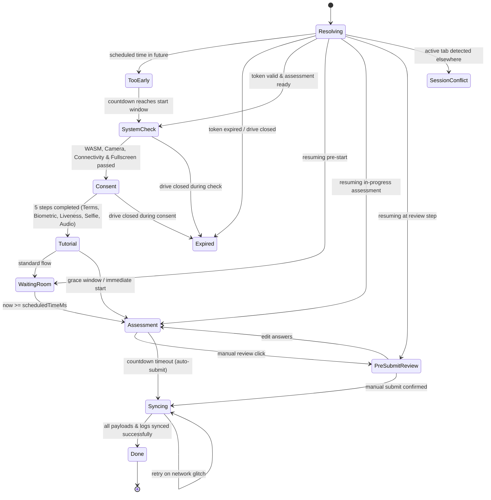

# CD-Recruit Candidate Workflow & API Contracts Specification

This document provides a comprehensive guide to the **Candidate Page Workflow** and the **Authoritative API Contracts / Swagger Specifications** for the CD-Recruit proctoring and assessment platform.

---

## 1. System Architecture & API Documentation Overview

### 1.1 Technology Stack & API Infrastructure
* **Frontend Framework:** React 18 + Vite, TypeScript, Tailwind CSS, Lucide Icons, Zustand (State Machine).
* **Backend Framework:** NestJS with TypeScript, Prisma ORM, PostgreSQL database, MinIO S3 object storage.
* **Proctoring & Scoring:** FaceDetectionService (Web Workers / OpenCV WASM), Web Audio API, Judge0 CE execution engine, Correlation Engine (AI evaluation).
* **API Base URL:** `http://localhost:3001/api/v1`
* **Swagger UI Documentation:** `http://localhost:3001/api-docs` (Served via `@nestjs/swagger` in `backend/api/src/main.ts`)
* **Authentication:** Candidate endpoints require a Bearer JWT (Keycloak-issued or derived from candidate invite token). Admin endpoints require `recruiter` or `admin` roles.
* **Content-Type:** `application/json` for all request/response bodies unless streaming media.

---

## 2. Candidate Page Workflow & State Machine

The candidate experience in `frontend/candidate-web` is governed by a strict Zustand state machine (`src/store/sessionMachine.ts`). The URL remains fixed (`/invite/:token` or `/start/:token`), while the screen is rendered conditionally based on `ScreenState`.



### 2.1 Screen State Progression Detail

| Journey Phase | Screen Key (`screen.type`) | React Component | Preconditions & User Actions | Next State / Transition |
|---|---|---|---|---|
| **1. Link Resolution** | `resolving` | `InviteResolver.tsx` | Resolves token from route params or `?token=`. Calls API to validate token. | `too-early`, `system-check`, `assessment` (if resuming), `expired`, `session-conflict` |
| **2. Too Early** | `too-early` | `TooEarlyScreen.tsx` | Scheduled start time is in the future. Displays live countdown & timezone warning. | `system-check` (auto-advances when within 2 min buffer) |
| **3. System Check** | `system-check` | `SystemCheckScreen.tsx` | Hardware verification: WASM support, Camera permission & stream check, Connectivity delay, Fullscreen API request. | `consent` (when all checks pass), `expired` |
| **4. Legal & Biometric Consent** | `consent` | `ConsentScreen.tsx` | 5 sub-steps: **Step 1:** Terms of Use; **Step 2:** Biometric Consent; **Step 3:** Liveness Challenge (Blink, Head Left, Head Right via FaceDetection); **Step 4:** Baseline Selfie Capture (JPEG stored in localStorage); **Step 5:** Audio/Microphone check. | `consent` (internal step increment) $\rightarrow$ `tutorial` |
| **5. Platform Tutorial** | `tutorial` | `TutorialScreen.tsx` | Interactive walkthrough explaining layout, timer rules, run vs submit actions, and sample practice MCQ. `full` mode (7 steps) or `condensed` mode (4 steps). | `waiting-room` or `assessment` |
| **6. Waiting Room** | `waiting-room` | `WaitingRoomScreen.tsx` | Pre-assessment landing card with high-contrast countdown, module overview list, and expandable FAQ. | `assessment` (auto-navigates on zero countdown) |
| **7. Assessment Interface** | `assessment` | `AssessmentScreen.tsx` | Core test-taking view wrapped in `ModuleShell`. Enables free navigation across questions & modules. Renders typed module component (MCQ, SQL, Coding, AI Prompting, Contextual Sim). | `pre-submit-review` (manual click) or `syncing` (timer expiration) |
| **8. Pre-Submit Review** | `pre-submit-review` | `PreSubmitReview.tsx` | Summary dashboard showing total answered, skipped, and flagged questions per module. Surfaces amber warning if unanswered questions exist. | `assessment` (to edit) or `syncing` (final confirm) |
| **9. Payload Syncing** | `syncing` | `SyncingScreen.tsx` | Multi-phase submit sequence: 1. Sync responses $\rightarrow$ 2. Post proctoring log events $\rightarrow$ 3. Submit code execution payloads $\rightarrow$ 4. Final integrity handshake. | `done` (on 200 OK across all APIs), retry on error |
| **10. Done / Thank You** | `done` | `DoneScreen.tsx` | Submission confirmation display, displays candidate reference ID, terminates media streams (`services.cv.stop()`), displays optional micro-survey. | Terminal state |
| **11. Session Conflict** | `session-conflict` | `SessionConflictScreen.tsx` | Single-active-tab guard fired via BroadcastChannel when a second browser tab is opened. | Restores state on tab claim |
| **12. Expired Link** | `expired` | `ExpiredScreen.tsx` | Displays notification when invite link expired, grace window lapsed, or drive closed. | Terminal state |

---

## 3. Assessment UI & Module Workflows

### 3.1 Shared Outer Chrome (`ModuleShell.tsx`)
All module types are embedded inside the `ModuleShell` container, which maintains session integrity and layout:
* **Header:** Displays Module Name, Question Count (`Q{n} of {total}`), Live Proctoring Camera Indicator, Countdown Timer, Theme Toggle (Light/Dark mode), and Final Review & Submit CTA.
* **Proctoring Camera Thumbnail (`ProctoringIndicator.tsx`):** Displays a $64 \times 48\text{ px}$ mirrored video feed in the header with a pulsing green/amber status indicator. Can be expanded into a floating $288\text{ px}$ panel.
* **Countdown Timer (`Timer.tsx`):** Monospace clock displaying remaining session time. Color changes from neutral $\rightarrow$ amber at 10 min $\rightarrow$ bold amber at 5 min $\rightarrow$ pulsing bold amber at 1 min. Triggers auto-submit to `syncing` state on expiration.
* **Navigation Palette (`QuestionPalette.tsx`):** Fixed left sidebar showing question status grid (Unvisited, Answered, Skipped, Flagged). Supports keyboard shortcut `F` to flag/unflag questions.

```
┌────────────────────────────────────────────────────────────────────────────────────────┐
│ [Logo] MCQ Module  Q1 of 5   [📷 Live Camera]  [⏱️ 01:25:40]  [🌓] [Final Review & Submit]    │
├─────────────────┬──────────────────────────────────────────────────────────────────────┤
│ QUESTION PALETTE│ QUESTION CONTENT PANEL                                               │
│                 │                                                                      │
│ 🟢 Answered (2) │ Question 1 of 5                                                      │
│ 🟡 Flagged  (1) │ What is the primary purpose of indexing in database systems?         │
│ ⚪ Unvisited (2) │                                                                      │
│                 │ [ ] A. To encrypt stored table data                                  │
│ [1] [2] [3]     │ [x] B. To speed up data retrieval operations                         │
│ [4] [5]         │ [ ] C. To enforce foreign key constraints                            │
│                 │ [ ] D. To automatically back up records                              │
│ Press 'F' to    │                                                                      │
│ flag question   │ [← Previous]                       [Flag]        [Save & Next →]     │
└─────────────────┴──────────────────────────────────────────────────────────────────────┘
```

### 3.2 Specific Module Behaviors

#### 1. MCQ Module (`MCQModule.tsx`)
* Fetches live question data via `GET /sessions/:sessionId/questions/:questionId`.
* Supports single-choice (radio) and multi-select (checkbox) options.
* Autosaves candidate selection on option click.

#### 2. SQL Query Module (`SQLModule.tsx`)
* Embeds Monaco SQL Editor with theme auto-synchronization.
* Loads client-side SQLite engine (`sql.js`) for instant query execution against seed data without network latency.
* Displays query output in a formatted mono table. Candidate clicks **Submit Answer** to record the final SQL query string.

#### 3. Coding Challenge Module (`CodingModule.tsx` & `CodingWorkspace.tsx`)
* Split-panel layout: Problem Statement, Constraints & Examples (Left) | Monaco Code Editor & Console (Right).
* Supports 4 programming languages: Python, JavaScript, Java, C++. Injects default starter code per language.
* **Run Code:** Submits draft code to backend `POST /sessions/:sessionId/responses/submit` (or Judge0 integration) and displays public test case results.
* **Paste Integrity Guard:** Intercepts `onPaste` events, recording paste length and time delta to report potential copy-pasting via `POST /sessions/:sessionId/events`.

#### 4. AI Prompting Module (`PromptingModule.tsx`)
* Candidate receives a scenario context card, system prompt objective, and evaluation criteria.
* Candidate drafts their prompt in a multi-line textarea.
* **Verbatim Detection:** Runs client-side token-overlap analysis. If $\ge 65\%$ match with generic template text, surfaces a "Direct Copy Detected / Socratic Mode Active" badge.
* Candidate submits prompt to receive AI-simulated model response.

#### 5. Contextual Simulation Module (`ContextualModule.tsx` & `InFictionInbox.tsx`)
* Simulates an in-fiction workplace communication environment (e.g., email inbox / Slack channel).
* Real-time message arrival powered by `ScenarioService` subscription.
* Candidate reviews incoming message threads and types structured replies to address workplace situations.

---

## 4. API Contracts & Swagger Endpoints Specification

Base URL: `http://localhost:3001/api/v1`  
Swagger UI: `http://localhost:3001/api-docs`

---

### 4.1 Session Lifecycle Endpoints

#### 1. Start Session
* **HTTP Method:** `POST`
* **Path:** `/sessions/start`
* **Summary:** Validates invite token, initializes Session (`NOT_STARTED` $\rightarrow$ `IN_PROGRESS`), sets `startedAt = now()`, and calculates `deadlineAt`.

**Request Body:**
```json
{
  "inviteToken": "eyJhbGciOi..."
}
```

**Response 201 Created:**
```json
{
  "sessionId": "b47c92a1-6380-4960-a292-66d10f545110",
  "candidateId": "c88f12a9-1123-4d76-8801-443219aa1234",
  "roleTemplateId": "r10023a4-8891-4500-a000-112233445566",
  "roleTemplateName": "Senior Full-Stack Engineer",
  "durationMinutes": 90,
  "cvMode": "FULL",
  "status": "IN_PROGRESS",
  "startedAt": "2026-08-06T10:00:00Z",
  "deadlineAt": "2026-08-06T11:30:00Z",
  "disconnectCount": 0,
  "questions": [
    { "questionId": "q101", "moduleType": "MCQ", "moduleIndex": 0 },
    { "questionId": "q102", "moduleType": "SQL", "moduleIndex": 0 },
    { "questionId": "q103", "moduleType": "CODING", "moduleIndex": 0 }
  ]
}
```

**Error Responses:**
* `400 Bad Request`: `INVITE_TOKEN_MISSING`
* `401 Unauthorized`: `INVITE_TOKEN_INVALID`
* `409 Conflict`: `SESSION_ALREADY_ACTIVE`
* `410 Gone`: `INVITE_TOKEN_EXPIRED`

---

#### 2. Resume Session
* **HTTP Method:** `POST`
* **Path:** `/sessions/:sessionId/resume`
* **Summary:** Resumes a `DISCONNECTED` session if reconnect window ($< 5\text{ min}$) is valid and `disconnectCount < 3`.

**Request Body:**
```json
{
  "sessionId": "b47c92a1-6380-4960-a292-66d10f545110",
  "tabId": "tab-uuid-88912"
}
```

**Response 200 OK:**
```json
{
  "sessionId": "b47c92a1-6380-4960-a292-66d10f545110",
  "status": "IN_PROGRESS",
  "deadlineAt": "2026-08-06T11:30:00Z",
  "disconnectCount": 1,
  "reconnectedAt": "2026-08-06T10:04:12Z",
  "questions": [ ... ]
}
```

---

#### 3. Heartbeat
* **HTTP Method:** `POST`
* **Path:** `/sessions/:sessionId/heartbeat`
* **Summary:** Sent every 15–30 seconds by the active tab. Updates `lastHeartbeatAt` and enforces single-active-tab restriction.

**Request Body:**
```json
{
  "sessionId": "b47c92a1-6380-4960-a292-66d10f545110",
  "tabId": "tab-uuid-88912"
}
```

**Response 200 OK:**
```json
{
  "ok": true,
  "sessionStatus": "IN_PROGRESS",
  "deadlineAt": "2026-08-06T11:30:00Z"
}
```

**Error Responses:**
* `409 Conflict`: `SECOND_TAB_DETECTED` (Sent when a different `tabId` is active).
* `422 Unprocessable Entity`: `SESSION_NOT_IN_PROGRESS`

---

#### 4. Get Session Progress
* **HTTP Method:** `GET`
* **Path:** `/sessions/:sessionId/progress`
* **Summary:** Returns completion status for all questions assigned to the session to populate sidebar colors.

**Response 200 OK:**
```json
{
  "sessionId": "b47c92a1-6380-4960-a292-66d10f545110",
  "items": [
    {
      "questionId": "q101",
      "moduleType": "MCQ",
      "moduleIndex": 0,
      "status": "submitted",
      "lastAutosavedAt": "2026-08-06T10:05:00Z"
    },
    {
      "questionId": "q103",
      "moduleType": "CODING",
      "moduleIndex": 0,
      "status": "draft",
      "lastAutosavedAt": "2026-08-06T10:14:22Z"
    }
  ],
  "answeredCount": 1,
  "totalCount": 3
}
```

---

#### 5. Close Session (Manual Submit)
* **HTTP Method:** `POST`
* **Path:** `/sessions/:sessionId/close`
* **Summary:** Finalizes the assessment session. Sets `status = SUBMITTED` and records `submittedAt = now()`.

**Response 200 OK:**
```json
{
  "sessionId": "b47c92a1-6380-4960-a292-66d10f545110",
  "status": "SUBMITTED",
  "submittedAt": "2026-08-06T11:20:00Z"
}
```

---

### 4.2 Question & Content Retrieval

#### Get Question Content
* **HTTP Method:** `GET`
* **Path:** `/sessions/:sessionId/questions/:questionId`
* **Summary:** Retrieves details for a specific question. Omits hidden test cases, correct indices, and scoring keys.

**Response 200 OK (Coding Question Example):**
```json
{
  "questionId": "q103",
  "roleTemplateId": "r10023a4-8891-4500-a000-112233445566",
  "content": {
    "moduleType": "CODING",
    "prompt": "Write a function `twoSum(nums, target)` that returns indices of the two numbers such that they add up to target.",
    "starterCode": {
      "python": "def twoSum(nums: list[int], target: int) -> list[int]:\n    pass",
      "javascript": "function twoSum(nums, target) {\n  // your code here\n}"
    },
    "testCases": [
      {
        "input": "nums = [2,7,11,15], target = 9",
        "expectedOutput": "[0, 1]",
        "label": "Example 1"
      }
    ],
    "constraints": ["2 <= nums.length <= 10^4", "-10^9 <= nums[i] <= 10^9"],
    "difficulty": "easy"
  }
}
```

---

### 4.3 Response Submission & Autosave Endpoints

#### 1. Save Draft Response (Autosave)
* **HTTP Method:** `POST`
* **Path:** `/sessions/:sessionId/responses/draft`
* **Summary:** Debounced autosave (triggered every 10–15 s during typing or on input blur). Updates `ModuleResponse` with `isDraft = true`.

**Request Body:**
```json
{
  "sessionId": "b47c92a1-6380-4960-a292-66d10f545110",
  "questionId": "q103",
  "responsePayload": {
    "moduleType": "CODING",
    "code": "def twoSum(nums, target):\n    seen = {}\n    for i, num in enumerate(nums):\n        diff = target - num\n        if diff in seen:\n            return [seen[diff], i]\n        seen[num] = i",
    "language": "python"
  },
  "timeSpentSeconds": 145
}
```

**Response 200 OK:**
```json
{
  "moduleResponseId": "mr-990123-abc",
  "isDraft": true,
  "lastAutosavedAt": "2026-08-06T10:14:22Z"
}
```

---

#### 2. Submit Response (Final)
* **HTTP Method:** `POST`
* **Path:** `/sessions/:sessionId/responses/submit`
* **Summary:** Marks `ModuleResponse` as final (`isDraft = false`). For `CODING` questions, synchronously invokes Judge0 CE execution.

**Request Body:** Same as Save Draft payload.

**Response 200 OK (Coding Submission Passed):**
```json
{
  "moduleResponseId": "mr-990123-abc",
  "isDraft": false,
  "executionResult": {
    "executionStatus": "PASS",
    "stdout": "Test cases passed: 1/1",
    "stderr": "",
    "allVisiblePassed": true
  }
}
```

---

### 4.4 Proctoring Event Ingestion

#### Record Proctoring Event
* **HTTP Method:** `POST`
* **Path:** `/sessions/:sessionId/events`
* **Summary:** Ingests proctoring alerts and integrity telemetry into the `EventLog` table. Fire-and-forget call from candidate client.

**Request Body:**
```json
{
  "eventType": "TAB_SWITCH",
  "payload": {
    "blurDurationMs": 3400,
    "target": "external_window"
  },
  "occurredAt": "2026-08-06T10:15:30.123Z"
}
```

**Supported Event Types:**
* **Proctoring Anomalies:** `TAB_SWITCH`, `PASTE`, `GAZE_DEVIATION`, `FACE_NOT_VISIBLE`, `MULTIPLE_FACES`.
* **Session Integrity Events:** `HEARTBEAT_MISSED`, `DISCONNECTED`, `RECONNECTED`, `GRACE_WINDOW_EXPIRED`, `AUTO_SUBMITTED`, `SECOND_TAB_DETECTED`, `DEADLINE_REACHED`.

**Response 204 No Content**

---

### 4.5 Judge0 Execution & Polling (CODING Only)

#### Poll Code Execution Result
* **HTTP Method:** `GET`
* **Path:** `/sessions/:sessionId/responses/:moduleResponseId/execution`
* **Summary:** If code submission to Judge0 times out ($\ge 8\text{ s}$), backend returns `executionStatus: "PENDING"`. Frontend polls this endpoint every 3 seconds until status resolves to `PASS`, `FAIL`, `COMPILE_ERROR`, or `TIME_LIMIT_EXCEEDED`.

**Response 200 OK:**
```json
{
  "moduleResponseId": "mr-990123-abc",
  "executionResult": {
    "executionStatus": "PASS",
    "stdout": "Test Output: [0, 1]",
    "stderr": "",
    "allVisiblePassed": true
  }
}
```

---

### 4.6 Admin & Scoring Endpoints

#### 1. List Candidate Sessions
* **HTTP Method:** `GET`
* **Path:** `/admin/sessions?page=1&pageSize=20&status=SUBMITTED`
* **Summary:** Admin list of candidate sessions with composite scores and integrity warning flags.

**Response 200 OK:**
```json
{
  "items": [
    {
      "sessionId": "b47c92a1-6380-4960-a292-66d10f545110",
      "candidateName": "John Doe",
      "candidateEmail": "john.doe@example.com",
      "roleTemplateName": "Senior Full-Stack Engineer",
      "status": "SUBMITTED",
      "startedAt": "2026-08-06T10:00:00Z",
      "submittedAt": "2026-08-06T11:20:00Z",
      "compositeScore": 0.88,
      "sayDoConsistencyScore": 0.92,
      "humanReviewRequired": false
    }
  ],
  "total": 1,
  "page": 1,
  "pageSize": 20
}
```

#### 2. Get Session Detail
* **HTTP Method:** `GET`
* **Path:** `/admin/sessions/:sessionId`
* **Summary:** Fetches session responses, recorded proctoring integrity flags, evidence video clip URLs, and AI module score breakdowns.

#### 3. Submit Reviewer Decision
* **HTTP Method:** `POST`
* **Path:** `/admin/sessions/:sessionId/decision`
* **Request Body:** `{ "decision": "ADVANCE" }` or `{ "decision": "REJECT" }`
* **Response 201 Created:** `{ "sessionId": "...", "decision": "ADVANCE", "decidedAt": "2026-08-06T12:00:00Z" }`

---

## 5. Verification & Compliance Checklist

* [x] **Swagger UI Integration:** Configured in NestJS `main.ts` via `SwaggerModule.setup("api-docs", app, document)`.
* [x] **Single-Tab Integrity:** Guaranteed by `POST /sessions/:sessionId/heartbeat` and `SessionConflictScreen.tsx`.
* [x] **Automatic Failover:** Disconnect grace window (5 min) handles unexpected connection drops.
* [x] **Data Privacy & Cleanup:** Camera & microphone streams released upon transition to `done` state via `services.cv.stop()`.
