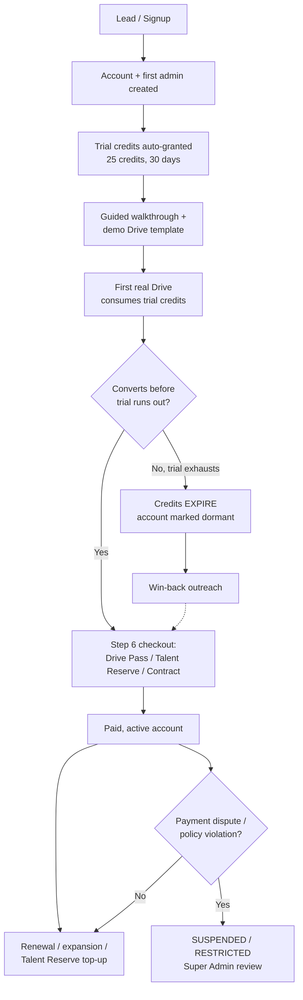

# CD-Recruit — Super Admin Panel, Client Onboarding & Trial Plan

This plans the piece that doesn't exist anywhere yet: the panel **Proctora's own team** uses to manage tenants, run onboarding, and operate the business — as distinct from the Admin Dashboard already speced for a *client's* own recruiters. It builds directly on the locked decisions in `PRICING_AND_CREDIT_POOL_SPECIFICATION.md` and its plain-English companion, reusing the entities, roles, and enums already defined there rather than inventing parallel ones.

Scoped deliberately at product/ops level — flow, features, and the data each screen needs — not schema or API detail. That's the natural next document once the open calls below are made, same pattern as every other doc in this set.

Companion docs: `PRICING_AND_CREDIT_POOL_SPECIFICATION.md`, `PROCTORA_PRICING_AND_CREDIT_SYSTEM_EXPLAINED.md`, `CD-Recruit_Admin_Dashboard_IA_Review_and_Walkthrough.md`.

---

## 0. Two Panels, Two Audiences

Worth stating before anything else, because the pricing spec's `StaffRole` names invite exactly this confusion — the same way "Drive vs. Session" did in the Admin Dashboard doc.

| | Admin Dashboard (already speced) | Super Admin Panel (this doc) |
|---|---|---|
| Who uses it | A *client's* own team — `RECRUITER`, `HR_ASSOCIATE`, that client's `BILLING_ADMIN` | **Proctora's own staff** — `ADMIN` (Platform Support), `SUPER_ADMIN` (Platform Finance), plus one new internal role recommended below |
| Scope | One `BillingAccount`, one Organization's Drives/candidates | Every tenant — every Organization, every `BillingAccount`, across the whole platform |
| Manages | Drives, candidates, reports, their own credit balance | Tenant lifecycle, onboarding, trials, pricing, the ledger, platform health |
| Already speced in | `CD-Recruit_Admin_Dashboard_IA_Review_and_Walkthrough.md` | Nowhere — this document |

A client's `BILLING_ADMIN` can see *their own* ledger and buy *their own* credit packs. They can't see another tenant, edit a price book, or approve a manual grant on someone else's account. That authority lives only in the Super Admin Panel, gated to Proctora's internal roles. Build this as a genuinely separate app/route family behind Keycloak, not a hidden tab inside the existing Admin Dashboard — same isolation logic already applied to the Judge0 sandbox host: the one surface with the highest blast radius if a permission check is ever wrong deserves its own boundary, not a role flag inside a shared codebase.

---

## 1. Guiding Principle: Extend "Draft Free, Pay at Launch" to Onboarding Itself

The pricing spec's whole philosophy is *defer friction until money actually moves* — Drive setup is free, invites are free, and real payment only happens at Step 6 checkout. The same logic should govern how a *tenant* gets onboarded, not just how a *drive* gets funded:

- Signing up, verifying a work email, and getting the first admin logged in should require **zero** billing-entity paperwork.
- Full KYC — legal entity name, tax ID/GSTIN/EIN, `billingCountry` — should only be collected at the point the account needs to do something that touches real money: buying a paid pack, or converting past trial. This is the same "Instant Drive Pass... exact seat billing" JIT pattern already locked in Section 5.2 of the pricing spec, applied one layer up.
- Trial credit is free, capped, and automatic — it's policy-bound, not discretionary, so it never needs the maker-checker flow the rest of the ledger enforces. That distinction matters and is worth keeping explicit (Section 4).

Everything below follows from this one call.

---

## 2. Full Client Lifecycle

---

## 3. Stage-by-Stage Onboarding Flow

| Stage | What happens | Data touched |
|---|---|---|
| **1. Signup** | Company name + work email domain captured. No card, no tax ID required yet. Self-serve form or Proctora sales/support creates the account manually from the Super Admin Panel. | New `Organization` + `BillingAccount` (minimal fields only — `billingCountry` left provisional/unverified). |
| **2. First admin & access** | An invite goes to the signup email. First user sets a password (pre-Keycloak-cutover: dev-JWT flow, per the current auth state). | First tenant user created, tied to the new Organization. |
| **3. Trial activation** | System auto-grants a `TRIAL` `CreditPool`: 25 credits, 30-day validity, one per verified domain. Fully automatic — `GrantSource.TRIAL`, actor = `system`, no maker-checker (it's policy-capped, not discretionary). | `CreditPool` row; `GRANT` ledger entry; `BillingAccount.trialDomain` set. |
| **4. Guided walkthrough** | In-app tour + a pre-loaded demo Drive template (Section 5). Admin can click through the candidate experience for free using `SessionKind.PREVIEW` before spending a single trial credit. | Walkthrough-completion flags (new field, Section 8). |
| **5. First real Drive** | Admin builds or reuses the demo template, uploads a small candidate batch, sends invites. First trial credits actually get consumed here. | `Drive`, `Invite`, `CONSUME` ledger entries. |
| **6. Conversion nudges** | Automatic prompts at defined thresholds — e.g. <20% trial credits remaining, or 7 days before the 30-day expiry — surfaced to the client *and* flagged on the Super Admin dashboard for outreach. | Trigger fields, Section 8. |
| **7. Conversion / purchase** | Same Step 6 checkout flow already speced — Drive Pass, Talent Reserve, or Enterprise Contract/PO. This is the point full billing-entity KYC (legal name, tax ID) actually gets collected. | `BillingAccount.hasPaidPurchase = true`; `billingCountry` locked in; `Payment` + `CreditPool(DRIVE_PASS/TALENT_RESERVE)`. |
| **8a. No conversion — trial lapses** | 30 days pass with credits unused or exhausted. `EXPIRE` ledger entry fires automatically. Account is not deleted — it's marked dormant and stays visible in the Super Admin Panel's lapsed-trial view for win-back. | `EXPIRE` entry; lifecycle-stage field flips to dormant. |
| **8b. Post-conversion ops** | Ongoing renewal reminders (Talent Reserve nearing expiry), capacity monitoring during hiring waves, standard account management. | Same entities as the existing pricing spec — no new lifecycle needed here. |

---

## 4. Trial Policy — the Specifics

Already locked in the pricing spec (Section 11, item 9): **25 credits, 30-day validity, one per verified corporate email domain.** What this document adds is how that plays out operationally:

- **Domain gating, two layers.** First line: reject known free/personal email domains (gmail, outlook.com, etc.) at signup — work email only. Second line: the existing `trialDomain` unique constraint on `BillingAccount` is the hard stop against the same company re-running the trial through a second employee's email.
- **Manual override exists, but goes through maker-checker.** A legitimate second trial (e.g. a genuinely separate subsidiary sharing a parent domain) should be possible, but only via Platform Support (`ADMIN`) filing a `ManualBillingRequest` with a ticket reference, approved by `SUPER_ADMIN` — same dual-authorization the rest of the ledger already requires for anything discretionary. The *automatic* 25-credit grant never needs this; a manual *override* of the domain-uniqueness rule does.
- **First-user access level — recommend a combined "Owner" role for trial.** The pricing spec's tenant-side roles are `RECRUITER`/`HR_ASSOCIATE` (create drives, see the credit badge) and `BILLING_ADMIN` (purchase packs, view ledger) as separate roles. Making a brand-new trial signup coordinate two people to spend a 25-credit trial is unnecessary friction — recommend the first trial user holds all tenant-side capabilities at once (an `OWNER`-style role, or all three flags bundled), with the option to invite a dedicated billing contact once the account is real. **[Your call]** — flagged in Section 12.
- **Card required at trial start, or not?** Two real options: a true no-card trial (higher signup conversion, some risk of throwaway accounts) vs. card-on-file-but-not-charged (lower signup friction reduction, but a cleaner path straight into Step 6 checkout later). **[Your call]** — recommend no-card, since the domain-uniqueness rule plus the 5:1 invite bloat-guard already limit abuse without needing a card at this stage.

---

## 5. The Walkthrough — What It Actually Needs to Contain

The goal isn't a generic product tour — it's getting a new admin to *see the Say-Do score on a real report* as fast as possible, since that's the actual thing being sold.

1. **One-screen context, not a slideshow.** What Proctora measures and why (the Say-Do gap), before any UI is shown.
2. **Pre-loaded demo Drive.** Reuse the existing "Template Drive (Pre-built)" intake channel from the pricing spec's four-channel model — the admin never has to author their own questions to see the product work.
3. **Free preview before real spend.** `SessionKind.PREVIEW` already exists in the schema (free, watermarked, no grading) — let the admin click through the entire candidate experience themselves before a single trial credit is on the line. This is the cheapest possible way to build trust in the flow before it costs anything.
4. **A small first real batch.** Guide them to invite a handful of real candidates (5–10, not their whole pipeline) so the trial's 25 credits stretch across a couple of real learning moments rather than being spent in one shot.
5. **The actual "aha" — a completed Report.** Once one candidate finishes, trigger a contextual nudge ("your first candidate report is ready") rather than relying on a static, one-time tour. This is the moment that should convert intent into a habit.

---

## 6. Super Admin Panel — Sitemap & Feature Modules

| Route | Page | Purpose |
|---|---|---|
| `/platform/dashboard` | Global Dashboard | Action queue — what needs attention today, platform-wide |
| `/platform/tenants` | Tenants | Every Organization/BillingAccount, searchable |
| `/platform/tenants/:id` | Tenant Detail | One account's full picture — pools, ledger, users, drives, onboarding stage |
| `/platform/onboarding` | Onboarding Pipeline | Kanban of accounts by lifecycle stage |
| `/platform/billing` | Billing & Plans | Payments, price book, pending manual requests |
| `/platform/finance` | Finance & Ledger | Reconciliation status, ledger explorer, margin alarms |
| `/platform/metrics` | Global Metrics | Cross-tenant usage, capacity, funnel |
| `/platform/support` | Support & Escalations | HOLD queue, waiver approvals |
| `/platform/staff` | Staff & Roles | Internal `StaffRole` management, audit log |
| `/platform/settings` | Platform Settings | Trial policy, price book versions, bloat-guard ratios |

### 6.1 Global Dashboard
The Section 0 principle in action: an action queue, not a stats wall. Surfaces — pending maker-checker approvals older than X hours, trials expiring within 7 days with no Drive created yet, accounts currently in HOLD, and last night's reconciliation pass/fail (Section 9.2 of the pricing spec already defines the 7-point check — this is just where its result becomes visible to a human).

### 6.2 Tenants
List every Organization/BillingAccount with status, plan type (trial / Drive Pass / Talent Reserve / Enterprise), lifetime credits purchased, and last activity. Drill into one tenant to see everything about it in one place — this is the direct counterpart to the Admin Dashboard's per-client Reports view, but one level up.

### 6.3 Onboarding Pipeline
A Kanban-style board by lifecycle stage (Signed Up → Trial Active → First Drive Created → Converted → Dormant), same pattern already used for Drives in the Admin Dashboard doc. This is where a Platform Support person spots a trial that's stalled and reaches out before it lapses.

### 6.4 Billing & Plans
Where the pricing spec's existing entities get a UI: `Payment` records, `PriceBookEntry` management (regional pricing, versioned), and — the highest-stakes screen in this whole panel — the `ManualBillingRequest` maker-checker queue. Every manual grant, adjustment, refund, or expiry extension shows here as a pending item, requiring an approver who isn't the requester (R8, already locked).

### 6.5 Finance & Ledger
The nightly 7-point reconciliation job's results, a searchable ledger explorer (by account, pool, or session), and the margin-alarm telemetry already speced in Section 8.4 of the pricing spec (AI cost exceeding 25% of unit credit price). This is the screen Platform Finance lives in.

### 6.6 Global Metrics
Covered in detail in Section 10 below.

### 6.7 Support & Escalations
The HOLD queue across every tenant (candidates waiting on capacity), and the courtesy-waiver approval queue (5%-cap reattempts, `HARDWARE_OTHER` reason requiring `BILLING_ADMIN`-equivalent approval per the pricing spec).

### 6.8 Staff & Roles
Who at Proctora has `ADMIN` or `SUPER_ADMIN` access, and a full audit log of every action taken in this panel — every grant, every approval, every status change. This is the internal equivalent of the client-facing Admin Dashboard's own Audit Log (Section 7 of the Admin Dashboard doc), scoped to Proctora's own staff instead of a client's recruiters.

### 6.9 Platform Settings
Trial credit amount and duration (currently 25 / 30 days — should be admin-editable, not hardcoded, same reasoning already applied to the AI-confidence threshold in the client-facing Settings page), price book versioning, and the 5:1 invite bloat-guard ratio.

---

## 7. Roles Recap — Tenant-Side vs. Platform-Side

Worth a single clarifying table, since the pricing spec's `StaffRole` enum mixes both audiences in one list:

| Role | Side | Can do |
|---|---|---|
| `RECRUITER` / `HR_ASSOCIATE` | Tenant | Create drives, view own credit badge, request waivers within cap |
| `BILLING_ADMIN` | Tenant | View own ledger, buy own credit packs, approve own out-of-cap waivers |
| *(recommended)* `OWNER` | Tenant | All of the above combined — the trial-friendly first-user role from Section 4 |
| `ADMIN` | **Platform** | Manual credit/adjustment requests (maker), cross-tenant support actions, mandatory ticket reference |
| `SUPER_ADMIN` | **Platform** | Approve manual requests (checker), pricing/settings changes, full platform visibility |

Nothing here removes or renames what's already locked in the pricing spec — the only addition is the `OWNER` role recommendation flagged as an open call.

---

## 8. Data Not Yet Covered by the Pricing Spec

The pricing spec is thorough on the financial ledger but has nothing for onboarding state. These are genuinely new, small additions — no changes to anything already locked:

| Where it lives | New field (plain English) | Why |
|---|---|---|
| `Organization` | Lifecycle stage (signed-up / trial-active / converted / dormant / churned) | The existing `BillingAccountStatus` enum (ACTIVE/RESTRICTED/SUSPENDED) answers "can they transact," not "where are they in the funnel" — these are two different questions and need two different fields. |
| `Organization` | Domain-verified flag + timestamp | Backs the trial-uniqueness rule with an actual verification event, not just the DB constraint. |
| `Organization` | Walkthrough-completed flag + timestamp | Lets the onboarding pipeline (6.3) distinguish "signed up, never opened the tour" from "toured, never made a Drive." |
| `Organization` | Internal owner (which Proctora staff member owns this relationship) | Needed the moment there's more than one Platform Support person — without it, a stalled trial has no clear owner to chase it. |
| `Organization` | Trial-conversion nudge log (which threshold nudges have fired) | Prevents double-sending the same "your trial is expiring" prompt and gives Section 10's funnel metrics something to count. |

---

## 9. Account Lifecycle States — Beyond Onboarding

Once an account is past onboarding, it still needs states the current billing-status enum doesn't fully cover:

- **Dormant** (trial lapsed, never converted) — distinct from `SUSPENDED` (a payment dispute or policy issue). Dormant accounts are a sales target, not a compliance problem; conflating the two in the UI would send the wrong team to the wrong account.
- **Restricted vs. Suspended, surfaced clearly** — both already exist in `BillingAccountStatus`, but the Super Admin Panel should show *why* a given account is in that state (overdraft aged past 14 days vs. an active fraud/payment-dispute lock are very different next actions).
- **Reactivation path** — a dormant account converting later should re-enter the normal Section 3 flow at Stage 7, not restart onboarding from Stage 1.

---

## 10. Metrics That Belong on the Super Admin Dashboard

Grouped by what kind of question they answer:

**Trial funnel** — signups → trial-active → first-drive-created → converted, as both counts and conversion rates between each step. This is the number that tells you whether the walkthrough (Section 5) is actually working.

**At-risk accounts** — trials expiring within 7 days with no Drive created yet; trials under 20% credits remaining with no purchase intent signal. This is what turns the Onboarding Pipeline (6.3) from a status board into an actual to-do list.

**Cross-tenant capacity** — HOLD queue depth right now, sandbox/Judge0 utilization, grading-queue backlog. This is platform health, not any single tenant's problem, and needs its own view since a capacity issue during one client's campus drive can be caused by load from a completely different tenant.

**Revenue & unit economics** — credits sold by plan type and region, `hasPaidPurchase` rate, and the margin-alarm telemetry already speced (AI cost vs. credit price). This is the number Platform Finance actually watches day to day.

**Governance health** — pending `ManualBillingRequest` approvals and their age, last night's 7-point reconciliation result. If either of these goes red, it's a bigger problem than any single metric above.

---

## 11. Suggested Build Order

1. **Tenant + Billing Account CRUD** — the floor. Nothing else works without a way to look at and create tenants.
2. **First-user provisioning + automatic trial grant** — gets a real client from signup to a usable account.
3. **Onboarding pipeline view + walkthrough** — closes the loop on Section 3–5; this is what actually drives trial-to-paid conversion.
4. **Billing & Plans, including the maker-checker queue** — needed before any manual money touches a real account.
5. **Global Metrics dashboard** — needs the above to have real data to show; building it first means staring at empty charts, same lesson already learned on the client-facing Admin Dashboard.
6. **Finance & Ledger, reconciliation surfacing** — operational hardening once volume exists.
7. **Staff & Roles, audit log** — lowest urgency, same reasoning as Settings & Admin in the client-facing dashboard, but stub the audit log early so other features are writing to it from day one.

---

## 12. Open Decisions Requiring Your Sign-Off

1. **First-user role for trial accounts** — a combined `OWNER`-style role (recommended) vs. requiring the client to designate separate recruiter/billing contacts from day one.
2. **Card-on-file at trial signup or not** — recommend no-card, relying on domain-uniqueness + the existing invite bloat-guard.
3. **Self-serve signup vs. sales-assisted-only vs. both** — changes whether Stage 1 needs a public signup form at all, or whether every account starts life created manually from the Super Admin Panel by Platform Support.
4. **Trial credit amount/duration as admin-editable Platform Setting** — recommend yes, same reasoning as the client-facing AI-confidence threshold already being made admin-editable rather than hardcoded.
5. **Second-trial override policy** — confirm it goes through the same `ManualBillingRequest` maker-checker path as any other discretionary grant, with mandatory ticket reference.
6. **Dormant-account win-back cadence** — how many nudges, over what window, before a lapsed trial is considered closed rather than just quiet.

---

*This document is a flow-and-feature plan, not a final build spec — schema, API surface, and screen-level detail are the natural next step once Section 12's calls are made, same pattern as every other doc in this set.*
