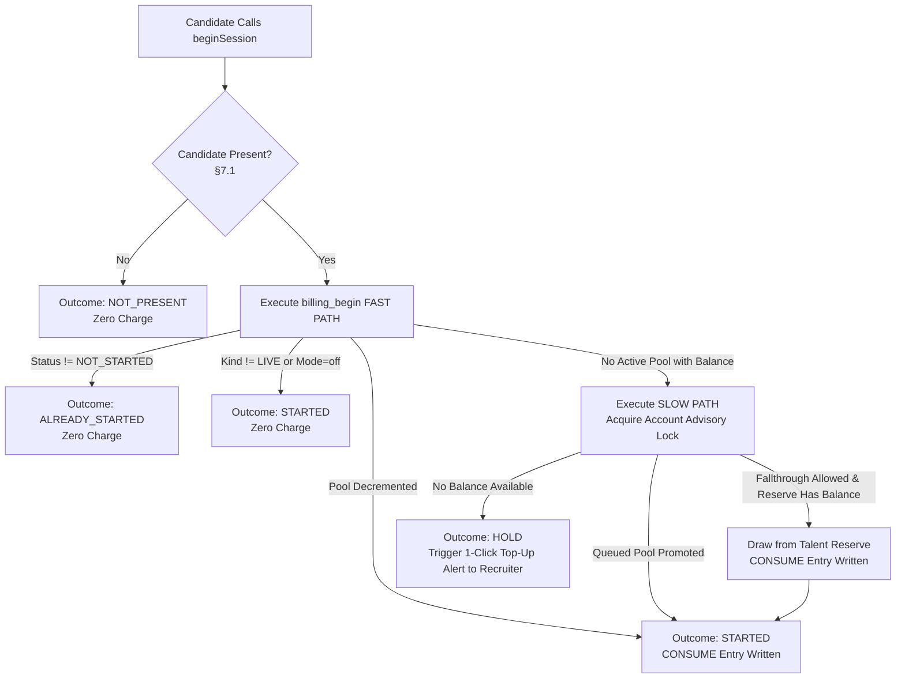

# Proctora — Complete Pricing, Assessment Credit Pools & Usage Architecture Specification

> **Document Status:** Master Architecture & Implementation Specification (v3 Fix Specification Applied)  
> **Target System:** Proctora Assessment Platform (`backend/api`, `frontend/admin-web`, `frontend/candidate-web`)  
> **Classification:** Commercial Product Design, Financial Ledger & High-Concurrency Distributed Architecture  
> **Effective Date:** September 2026  
> **Rule of Precedence:** This v3 document is authoritative. Where any prior draft or notes conflict with this specification, this specification wins.

---

## 0. Architectural Principles & Global Invariants

These nine rules apply across all schemas, APIs, background workers, and user interfaces:

| # | Invariant Rule | Rationale & Architectural Enforcement |
|---|---|---|
| **R1** | **Whole-Number Credits (`Int`).** | Drop `Decimal` and fractional credits. Eliminate the "AI Interviewer Tier (1.5 credits)". If micro-pricing is ever needed in the future, migrate to integer "credit units" (1 credit = 100 units). Prevents IEEE-754 floating-point drift and decimal rounding bugs in TypeScript money math. |
| **R2** | **The Ledger is the Single Source of Truth.** | `credit_pool.cached_remaining` and `billing_account.overdraft_used` are fast read caches, written **only** by `LedgerService` within the exact same database transaction as the ledger row insertion. Reconciled nightly via automated ledger replay (§9.4). |
| **R3** | **Never Use `NOW()` Where Timing Matters.** | In PostgreSQL, `NOW()` returns the *transaction start time*. If a start transaction waits 1.5 seconds for a lock, `NOW()` steals 1.5 seconds from the candidate. Always use `clock_timestamp()` for `started_at`, expiry boundaries, and event logging. |
| **R4** | **Strict, Global Lock Hierarchy.** | One lock order across the entire platform: **BillingAccount Advisory Lock $\rightarrow$ Session Row $\rightarrow$ CreditPool Row(s) $\rightarrow$ Ledger Row Insert**. Holding a later lock while acquiring an earlier lock is strictly prohibited, mathematically preventing deadlocks. |
| **R5** | **Zero Foreign Keys from Ledger to Transient Entities.** | Ledger rows carry plain UUID snapshots (`session_id`, `candidate_id`, `drive_id`, `organization_id`) with **no foreign keys**. Foreign keys exist only to `BillingAccount`, `CreditPool`, `Payment`, `ManualBillingRequest`, and itself (`Restrict`). GDPR erasure requests and retention purges will never fail or delete financial audit trails. |
| **R6** | **All Enforcement is Server-Authoritative.** | UI badges, wizard calculators, and client estimators mirror server rules. Every entry point (Manual Admin UI, CSV ingestion, Template creation, and Partner ATS API) executes through the exact same server-side domain services. |
| **R7** | **Candidate APIs are 100% Billing-Blind.** | Candidate-facing DTOs, WebSockets, and responses never carry credit balances, token counts, or pricing fields. Candidate start attempts map strictly to `{ state: 'STARTED' | 'HOLD' | 'NOT_PRESENT' | 'RETRY' }`. Enforced via CI contract tests (§9.6). |
| **R8** | **Maker-Checker Dual Authorization for All Manual Money.** | Every manual credit creation, adjustment, refund, and expiry extension requires two distinct actors (`requested_by_id != approved_by_id`). No single super-admin can mint or destroy credits. |
| **R9** | **Honest Capability Standards.** | Marketing copy, UI modals, and documentation state: *"Designed to prevent double-billing; verified by nightly reconciliation and chaos testing."* Never use unprovable claims like *"bulletproof"* or *"unhackable"*. |

---

## 1. Commercial Context: The Assessment Credit & The Two Plans

Proctora evaluates candidates through multi-skill modules (MCQ, SQL, Coding, AI Prompting, Contextual Simulation) backed by automated proctoring (camera presence, tab-switch monitoring, and 10-second anomaly evidence clips).

```
                             THE BILLABLE UNIT
            ┌──────────────────────────────────────────────────┐
            │   1 Assessment Credit = 1 Live Candidate Attempt │
            └──────────────────────────────────────────────────┘
```

### The Two Commercial Products
1. **Plan A — Drive Pass (Event-Anchored / Campus Pass):**
   * **Draft Free, Pay at Launch:** Drive setup (Steps 1–5) is 100% free. The pass is instantiated at Step 6 ("Review & Launch") based on the exact valid candidate count (e.g., 173 seats), eliminating under/over-buying guesswork. Alternatively, enterprise pre-funded balances auto-apply.
   * **7-Day Makeup Window:** Fixed calendar validity (`expiresAt = drive.schedule_end + INTERVAL '7 days'`). Unconsumed credits remain active for 7 days post-drive to run makeup sessions or Round 2 tests for the same drive, OR apply towards another campus drive within that 7-day window. Unused credits lapse after 7 days (strictly eliminating cross-tier price arbitrage with Talent Reserve).
   * **Isolated Multi-Drive Execution:** Locked to `driveId`. Each drive maintains an independent seat counter; candidates in Drive A never consume from Drive B.
2. **Plan B — Talent Reserve (Flexible Enterprise Pool):**
   * Purchased for ongoing lateral hiring (e.g., *1,000 assessments valid for 180 days*).
   * Sequential floating clock: validity starts upon **first draw** or **`purchasedAt + maxWaitDays`** (12 months), whichever is earlier.
   * Usable across all standard drives, roles, and departments. Queued sequentially behind active reserve packs ("Jio Model").

### The Problem with Seat-Based SaaS
Traditional user subscriptions (`user.plan = 'ENTERPRISE'`) fail in recruitment:
* Recruitment hiring surges are bursty: a company may assess 5,000 campus graduates in September and 20 lateral hires in November.
* Companies think in **candidate throughput**, not monthly recruiter seats.
* Decoupling organizations into **Billing Accounts** and **Credit Pools** lets one parent company or staffing agency pay for multiple client organizations without messy data re-architecture.

---

## 2. Infrastructure Cost Realities & The 1.0 Credit Standard

### Why Video Proctoring Does Not Justify 1.5 Credits
In Proctora, automated proctoring is a core brand promise. Every assessment includes webcam presence detection, tab-switch monitoring, and 10-second WebM evidence clips on anomaly. Treating video clips as an "add-on" would make *every test default to 1.5 credits*, destroying predictable pricing.

```
┌────────────────────────────────────────────────────────────────────────┐
│               ACTUAL INFRASTRUCTURE COST PER 90-MIN SESSION            │
├──────────────────────────┬──────────────────────┬──────────────────────┤
│ Component                │ Execution Location   │ Marginal Cost ($)    │
├──────────────────────────┼──────────────────────┼──────────────────────┤
│ Face Tracking/MediaPipe  │ Candidate Browser    │ $0.00 (Client GPU)   │
│ 10s WebM Video Clips     │ MinIO S3 (2-5 clips) │ < $0.003 (Negligible)│
│ Postgres Sandboxed SQL   │ Dedicated DB Schema  │ < $0.001 (10ms CPU)  │
│ Judge0 Code Execution    │ Isolated Docker CPU  │ $0.010 (Moderate)    │
│ LLM Free-Text Grading    │ Claude / OpenAI API  │ $0.030 - $0.080      │
└──────────────────────────┴──────────────────────┴──────────────────────┘
```

### The Flat 1.0 Credit Rule
$$\mathbf{1\text{ Live Candidate Assessment Attempt} = 1\text{ Credit Flat}}$$
* Standard proctoring, webcam checks, 10-second anomaly clips, MCQ, SQL, Coding, and standard prompt grading are **all included in the 1 Credit baseline**.
* **Removal of "AI Interviewer Tier":** Live multi-turn conversational LLM generation inside an active session contradicts Proctora's locked architectural principle (*no non-deterministic live LLM in candidate testing path*). All LLM evaluation happens asynchronously post-test during grading. Hence, the 1.5 credit tier is permanently removed.
* **Variable Cost Safeguards (§8.4):** Flat pricing is safeguarded by hard server-side token ceilings, response length limits, and a maximum of two automated grading retries.

---

## 3. Database Schema v3

### 3.1 Prisma Schema (`backend/prisma/schema.prisma`)

```prisma
enum LedgerEntryType {
  GRANT              // +n   credits added (PURCHASE, TRIAL, PROMO, MIGRATION, etc.)
  CONSUME            // -1   LIVE attempt started, drawn from an active pool
  OVERDRAFT          // -1   LIVE attempt started beyond capacity; debt on BillingAccount (pool is null)
  OVERDRAFT_SETTLE   // -n   deducted from a newly granted pool; nets down overdraft debt
  WAIVE              //  0   recruiter-approved courtesy reattempt (capped at 5%, audited)
  REVERSAL           // +1   returns an acquired credit (platform fault / approved dispute)
  REFUND             // -n   unused credits removed because cash was refunded to customer
  EXPIRE             // -n   remaining unconsumed credits expired at deadline
  ADJUST             // +-n  manual correction (strictly maker-checker)
}

enum GrantSource {
  PURCHASE
  CONTRACT
  TRIAL
  PROMO
  GOODWILL
  MIGRATION
  ROLLOVER
}

enum LedgerReason {
  ATTEMPT_START
  OVERDRAFT_USED
  HARDWARE_CAMERA_FAILURE
  HARDWARE_OTHER
  PLATFORM_FAULT
  INCIDENT_WINDOW
  DISPUTE_RESOLVED
  PAYMENT_CAPTURED
  PAYMENT_REFUNDED
  CHARGEBACK
  POOL_EXPIRED
  ROLLOVER
  TRIAL
  PROMO
  GOODWILL
  MIGRATION_SEED
  MANUAL_CORRECTION
}

enum PoolType {
  DRIVE_PASS
  TALENT_RESERVE
  ENTERPRISE
}

enum PoolStatus {
  QUEUED             // Purchased, waiting in line
  ACTIVE             // Currently accepting candidate start claims
  SUSPENDED          // Frozen due to payment dispute/chargeback
  EXHAUSTED          // 0 cached_remaining credits
  EXPIRED            // Validity deadline reached
  CANCELLED          // Refunded or administratively closed
}

enum SessionKind {
  LIVE               // Real candidate attempt (BILLABLE)
  PREVIEW            // Recruiter previewing questions (FREE, watermarked, no grading)
  SANDBOX            // Automated QA, k6 load scripts, dev runs (FREE, rejected in prod)
}

enum BillingAccountStatus {
  ACTIVE
  RESTRICTED         // Overdraft aged > 14 days; cannot schedule drives or invite
  SUSPENDED          // Payment dispute / fraud lock
}

enum DrivePoolFallthrough {
  ALLOW              // Exhausted Drive Pass falls through to Talent Reserve
  HOLD               // Exhausted Drive Pass puts candidate into polite HOLD screen
}

enum PaymentProvider {
  RAZORPAY
  STRIPE
  MANUAL_INVOICE
}

enum PaymentStatus {
  CREATED
  CAPTURED
  FAILED
  REFUNDED
  PARTIALLY_REFUNDED
  DISPUTED
}

enum ManualRequestKind {
  GRANT
  ADJUST
  REFUND
  EXPIRY_EXTEND
  OVERDRAFT_LIMIT
  ACCOUNT_STATUS
  BILLING_COUNTRY
}

enum ManualRequestStatus {
  PENDING
  APPROVED
  REJECTED
  EXECUTED
  CANCELLED
}

enum SessionEndReason {
  SUBMITTED
  TIME_EXPIRED
  ABANDONED
  CANDIDATE_LEFT
  PLATFORM_FAULT
}

enum HoldReason {
  CAPACITY
}

/// The payer entity. 1:1 with Organization by default; decouples payer from tenant orgs.
/// Holds overdraft balances and tax/country pricing anchor.
model BillingAccount {
  id               String               @id @default(uuid())
  name             String
  legalEntityName  String?              @map("legal_entity_name")
  billingCountry   String               @map("billing_country") // From legal entity + tax ID, NOT IP.
  currency         String               @default("INR")
  taxId            String?              @map("tax_id")          // e.g. GSTIN / EIN
  status           BillingAccountStatus @default(ACTIVE)
  overdraftLimit   Int                  @default(0) @map("overdraft_limit") // Absolute ceiling; 0 = disabled
  overdraftUsed    Int                  @default(0) @map("overdraft_used")  // Fast cache of debt
  hasPaidPurchase  Boolean              @default(false) @map("has_paid_purchase")
  trialDomain      String?              @unique @map("trial_domain")       // 1 trial per verified domain
  trialGrantedAt   DateTime?            @map("trial_granted_at")
  createdAt        DateTime             @default(now()) @map("created_at")

  organizations    Organization[]
  pools            CreditPool[]
  ledgerEntries    CreditLedgerEntry[]
  payments         Payment[]

  @@map("billing_account")
}

model CreditPool {
  id               String      @id @default(uuid())
  billingAccountId String      @map("billing_account_id")
  driveId          String?     @map("drive_id")         // DRIVE_PASS only. Plain UUID snapshot. Immutable.
  poolType         PoolType    @map("pool_type")
  name             String
  source           GrantSource
  totalCredits     Int         @map("total_credits")     // Initial opening credits. Immutable.
  cachedRemaining  Int         @map("cached_remaining")  // Fast read cache; CHECK (cached_remaining >= 0)
  validityDays     Int?        @map("validity_days")
  maxWaitDays      Int         @default(365) @map("max_wait_days")
  queueOrder       Int?        @map("queue_order")       // Order for promotion; assigned under account lock
  status           PoolStatus  @default(QUEUED)
  purchasedAt      DateTime    @default(now()) @map("purchased_at")
  clockStartedAt   DateTime?   @map("clock_started_at")  // First draw OR purchasedAt + maxWaitDays
  activatedAt      DateTime?   @map("activated_at")      // Promoted to ACTIVE
  expiresAt        DateTime?   @map("expires_at")        // Hard deadline calculated at clock start
  unitPriceMinor   Int?        @map("unit_price_minor")  // Minor currency units (paise/cents) at purchase
  currency         String?
  paymentId        String?     @map("payment_id")
  termsVersion     String?     @map("terms_version")
  termsAcceptedBy  String?     @map("terms_accepted_by")
  termsAcceptedAt  DateTime?   @map("terms_accepted_at")
  createdAt        DateTime    @default(now()) @map("created_at")

  billingAccount   BillingAccount      @relation(fields: [billingAccountId], references: [id], onDelete: Restrict)
  payment          Payment?            @relation(fields: [paymentId], references: [id], onDelete: Restrict)
  ledgerEntries    CreditLedgerEntry[]

  @@index([billingAccountId, status])
  @@index([driveId])
  @@map("credit_pool")
}

model CreditLedgerEntry {
  id               String          @id @default(uuid())
  billingAccountId String          @map("billing_account_id")
  organizationId   String          @map("organization_id")  // Plain UUID snapshot (R5)
  creditPoolId     String?         @map("credit_pool_id")   // Null for OVERDRAFT, WAIVE, REVERSAL of overdraft
  entryType        LedgerEntryType @map("entry_type")
  amount           Int                                      // Signed: CONSUME=-1, GRANT=+n, WAIVE=0
  balanceAfter     Int?            @map("balance_after")    // Pool balance after entry (null for overdraft)
  sessionId        String?         @map("session_id")       // Plain UUID snapshot (R5)
  driveId          String?         @map("drive_id")         // Plain UUID snapshot (R5)
  relatedEntryId   String?         @map("related_entry_id") // Links REVERSAL -> original acquisition
  grantSource      GrantSource?    @map("grant_source")     // GRANT entries only
  reason           LedgerReason
  reasonNote       String?         @map("reason_note")      // Max 200 chars, validated non-PII
  paymentId        String?         @map("payment_id")
  requestId        String?         @map("request_id")       // ManualBillingRequest ID for maker-checker
  idempotencyKey   String          @unique @map("idempotency_key") // acquire:{sessionId}, grant:pay:{id}, etc.
  actorId          String          @map("actor_id")         // Staff ID or 'system'
  approvedById     String?         @map("approved_by_id")   // Approver ID for maker-checker
  shadow           Boolean         @default(false)          // Phase 2 shadow rows; excluded from balances
  createdAt        DateTime        @default(now()) @map("created_at")

  billingAccount   BillingAccount      @relation(fields: [billingAccountId], references: [id], onDelete: Restrict)
  creditPool       CreditPool?         @relation(fields: [creditPoolId], references: [id], onDelete: Restrict)
  payment          Payment?            @relation(fields: [paymentId], references: [id], onDelete: Restrict)
  relatedEntry     CreditLedgerEntry?  @relation("EntryRelation", fields: [relatedEntryId], references: [id], onDelete: Restrict)
  relatedBy        CreditLedgerEntry[] @relation("EntryRelation")

  @@index([billingAccountId, createdAt])
  @@index([creditPoolId, createdAt])
  @@index([sessionId])
  @@index([driveId, entryType])
  @@map("credit_ledger_entry")
}

model Payment {
  id                 String          @id @default(uuid())
  billingAccountId   String          @map("billing_account_id")
  provider           PaymentProvider
  providerPaymentId  String          @map("provider_payment_id")
  providerOrderId    String?         @map("provider_order_id")
  status             PaymentStatus
  priceBookEntryId   String          @map("price_book_entry_id")
  quantityCredits    Int             @map("quantity_credits")
  unitPriceMinor     Int             @map("unit_price_minor")
  amountMinor        Int             @map("amount_minor")     // Total charged including taxes
  taxMinor           Int?            @map("tax_minor")
  currency           String
  invoiceNumber      String?         @map("invoice_number")
  capturedAt         DateTime?       @map("captured_at")
  createdAt          DateTime        @default(now()) @map("created_at")

  billingAccount     BillingAccount  @relation(fields: [billingAccountId], references: [id], onDelete: Restrict)
  pools              CreditPool[]
  ledgerEntries      CreditLedgerEntry[]

  @@unique([provider, providerPaymentId])
  @@map("payment")
}

model PriceBookEntry {
  id             String    @id @default(uuid())
  sku            String
  poolType       PoolType  @map("pool_type")
  credits        Int
  validityDays   Int?      @map("validity_days")
  billingCountry String    @map("billing_country")
  currency       String
  unitPriceMinor Int       @map("unit_price_minor")
  version        Int
  effectiveFrom  DateTime  @map("effective_from")
  effectiveTo    DateTime? @map("effective_to")

  @@unique([sku, billingCountry, version])
  @@map("price_book_entry")
}

model ManualBillingRequest {
  id               String              @id @default(uuid())
  billingAccountId String              @map("billing_account_id")
  kind             ManualRequestKind
  payload          Json                // Validated JSON payload per kind (strictly non-PII)
  reason           String
  ticketRef        String              @map("ticket_ref")
  requestedById    String              @map("requested_by_id")
  approvedById     String?             @map("approved_by_id")
  status           ManualRequestStatus @default(PENDING)
  decidedAt        DateTime?           @map("decided_at")
  executedAt       DateTime?           @map("executed_at")
  createdAt        DateTime            @default(now()) @map("created_at")

  @@map("manual_billing_request")
}

model BillingAuditEvent {
  id               String   @id @default(uuid())
  billingAccountId String   @map("billing_account_id")
  subjectType      String   @map("subject_type") // POOL | ACCOUNT | PRICE | REQUEST
  subjectId        String   @map("subject_id")
  action           String
  before           Json?
  after            Json?
  actorId          String?  @map("actor_id")
  approvedById     String?  @map("approved_by_id")
  requestId        String?  @map("request_id")
  createdAt        DateTime @default(now()) @map("created_at")

  @@index([billingAccountId, createdAt])
  @@map("billing_audit_event")
}

model SessionBillingEvidence {
  sessionId              String            @id @map("session_id")
  billingAccountId       String            @map("billing_account_id")
  driveId                String?           @map("drive_id")
  kind                   SessionKind
  startedAt              DateTime          @map("started_at")
  firstContentRenderedAt DateTime?         @map("first_content_rendered_at")
  lastHeartbeatAt        DateTime?         @map("last_heartbeat_at")
  endedAt                DateTime?         @map("ended_at")
  endReason              SessionEndReason? @map("end_reason")
  eventCount             Int               @map("event_count")
  modulesReached         Int               @map("modules_reached")
  cvMode                 String?           @map("cv_mode")
  tutorialMode           String?           @map("tutorial_mode")
  infraFlags             Json?             @map("infra_flags")
  createdAt              DateTime          @default(now()) @map("created_at")

  @@map("session_billing_evidence")
}
```

### 3.2 Additions to Existing Models

| Model | Schema Adjustments & Rationale |
|---|---|
| **`Organization`** | Add `billingAccountId String` (FK `Restrict`). Seed migration backfills one `BillingAccount` per existing organization. Orgs are soft-deleted while ledger entries exist. |
| **`Drive`** | Add `fallthrough DrivePoolFallthrough @default(ALLOW)`. Add `expectedAttendance Int?` (required to advance drive from `DRAFT` to `SCHEDULED` for capacity planning). Drives are archived, never hard-deleted. |
| **`Session`** | Add `kind SessionKind @default(LIVE)` (immutable after creation). Add `heldAt DateTime?`, `holdReason HoldReason?` (HELD is recorded as attributes on `NOT_STARTED`, leaving the 8-state machine intact). Add `reattemptOfSessionId String?`. |
| **`StaffRole`** | Add `BILLING_ADMIN` to the existing `StaffRole` enum (`packages/shared-types` + `schema.prisma`). |

---

### 3.3 Raw PostgreSQL Migration (Hand-Crafted Constraints & Triggers)

Prisma cannot generate partial unique indexes, row-level revokes, or complex security triggers. These are deployed via a dedicated raw migration file (`prisma/migrations/20260921_billing_v3_core/migration.sql`) and verified by CI tests.

```sql
-- ── 1. Amount Sign & Reference Integrity Constraints ─────────────────
ALTER TABLE credit_ledger_entry ADD CONSTRAINT chk_ledger_amount_sign CHECK (
     (entry_type IN ('GRANT','REVERSAL')                        AND amount > 0)
  OR (entry_type IN ('CONSUME','OVERDRAFT')                     AND amount = -1)
  OR (entry_type IN ('OVERDRAFT_SETTLE','REFUND','EXPIRE')      AND amount < 0)
  OR (entry_type = 'WAIVE'                                      AND amount = 0)
  OR (entry_type = 'ADJUST'                                     AND amount <> 0));

ALTER TABLE credit_ledger_entry ADD CONSTRAINT chk_ledger_pool_presence CHECK (
  credit_pool_id IS NOT NULL OR entry_type IN ('OVERDRAFT','WAIVE','REVERSAL'));

ALTER TABLE credit_ledger_entry ADD CONSTRAINT chk_ledger_required_refs CHECK (
      (entry_type <> 'GRANT'    OR grant_source IS NOT NULL)
  AND (entry_type <> 'REVERSAL' OR related_entry_id IS NOT NULL)
  AND (entry_type <> 'REFUND'   OR payment_id IS NOT NULL)
  AND (entry_type <> 'ADJUST'   OR request_id IS NOT NULL)
  AND (NOT (entry_type = 'GRANT' AND grant_source = 'PURCHASE') OR payment_id IS NOT NULL)
  AND (NOT (entry_type = 'GRANT' AND grant_source IN ('PROMO','GOODWILL','CONTRACT','MIGRATION','ROLLOVER'))
       OR request_id IS NOT NULL));

ALTER TABLE credit_pool            ADD CONSTRAINT chk_pool_nonneg      CHECK (cached_remaining >= 0);
ALTER TABLE billing_account        ADD CONSTRAINT chk_overdraft_nonneg CHECK (overdraft_used >= 0);
ALTER TABLE manual_billing_request ADD CONSTRAINT chk_maker_checker    CHECK (approved_by_id IS NULL OR approved_by_id <> requested_by_id);

-- ── 2. Double-Billing & Double-Promotion Partial Indexes ──────────────
-- Exactly one live acquisition (CONSUME | OVERDRAFT | WAIVE) per session
CREATE UNIQUE INDEX uq_ledger_one_acquisition_per_session ON credit_ledger_entry (session_id)
  WHERE entry_type IN ('CONSUME','OVERDRAFT','WAIVE') AND shadow = false;

-- An acquisition can be reversed at most once
CREATE UNIQUE INDEX uq_ledger_single_reversal ON credit_ledger_entry (related_entry_id)
  WHERE entry_type = 'REVERSAL';

-- Pool Topology: At most one ACTIVE general pool per account
CREATE UNIQUE INDEX uq_pool_one_active_general ON credit_pool (billing_account_id)
  WHERE status = 'ACTIVE' AND drive_id IS NULL;

-- Pool Topology: At most one ACTIVE pass per drive
CREATE UNIQUE INDEX uq_pool_one_active_per_drive ON credit_pool (drive_id)
  WHERE status = 'ACTIVE' AND drive_id IS NOT NULL;

-- Pool Topology: Unique queue order per account
CREATE UNIQUE INDEX uq_pool_queue_order ON credit_pool (billing_account_id, queue_order)
  WHERE status IN ('QUEUED','ACTIVE') AND drive_id IS NULL;

-- ── 3. Append-Only Immutability Enforcement ───────────────────────────
REVOKE UPDATE, DELETE, TRUNCATE ON credit_ledger_entry, billing_audit_event, session_billing_evidence FROM proctora_app;

CREATE OR REPLACE FUNCTION forbid_mutation() RETURNS trigger AS $$
BEGIN
  RAISE EXCEPTION '% on % is strictly forbidden (financial ledger is append-only)', TG_OP, TG_TABLE_NAME;
END;
$$ LANGUAGE plpgsql;

CREATE TRIGGER trg_ledger_append_only   BEFORE UPDATE OR DELETE ON credit_ledger_entry      FOR EACH ROW EXECUTE FUNCTION forbid_mutation();
CREATE TRIGGER trg_audit_append_only    BEFORE UPDATE OR DELETE ON billing_audit_event      FOR EACH ROW EXECUTE FUNCTION forbid_mutation();
CREATE TRIGGER trg_evidence_append_only BEFORE UPDATE OR DELETE ON session_billing_evidence FOR EACH ROW EXECUTE FUNCTION forbid_mutation();

-- ── 4. CreditPool Immutability & Audit Trigger ────────────────────────
CREATE OR REPLACE FUNCTION guard_credit_pool_mutation() RETURNS trigger AS $$
BEGIN
  -- Immutable columns once created:
  IF OLD.total_credits <> NEW.total_credits OR
     OLD.drive_id IS DISTINCT FROM NEW.drive_id OR
     OLD.purchased_at <> NEW.purchased_at OR
     OLD.unit_price_minor IS DISTINCT FROM NEW.unit_price_minor OR
     OLD.currency IS DISTINCT FROM NEW.currency OR
     OLD.payment_id IS DISTINCT FROM NEW.payment_id OR
     OLD.terms_version IS DISTINCT FROM NEW.terms_version THEN
    RAISE EXCEPTION 'Core commercial columns on credit_pool % are immutable', OLD.id;
  END IF;

  -- Expiry extension requires active maker-checker request context:
  IF OLD.expires_at IS NOT NULL AND NEW.expires_at <> OLD.expires_at THEN
    IF COALESCE(current_setting('proctora.request_id', true), '') = '' THEN
      RAISE EXCEPTION 'Extending expires_at on pool % requires an approved maker-checker request', OLD.id;
    END IF;
  END IF;

  -- Automatic Audit Trail: Write audit event on status/date changes
  IF OLD.status <> NEW.status OR OLD.expires_at IS DISTINCT FROM NEW.expires_at OR
     OLD.clock_started_at IS DISTINCT FROM NEW.clock_started_at OR OLD.activatedAt IS DISTINCT FROM NEW.activatedAt THEN
    INSERT INTO billing_audit_event (
      id, billing_account_id, subject_type, subject_id, action, before, after, request_id, created_at
    ) VALUES (
      gen_random_uuid(), OLD.billing_account_id, 'POOL', OLD.id, 'POOL_UPDATE',
      json_build_object('status', OLD.status, 'expires_at', OLD.expires_at, 'cached_remaining', OLD.cached_remaining),
      json_build_object('status', NEW.status, 'expires_at', NEW.expires_at, 'cached_remaining', NEW.cached_remaining),
      nullif(current_setting('proctora.request_id', true), ''),
      clock_timestamp()
    );
  END IF;

  RETURN NEW;
END;
$$ LANGUAGE plpgsql;

CREATE TRIGGER trg_guard_credit_pool BEFORE UPDATE ON credit_pool
  FOR EACH ROW EXECUTE FUNCTION guard_credit_pool_mutation();

-- ── 5. Session-Start Gateway Trigger ──────────────────────────────────
-- Closes the side-door gap: Nothing may transition Session to IN_PROGRESS except via billing_begin()
CREATE OR REPLACE FUNCTION guard_session_start() RETURNS trigger AS $$
BEGIN
  IF OLD.status = 'NOT_STARTED' AND NEW.status = 'IN_PROGRESS'
     AND COALESCE(current_setting('proctora.begin_ok', true), 'off') <> 'on'
     AND COALESCE(current_setting('proctora.allow_direct_start', true), 'off') <> 'on' THEN
    RAISE EXCEPTION 'Session % must start strictly via billing_begin()', NEW.id;
  END IF;
  RETURN NEW;
END;
$$ LANGUAGE plpgsql;

CREATE TRIGGER trg_guard_session_start BEFORE UPDATE OF status ON session
  FOR EACH ROW EXECUTE FUNCTION guard_session_start();
```

---

## 4. The Two-Tier High-Concurrency Begin Engine

At scheduled drive start times (e.g. 10:00 AM for 2,000 campus candidates), serializing transactions behind an organization-level lock causes connection exhaustion in Prisma and starves background heartbeats.

Proctora implements a **Two-Tier Engine**:
* **Fast Path (99% of starts):** Uncontended session transition + row-level conditional pool decrement in a single SQL round-trip. Pool row lock is held for $<2\text{ms}$. Zero advisory locks!
* **Slow Path (1% boundary cases):** Triggered only when a pool hits 0 or expires. Acquires the BillingAccount advisory lock to promote the next queued pool or evaluate fallthrough/HOLD state.



### 4.1 Fast Path PL/pgSQL Function (`billing_begin`)

Implemented as a database function called via Prisma `$queryRaw`:

```sql
CREATE OR REPLACE FUNCTION billing_begin(
  p_session_id uuid,
  p_mode text -- 'off', 'shadow', 'enforce'
)
RETURNS TABLE (outcome text, pool_id uuid, balance_remaining int) AS $$
DECLARE
  v_session RECORD;
  v_acct_id uuid;
  v_pool_id uuid;
  v_rem int;
BEGIN
  SET LOCAL lock_timeout = '2s';
  SET LOCAL statement_timeout = '5s';
  SET LOCAL proctora.begin_ok = 'on';

  -- Step 1: Claim Session Transition (Guards double-click, 2 tabs, retries)
  UPDATE session
     SET status = 'IN_PROGRESS'
   WHERE id = p_session_id AND status = 'NOT_STARTED'
  RETURNING kind, drive_id, organization_id INTO v_session;

  IF NOT FOUND THEN
    RETURN QUERY SELECT 'ALREADY_STARTED'::text, NULL::uuid, 0;
    RETURN;
  END IF;

  IF v_session.kind <> 'LIVE' OR p_mode = 'off' THEN
    UPDATE session SET started_at = clock_timestamp() WHERE id = p_session_id;
    RETURN QUERY SELECT 'STARTED'::text, NULL::uuid, 0;
    RETURN;
  END IF;

  -- Resolve Billing Account
  SELECT billing_account_id INTO v_acct_id FROM organization WHERE id = v_session.organization_id;

  -- Step 2: Claim 1 Credit. (Drive Pass first, then single ACTIVE general pool)
  WITH eligible_pool AS (
    SELECT p.id FROM credit_pool p
     WHERE p.billing_account_id = v_acct_id
       AND p.status = 'ACTIVE'
       AND p.cached_remaining >= 1
       AND (p.expires_at IS NULL OR p.expires_at > clock_timestamp())
       AND (
         p.drive_id = v_session.drive_id
         OR (p.drive_id IS NULL AND (
           EXISTS (SELECT 1 FROM drive d WHERE d.id = v_session.drive_id AND d.fallthrough = 'ALLOW')
           OR NOT EXISTS (SELECT 1 FROM credit_pool dp WHERE dp.drive_id = v_session.drive_id AND dp.status = 'ACTIVE')
         ))
       )
     ORDER BY (p.drive_id IS NULL), p.queue_order, p.created_at
     LIMIT 1
  )
  UPDATE credit_pool p
     SET cached_remaining = p.cached_remaining - 1
    FROM eligible_pool
   WHERE p.id = eligible_pool.id
  RETURNING p.id, p.cached_remaining INTO v_pool_id, v_rem;

  -- If no pool had available balance, rollback session claim and signal slow path
  IF NOT FOUND THEN
    RAISE EXCEPTION 'NEEDS_SLOW_PATH' USING ERRCODE = 'P0001';
  END IF;

  -- Step 3: Insert Immutable Ledger Entry
  IF p_mode = 'shadow' THEN
    INSERT INTO credit_ledger_entry (
      id, billing_account_id, organization_id, credit_pool_id, entry_type, amount, balance_after,
      session_id, drive_id, idempotency_key, actorId, reason, shadow, created_at
    ) VALUES (
      gen_random_uuid(), v_acct_id, v_session.organization_id, v_pool_id, 'CONSUME', -1, v_rem,
      p_session_id, v_session.drive_id, 'shadow:acquire:' || p_session_id, 'system', 'ATTEMPT_START', true, clock_timestamp()
    );
  ELSE
    INSERT INTO credit_ledger_entry (
      id, billing_account_id, organization_id, credit_pool_id, entry_type, amount, balance_after,
      session_id, drive_id, idempotency_key, actorId, reason, shadow, created_at
    ) VALUES (
      gen_random_uuid(), v_acct_id, v_session.organization_id, v_pool_id, 'CONSUME', -1, v_rem,
      p_session_id, v_session.drive_id, 'acquire:' || p_session_id, 'system', 'ATTEMPT_START', false, clock_timestamp()
    );
  END IF;

  -- Step 4: Candidate Clock Starts After Lock is Released (R3)
  UPDATE session SET started_at = clock_timestamp() WHERE id = p_session_id;

  RETURN QUERY SELECT 'STARTED'::text, v_pool_id, v_rem;
END;
$$ LANGUAGE plpgsql;
```

### 4.2 Slow Path Execution (Pool Promotion, Fallthrough & 1-Click Top-Up)

Executed inside NestJS `LedgerService` when the fast path returns `NEEDS_SLOW_PATH`:
1. Acquire BillingAccount advisory lock: `SELECT pg_advisory_xact_lock(hashtextextended(:billingAccountId::text, 0));`
2. **Housekeeping:**
   * Find any pools where `expires_at <= clock_timestamp()`. Write `EXPIRE` entries and mark `EXPIRED`.
   * If no `ACTIVE` general pool exists, find lowest `queue_order` `QUEUED` pool. Promote to `ACTIVE`, set `activated_at = clock_timestamp()`. If `clock_started_at` is null, set `clock_started_at = clock_timestamp()` and `expiresAt = clock_started_at + validity_days`.
3. **Re-attempt Fast Path Claim:** If a pool was activated, re-run claim. If credit claimed $\rightarrow$ write `CONSUME`, commit, return `STARTED`.
4. **Talent Reserve Fallthrough Check:**
   * If `drive.fallthrough = 'ALLOW'` and an active Talent Reserve has `cached_remaining >= 1`:
     Decrement Talent Reserve row, insert ledger row (`entry_type = 'CONSUME'`, `amount = -1`), set `session.status = 'IN_PROGRESS', startedAt = clock_timestamp()`. Commit, return `STARTED`.
5. **Capacity Exhaustion (HOLD) & 1-Click Top-Up Dispatch:**
   * If no pool has balance (or fallthrough is `HOLD`):
     Session remains `status = 'NOT_STARTED'`, set `heldAt = clock_timestamp()`, `holdReason = 'CAPACITY'`.
     Enqueue immediate WebSocket/push notification to `BILLING_ADMIN` / Drive Creator: *"Drive reached capacity. Extra candidates waiting. [1-Click Top-Up]"*.
     Return `{ state: 'HOLD' }`.
   * When the recruiter completes 1-click top-up, `ReleaseHeld` worker releases sessions FIFO.
   *(Note: Overdraft is disabled by default `overdraftLimit = 0` to eliminate uncollateralized debt. Only pre-contracted enterprise accounts with security deposits can enable non-zero overdraft).*

---

## 5. Four Drive Intake Pipelines & Capacity Guardrails

Proctora supports four intake channels. Every channel is free to setup, but protected against database bloat:

```
┌────────────────────┬────────────────────┬────────────────────┬────────────────────┐
│ 1. Template Drive  │ 2. Manual Custom   │ 3. Bulk CSV        │ 4. Partner API     │
│    (Pre-built)     │    (Custom role)   │    (Mass invite)   │    (ATS webhook)   │
├────────────────────┼────────────────────┼────────────────────┼────────────────────┤
│ • 0 Credits Used   │ • 0 Credits Used   │ • 0 Credits Used   │ • 0 Credits Used   │
│ • Setup is Free    │ • Setup is Free    │ • Bloat Guard (5:1)│ • Bloat Guard (5:1)│
└────────────────────┴────────────────────┴────────────────────┴────────────────────┘
```

### 5.1 The Silent Database-Bloat Guard (Backend Rate-Limiter)
Because link generation is free, an unconstrained user could upload 500,000 emails, bloating PostgreSQL with unredeemed candidate records.
* **The Rule:** Total outstanding invites account-wide cannot exceed **$5 \times$ usable credits** at the scheduled drive date.
* **Purely Behind-the-Scenes:** This is a silent backend abuse ceiling in `InviteService` against malicious automated spambots. It is **never** presented as customer-facing pricing math or a restrictive UI formula to genuine recruiters.

### 5.2 The "Draft Free, Pay at Launch" Checkout Architecture
Drive creation follows a low-friction, 6-step wizard:
* **Steps 1–5 (100% Free):** Recruiter configures basics, modules, question banks, and candidate CSV uploads. The drive persists in `DRAFT` status with zero upfront payment or credit card required.
* **Step 6 ("Review & Launch"):** The system parses the exact valid candidate count $N$. The recruiter chooses funding:
  1. *Instant Drive Pass:* Exact checkout for $N$ seats (or $N - \text{leftoverCredits}$).
  2. *Talent Reserve:* Deducts $N$ from existing active enterprise reserve.
  3. *Enterprise Contract / PO:* Charged against pre-approved enterprise allocation.
  4. *Pre-Funded Wallet:* Automatically draws down from pre-purchased account balance (for companies expending quarterly budgets in advance).
* Upon checkout completion, `CreditPool` of type `DRIVE_PASS` is instantiated bound to `drive.id`, and `drive.status` transitions from `DRAFT` to `SCHEDULED`, triggering token dispatch.

---

## 6. Sequential Activation Engine ("The Jio Model") & Expiry

Organizations consume from their active pool first. When exhausted or expired, the next queued pool auto-activates:

```
                  BILLING ACCOUNT: ACME CORP
                              │
           ┌──────────────────┴──────────────────┐
           ▼                                     ▼
     [CREDIT POOL #1]                      [CREDIT POOL #2]
     Status: ACTIVE                        Status: QUEUED
     Type: DRIVE_PASS (Sep 21)             Type: TALENT_RESERVE (Flex)
     Remaining: 0 (EXHAUSTED)              Remaining: 1,000 credits
           │                                     ▲
           │                                     │
           └──────────► AUTO-PROMOTE ────────────┘
                        Pool #2 Status: ACTIVE
                        Candidate #501 draws from Pool #2
```

### 6.1 Drive Pass Rules & The 7-Day Makeup Window
* `expiresAt = drive.schedule_end + INTERVAL '7 days'`, computed at Step 6 purchase and immutable.
* **7-Day Makeup & Re-Test Window:** Leftover unconsumed credits remain active for 7 days post-drive:
  * Can be used for makeup sessions or Round 2 tests for the same drive.
  * Can be applied as credit towards another `DRIVE_PASS` scheduled within that 7-day window.
* **Anti-Arbitrage Expiry:** After 7 days, any unconsumed credits expire (`EXPIRE` ledger entry). Cross-tier conversion to Talent Reserve is strictly disallowed.
* Sessions begun before `expiresAt` complete normally without extra charges.

### 6.2 Floating Clock Outer Bound (`maxWaitDays: 365`)
* A queued Talent Reserve pool does not start its countdown while waiting. Its clock starts upon **first draw** (`clockStartedAt = clock_timestamp()`, `expiresAt = clock_started_at + validityDays`).
* **Outer Bound:** A daily job checks if `clock_timestamp() >= purchasedAt + maxWaitDays`. If reached, the clock starts automatically even if the pool is still queued.

---

## 7. Candidate Protection, Overdraft, Waivers & Fault Reversals

### 7.1 Presence Verification Rule
* **Explicit Click:** Clicking *"Start Assessment"* is always considered proof of presence.
* **Scheduled Auto-Start at T:** Requires WebSocket heartbeat within 15 seconds **AND** `lastHumanInteractionAt` (mouse/keyboard/touch in the waiting room) within 60 seconds.
* An unattended browser tab left open in an empty room **is never auto-started or billed**. The test stays in waiting-room status with a *"Click to Start"* prompt.

### 7.2 Strict 100% Pre-Paid Policy & 1-Click JIT Top-Up
* **No Uncollateralized Debt:** `overdraftLimit` is `0` by default. Unsecured post-paid lending is eliminated across all standard accounts to prevent bad debt and billing disputes.
* **Handling Extra Candidates (Capacity Reached):**
  1. If `drive.fallthrough = 'ALLOW'` and an active Talent Reserve has credits: The test is immediately funded via Talent Reserve (`CONSUME`), zero interruption.
  2. If `drive.fallthrough = 'HOLD'` or no reserve balance exists: Candidate enters `HOLD` state (§7.3).
  3. Immediate push/SMS alert to `BILLING_ADMIN` / Drive Creator: *"Drive {name} reached capacity. Extra candidates waiting to enter. [1-Click Top-Up]"*.
  4. Recruiter taps 1-click top-up: charges saved corporate card or pre-funded wallet, increments `credit_pool.cached_remaining` on the **ongoing drive**, and releases waiting candidates FIFO.
* *(Enterprise Exception)*: Pre-negotiated Master Service Agreements (MSAs) with security deposits may configure `overdraftLimit > 0` via maker-checker approval.

### 7.3 The HELD Lifecycle (Candidate #501 Beyond Capacity)
If capacity and overdraft are completely exhausted:
* `session.status` remains `NOT_STARTED`; `session.heldAt = clock_timestamp()`, `session.holdReason = 'CAPACITY'`.
* Candidate sees honest, reassuring UI:
  > *"There is a brief delay starting your assessment session. Your recruiter has been notified. Your timer has not started and you will not lose any time."*
* When credits are replenished, `ReleaseHeld` worker releases sessions FIFO, pushing a WebSocket event prompting the candidate to begin.
* **Max Hold Duration (30 min):** If not released within 30 minutes, session is flagged `needs_reschedule`, invite validity is auto-extended by the hold duration, and the candidate is shown a rescheduling notice. Logged as `HOLD_CAPACITY` infrastructure event—**never** an integrity flag against the candidate.

### 7.4 Recruiter Courtesy Reattempts (Waivers)
* Capped at **$5\%$ of total drive acquisitions** (minimum 1).
* Maximum 1 waiver per candidate per drive.
* Allowed reason codes: `HARDWARE_CAMERA_FAILURE` (only auto-approved if telemetry recorded a camera failure) and `HARDWARE_OTHER` (requires `BILLING_ADMIN` approval).
* Recorded as a `WAIVE` ledger entry (`amount = 0`, `idempotency_key = 'acquire:' || newSessionId`).

### 7.5 Platform-Fault System-Initiated Reversals
If Proctora infrastructure fails, the platform automatically returns the credit:

| Trigger | Fault Condition | Automated Remediation |
|---|---|---|
| **T1** | `endReason = PLATFORM_FAULT` (Server error or sandbox container unavailable $> 3\text{ min}$) | Automated `REVERSAL` ledger entry |
| **T2** | Session started, but `firstContentRenderedAt` is null and session closed/expired | Automated `REVERSAL` ledger entry |
| **T3** | Session started inside an active, declared incident window and was not submitted | Automated `REVERSAL` ledger entry |

* **Destination:** Returned to the original pool if still `ACTIVE`; else to current `ACTIVE` general pool; else to a new 90-day `GOODWILL` pool. If reversing an overdraft, decrements `overdraft_used`.

---

## 8. Financial Operations & Unit Economics Protection

### 8.1 Self-Serve Purchases (Phase 4)
* **Catalog-Only Pricing:** Server resolves SKU and billing country from `PriceBookEntry`. Client-submitted prices are ignored.
* **Grant on Captured Webhook:** Credits are minted **only** upon cryptographic verification of payment gateway `payment.captured` webhook. Return redirect page simply polls.
* **Cash Refunds:** Cash refunds only cover **unconsumed credits** ($\text{unused} \times \text{unit_price_minor}$). Consumed credits are never cash-refunded.

### 8.2 Regional Pricing & Arbitrage Protection
* Pricing catalog is segmented by `billingCountry` and currency (e.g. India INR ₹60 vs US USD $2).
* `billingCountry` is determined by verified **Legal Entity Name + Tax ID (GSTIN/EIN)**, never browser IP or VPN address. Changing country requires maker-checker approval.

### 8.3 Variable Cost Token Ceilings
To guarantee profitability on flat 1-credit pricing:
1. **Grading Token Ceilings:** Server enforces a hard ceiling of 4,000 input tokens and 1,000 output tokens per question module.
2. **Automated Re-try Limits:** Maximum 2 grading retries on API timeout.
3. **Re-grade Quota:** Customers receive 1 free automated re-grade per drive. Additional re-grades require support review.
4. **Margin Alarms:** Telemetry logs token costs per session; automated alerts fire if 30-day rolling AI cost exceeds 25% of unit credit price.

---

## 9. Governance, Roles & Verification

### 9.1 Role Permissions (`StaffRole`)
* **`RECRUITER` / `HR_ASSOCIATE`:** View credit badge (read-only); create drives within 5:1 invite guardrail; request waivers within 5% cap.
* **`BILLING_ADMIN`:** View ledger, purchase credit packs, download pseudonymous billing CSV, approve out-of-cap waivers, override drive capacity warnings.
* **`ADMIN` (Platform Support):** Create manual credit/adjustment requests with mandatory ticket references.
* **`SUPER_ADMIN` (Platform Finance):** Approve manual requests (DB-enforced maker-checker: approver $\ne$ requester).

### 9.2 Nightly Automated 7-Point Reconciliation
A nightly background job replays the ledger and alerts on any discrepancy:
1. **Pool Integrity:** For every pool, `cached_remaining == total_credits + SUM(amount)` for non-shadow entries.
2. **Overdraft Integrity:** `account.overdraft_used == -SUM(OVERDRAFT) + SUM(OVERDRAFT_SETTLE) - SUM(REVERSAL where pool is null)`.
3. **Session Acquisition 1:1:** Every `IN_PROGRESS` live session has exactly one acquisition entry (`CONSUME`, `OVERDRAFT`, `WAIVE`), and every acquisition entry has corresponding session billing evidence.
4. **Expiry Sweeper:** No pool is `ACTIVE` with `expires_at < clock_timestamp() - INTERVAL '5 minutes'`.
5. **Topology Invariant:** At most one `ACTIVE` general pool per account; at most one `ACTIVE` pass per drive.
6. **Payment Proof:** Every `PURCHASE` grant has a captured `Payment` record with matching credit quantity.
7. **WORM Backup Verification:** Nightly export hash matches live ledger export checksum.

### 9.3 Data Durability & WORM Export
* Continuous Write-Ahead Log (WAL) archiving with Point-in-Time Recovery (PITR).
* Nightly export of credit ledger and billing evidence to an S3/MinIO bucket with **Object Lock in Compliance Mode** (retention mandated by tax/audit counsel).

### 9.4 Candidate API Contract Test
A CI automated test asserts:
* Candidate OpenAPI schema and TypeScript DTOs contain zero fields matching `credit*`, `balance*`, `billing*`, `overdraft*`.
* `POST /session/:id/begin` returns only `{ state: 'STARTED' | 'HOLD' | 'NOT_PRESENT' | 'RETRY' }`.
* Simulating database connection failure or empty pools returns friendly candidate copy with zero financial terminology.

---

## 10. Phased Rollout Roadmap

```
┌───────────────────┐     ┌───────────────────┐     ┌───────────────────┐     ┌───────────────────┐
│      PHASE 0      │     │      PHASE 1      │     │      PHASE 2      │     │      PHASE 3      │
│ Codebase Audit &  │ ──► │  Schema Migration │ ──► │ Shadow Validation │ ──► │ Full Live Cutover │
│ Side-Door Cleanup │     │  & Invariants     │     │ (Zero Risk)       │     │ & Enforcement     │
└───────────────────┘     └───────────────────┘     └───────────────────┘     └───────────────────┘
```

### Phase 0: Discovery & Codebase Audit (Current State)
* Identify and refactor all existing side-door transitions to `SessionStatus.IN_PROGRESS`.
  * **Audit Finding:** In `proctoring.service.ts` line 228 and `sql.service.ts` line 114, sessions auto-transition to `IN_PROGRESS` outside of `beginSession`. These must be channeled through `beginSession` before the Postgres trigger is deployed.
* Map all session creation and deletion flows to ensure retention scripts do not collide with ledger snapshots.

### Phase 1: Database Schema & Invariants
* Deploy Prisma models and raw SQL migration (`20260921_billing_v3_core`).
* Backfill one `BillingAccount` per existing `Organization`.
* CI schema-invariants test green. **No balances seeded yet.**

### Phase 2: Shadow Mode Validation (`BILLING_MODE=shadow`)
* All session starts execute `billing_begin(sessionId, 'shadow')`.
* Shadow rows (`shadow = true`) are written inside a database SAVEPOINT that swallows errors, guaranteeing that shadow testing **can never fail a candidate's real assessment**.
* Run 2 weeks of pilot traffic.
* **Exit Gate:** 100% reconciliation across $>10,000$ candidate attempts; zero duplicate entries; real cost distribution per session measured.

### Phase 3: Enforcement (`BILLING_MODE=enforce`)
* Seed starting balances for pilot organizations via maker-checker `GRANT` entries.
* Activate Admin Web balance badges, drive capacity estimators, and the HELD waiting room flow.
* Enable database session-start trigger `guard_session_start`.

### Phase 4: Payment Gateway Integration
* Wire Stripe and Razorpay webhooks for self-serve credit pack purchases.
* Enforce duplicate webhook protection and catalog-only pricing.

---

## 11. Key Decisions Requiring Stakeholder Sign-Off

The following 13 architectural parameters are formulated for executive sign-off:

1. **Drive Pass Purchase & Lifecycle:** "Draft Free, Pay at Launch" JIT purchase at Step 6 based on exact candidate count + 7-Day Makeup Window.
2. **Overdraft Limit Default:** `0` (Strictly Pre-Paid). Uncollateralized post-paid debt eliminated in favor of 1-Click JIT Top-Up & Optional Talent Reserve Fallthrough.
3. **Drive Pass Fallthrough:** Recruiter-configurable per drive (`ALLOW` vs `HOLD`).
4. **Maker-Checker Threshold:** No threshold—all manual credit modifications require dual authorization.
5. **Jittered Auto-Start:** Client waits 0–8 seconds random jitter at scheduled time T to eliminate thundering herd on PostgreSQL.
6. **Presence Verification:** Auto-start at T requires heartbeat + human interaction within 60s; otherwise candidate must explicitly click *"Start Assessment"*.
7. **HELD Max Duration:** 30 minutes before auto-extending invite token and prompting candidate to reschedule.
8. **Platform-Fault Auto-Reversal:** Automated credit return on infrastructure error triggers (T1–T3).
9. **Trial Pool Policy:** 25 free credits, 30-day validity, strictly 1 per verified corporate email domain.
10. **Regional Pricing:** Intentional difference between India (₹60) and Global ($2) anchored to legal entity tax ID.
11. **Free Re-grade Allowance:** 1 free automated re-grade per drive.
12. **Ledger Relation Style:** Plain UUID snapshots without foreign keys to Candidate, Session, or Drive (Rule R5).
13. **Final Pricing Validation:** Credit purchase pricing calibrated after measuring real token costs in Phase 2 shadow mode.
