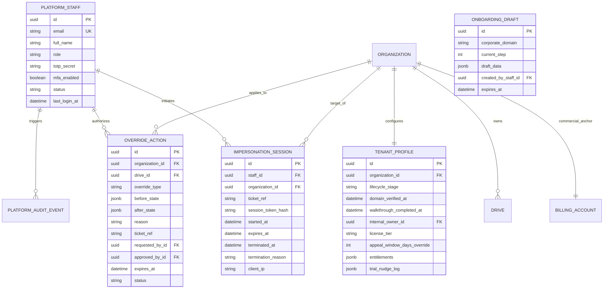

# Artifact 01 (Half 1): Platform Foundation & Tenant Lifecycle Domain & Scope Specification

**Document:** `docs/super-admin/design/01-half1-domain-and-scope.md`  
**Classification:** Technical Architecture Contract  
**System:** Proctora / CD-Recruit Platform Operations & Tenant Lifecycle Management  
**Authoritative Precedence:** `super-admin-intent.md` > `CD-Recruit_Super_Admin_Scope_and_Split.md` > `SUPER_ADMIN_DASHBOARD_SPECIFICATION.md`  
**Ownership:** Dev 1 (Half 1 Lead — Platform Foundation, Tenant Lifecycle, Operations & Security)

---

## 1. System Overview & Architecture Boundary

The Proctora platform operations model separates administrative capabilities into two coupled halves. **Half 1** provides the core platform runtime, operator authentication, tenant lifecycle orchestration, operational overrides, and security governance upon which the commercial billing engine (Half 2) mounts.

```
┌────────────────────────────────────────────────────────────────────────────────────────┐
│                        PROCTORA SUPER ADMIN CONSOLE ARCHITECTURE                       │
├───────────────────────────────────────────┬────────────────────────────────────────────┤
│           HALF 1: FOUNDATION &            │           HALF 2: COMMERCIAL &             │
│             TENANT LIFECYCLE              │              BILLING ENGINE                │
│             (Dev 1 / This Scope)          │           (Dev 2 / Commercial Team)        │
├───────────────────────────────────────────┼────────────────────────────────────────────┤
│ • Platform Foundation (Auth, MFA, Shell)  │ • Billing Accounts & Currency Anchors      │
│ • Tenant Lifecycle & Onboarding Wizard    │ • Credit Pools (Drive Pass, Talent Reserve)│
│ • Tenant 360 & Global Search              │ • Financial Ledger (Append-Only, Immutable)│
│ • Platform Staff Identity & Role Admin    │ • Two-Tier Begin Engine (Fast/Slow Path)   │
│ • Platform Audit Infrastructure & Ingress │ • Maker-Checker Queue (Dual Authorization) │
│ • Operational Overrides & Impersonation   │ • Versioned Regional Price Book            │
│ • Data Retention Policy Overrides         │ • Payments, Invoicing & Webhook Inbox      │
│ • Global Platform Health Telemetry        │ • Nightly 7-Point Automated Reconciliation │
│ • Licensing & Entitlement Engine          │ • Unit Economics Telemetry & Margin Alarms │
└───────────────────────────────────────────┴────────────────────────────────────────────┘
```

### 1.1 Core Architectural Principles
1. **PII-Blind by Default:** No Super Admin default screen (overview, tenant list, detail, metrics) exposes candidate PII (names, emails, resumes). Only aggregated metadata and counts are displayed. Real candidate data is reachable *only* through time-boxed, ticket-referenced Impersonation (F10).
2. **Two-Actor Rule Extends Past Money:** Any operational override that mutates candidate test parameters or evidentiary audit history (proctoring sensitivity relaxation, schedule extension, active-drive question update) requires dual-actor logging and ticket traceability.
3. **Modular Monolith with Dual Entrypoints:** Platform operations run as a dedicated bootstrap process (`main.platform.ts`) on a private network, mounting `PlatformModule` with strict IP allowlisting and mandatory TOTP MFA. Public traffic never reaches `/platform/*` routes.
4. **Zero Shared In-Memory State:** All state is persisted in PostgreSQL under the `platform` and `public` schemas. Communication with Half 2 happens via strongly typed service calls within shared database transactions or HTTP endpoints.

---

## 2. Feature Breakdown & Ownership Mapping (F0–F13)

| Feature ID | Feature Name | Classification | Ownership | Key Deliverables |
|---|---|---|---|---|
| **F0** | **Platform Foundation & Auth** | Core Foundation | **Half 1** | Platform entrypoint (`main.platform.ts`), `PlatformAuthGuard`, `@Roles()` / `@RequireMfa()`, `platform.platform_staff` table, frontend layout shell, global search hook. |
| **F1** | **Tenant Management (Tenant 360)** | v1 Core | **Half 1** | Tenant directory (`/tenants`), Tenant 360 cockpit (`/tenants/:id`), search/filter, tenant suspension/restoration, staff user management. |
| **F2** | **Onboarding & Trial Provisioning** | v1 Core | **Half 1** (Lead) + Half 2 | 6-step Onboarding Wizard (`/tenants/new`), corporate domain verification, draft persistence, auto-orchestration of Half 2 `BillingAccount` and 25-credit `TrialPool`. |
| **F3** | **Guided Walkthrough Tracking** | v1-Lite | **Half 1** | Onboarding checklist tracking, kickoff call, sample drive deployment flag, walkthrough completion timestamp. |
| **F4** | **Billing & Plans Console** | v1 Core | Half 2 (Half 1 UI Host) | Deep-links from Tenant 360 to Half 2 Maker-Checker queue (`/billing/requests`) and Price Book (`/billing/pricing`). |
| **F5** | **Finance & Ledger Console** | v1 Core | Half 2 (Half 1 UI Host) | Embedded view of pseudonymous ledger entries and nightly 7-point reconciliation health. |
| **F6** | **Global Metrics Dashboard** | v1 Core | **Half 1** | Platform Overview (`/`), aggregate funnel metrics, trial expiry radar, active drives, sandbox capacity, zero-PII health telemetry. |
| **F7** | **Operational Overrides Engine** | v1 Core | **Half 1** | Proctoring sensitivity adjustment, schedule window extension, mid-drive question version-and-rebind, invite bloat-guard override, incident window dispatch. |
| **F8** | **Licensing & Feature Entitlements**| v1 Core | **Half 1** | Tier management (`STARTER`, `GROWTH`, `ENTERPRISE`), boolean entitlement flags (`SSO_ENFORCED`, `BYOK_AI_ENABLED`, `CUSTOM_DOMAIN`, `ATS_PARTNER_API`, `EXTENDED_RETENTION`). |
| **F9** | **Payment Webhooks & Invoicing** | v1 / Phase 4 | Half 2 | Payment gateway inbox & manual enterprise PO invoicing. |
| **F10** | **Tenant Impersonation Session** | v1 Core | **Half 1** | Time-boxed (30 min) scoped admin token, high-visibility watermark banner, mandatory ticket ref, dual-actor audit logging, tenant-authority barrier. |
| **F11** | **Data Retention Overrides** | v1 Core | **Half 1** | Per-tenant appeal-window override (bounded 14–365 days), compliance ticket logging, integration with background purge worker. |
| **F12** | **Staff Roles & Unified Audit Log**| v1 Core | **Half 1** | Staff directory (`/staff`), unified audit log explorer (`/audit`), union view of `platform.platform_audit_event` and `billing.billing_audit_event`. |
| **F13** | **BYOK AI (Bring Your Own Key)** | **Deferred** | Deferred | Schema placeholder documented; implementation deferred pending enterprise demand. |

---

## 3. Domain Entity Relationships



---

## 4. Key Cross-Seam Boundaries with Half 2

1. **Tenant Provisioning:**
   - Half 1 creates the `public.organization` and `platform.tenant_profile`.
   - Half 1 invokes `BillingAccountService.createForOrganization()` in Half 2 within the same transaction.
   - Half 1 invokes `TrialGrantService.grantTrial()` to mint 25 trial credits (policy-bound, `actor = system`).
2. **Tenant 360 Billing View:**
   - Half 1 renders the Tenant 360 overview and queries Half 2's `GET /api/v1/platform/billing/accounts/:id/summary` for live credit balances and pool status.
   - Tenant 360 modal triggers Half 2's `POST /api/v1/platform/billing/requests` to initiate maker-checker requests.
3. **Security & Shared Context:**
   - Half 1 provides `PlatformAuthGuard`, `@Roles()`, and session token validation for all `/platform/*` endpoints.
   - Half 1 provides `AuditService.record()` which persists operational events to `platform.platform_audit_event`.
   - Half 1's unified `/audit` explorer aggregates events from both `platform.platform_audit_event` and `billing.billing_audit_event`.

---

## 5. Non-Functional Requirements & Guardrails

- **Sub-100ms Query Latency:** Tenant directory and aggregate overview pages must utilize indexed multi-column filters.
- **Zero Drift Derivation:** Tenant lifecycle stage is strictly derived from verified facts (wizard state, domain verification, billing status, active pools, manual profile flags), preventing stale duplicated state.
- **Fail-Safe Session Boundaries:** Impersonation tokens hard-expire at exactly 30 minutes; any token refresh is strictly prohibited.
- **Evidentiary Integrity:** All override mutations write immutable audit snapshots before and after state change.
