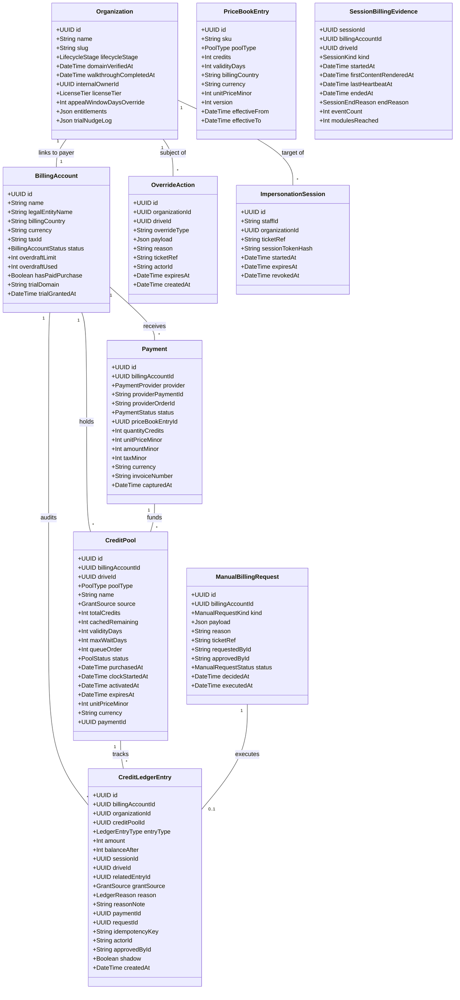

# Artifact 01: Half 2 Domain and Scope Specification

**Document:** `docs/super-admin/design/01-half2-domain-and-scope.md`  
**Classification:** Technical Architecture Contract  
**System:** Proctora / CD-Recruit Platform Ops & Billing Engine  
**Authoritative Precedence:** `PRICING_AND_CREDIT_POOL_SPECIFICATION.md` v3 > `super-admin-intent.md` > `CD-Recruit_Super_Admin_Scope_and_Split.md`  

---

## 1. Ownership & Boundary Model

The platform operations and commercial engine is partitioned into two clear engineering halves. Ownership is assigned by business capability and data authority, not merely by page titles.

```
┌────────────────────────────────────────────────────────────────────────────────────────┐
│                                 PROCTORA PLATFORM                                      │
├───────────────────────────────────────────┬────────────────────────────────────────────┤
│           HALF 1: FOUNDATION &            │           HALF 2: COMMERCIAL &             │
│             TENANT LIFECYCLE              │              BILLING ENGINE                │
├───────────────────────────────────────────┼────────────────────────────────────────────┤
│ • Platform Foundation (Auth, MFA, Shell)  │ • Billing Accounts & Currency Anchors      │
│ • Tenant Lifecycle & Onboarding Wizard    │ • Credit Pools (Drive Pass, Talent Reserve)│
│ • Tenant 360 & Global Search              │ • Financial Ledger (Append-Only, Immutable)│
│ • Platform Staff Identity & Role Admin    │ • Two-Tier Begin Engine (Fast/Slow Path)   │
│ • Platform Audit Infrastructure & Ingress │ • Maker-Checker Queue (Dual Authorization) │
│ • Operational Overrides & Impersonation   │ • Versioned Regional Price Book            │
│ • Data Retention Policy Overrides         │ • Payments, Invoicing & Webhook Inbox      │
│ • Global Platform Health Telemetry        │ • Nightly 7-Point Automated Reconciliation │
│                                           │ • Unit Economics Telemetry & Margin Alarms │
└───────────────────────────────────────────┴────────────────────────────────────────────┘
```

### 1.1 Detailed Ownership Breakdown

| Domain Component | Primary Owner | Consumer(s) | Dependencies | Source of Truth | Crosses H1/H2 Seam? |
|---|---|---|---|---|---|
| **Platform Shell & Navigation** | Half 1 | Half 1, Half 2 | Design Tokens | Frontend Router / Layout | Yes (H2 mounts in H1 shell) |
| **Staff Auth & MFA** | Half 1 | Half 1, Half 2 | In-House JWT / DB | `Staff` table / Session store | Yes (H2 guards depend on H1 auth) |
| **Organization Identity** | Half 1 | Half 2, Core App | PostgreSQL `public` | `organization` table | Yes (H2 references Org ID) |
| **Tenant Lifecycle Stage** | Half 1 | Half 2, Super Admin | Org + Billing state | Derived (H1 derivation rule) | Yes (Exposed via H1 Tenant API) |
| **Billing Account** | Half 2 | Half 1, Core App | `organization` (H1) | `billing_account` table | Yes (H1 embeds in Tenant 360) |
| **Credit Pool Management** | Half 2 | Core App, Half 1 | `billing_account` (H2) | `credit_pool` table | Yes (H1 reads for Tenant 360) |
| **Credit Ledger Engine** | Half 2 | Core App, Finance | `billing_account`, Pools | `credit_ledger_entry` table | Yes (H1 reads pseudonymous view) |
| **Maker-Checker Operations** | Half 2 | Half 1 (Support) | Staff Identity (H1) | `manual_billing_request` | Yes (H1 requests, H2 approves) |
| **Price Book (Versioned)** | Half 2 | Checkout, Half 1 | Regional Tax Config | `price_book_entry` table | Yes (H1 displays in Onboarding) |
| **Payment & Invoicing** | Half 2 | Finance, Tenant | Gateways / Webhooks | `payment` table | Yes (H1 reads payment status) |
| **Payment Webhook Receiver** | Half 2 | BullMQ Worker | Public API Ingress | `payment_event` table | Yes (Runs on public gateway) |
| **Session Begin Gateway** | Half 2 | Candidate App | Session (Core), Pools | `billing_begin()` PL/pgSQL | No (Candidate hot path) |
| **Nightly Reconciliation** | Half 2 | Finance, Health | Ledger, Pools, Storage | Automated Replay Job | Yes (H1 displays health status) |
| **Platform-Wide Audit Engine** | Half 1 (Writer) | Half 1, Half 2 | DB Storage | `platform_audit_event` | Yes (Shared audit contract) |
| **Billing Audit Trail** | Half 2 (Writer) | Finance, Auditor | DB Triggers | `billing_audit_event` | Yes (Aggregated in H1 Audit View) |
| **Operational Overrides** | Half 1 | Recruiter, Support | Drive, Question Bank | `override_action` table | Yes (Dispatches to H2 if money) |
| **Tenant Impersonation** | Half 1 | Support, Audit | Staff Auth (H1) | `impersonation_session` | Yes (Affects audit context) |
| **Feature Entitlements** | Half 1 | Feature Guards | Org Metadata | `organization.license_tier` | No (Pure tenant-tier gating) |

---

## 2. Feature Scope Normalization (F1–F13)

Normalizing features F1 through F13 defined in `super-admin-intent.md` and reconciling with `CD-Recruit_Super_Admin_Scope_and_Split.md`.

```
┌───────────────────────────────────────────────────────────────────────────────────────┐
│                                FEATURE SCOPE STATUS                                   │
├──────────────────────────┬───────────────────────────┬────────────────────────────────┤
│       V1 CORE            │         V2 ENHANCED       │      DEFERRED / PARKED         │
├──────────────────────────┼───────────────────────────┼────────────────────────────────┤
│ F1: Tenant Management    │ F3: Contextual Guided     │ F13: BYOK AI (Bring Your Own   │
│ F2: Onboarding & Trial   │     Walkthrough Tour      │      Key) — Parked for valid   │
│ F4: Billing & Plans      │ F9: Self-Serve Gateways   │      enterprise client demand. │
│ F5: Finance & Ledger     │     (Razorpay/Stripe live │                                │
│ F6: Global Metrics       │     checkout in portal)   │                                │
│ F7: Overrides & Incident │                           │                                │
│ F8: Licensing Tiers      │                           │                                │
│ F9: Offline Invoice / PO │                           │                                │
│ F10: Tenant Impersonate  │                           │                                │
│ F11: Retention Override  │                           │                                │
│ F12: Staff & Audit Log   │                           │                                │
└──────────────────────────┴───────────────────────────┴────────────────────────────────┘
```

### Detailed Feature Specifications

#### F1: Tenant Management
- **Purpose:** Full CRUD, search, filter, and detail triage across all platform tenants.
- **Phase & Status:** v1 Core.
- **Owner:** Half 1 (UI & Organization) + Half 2 (Billing summaries & pool integration).
- **Dependencies:** Part A Phase 1 (Schema) for billing data; existing `organization` table.
- **Data Required:** `Organization`, `BillingAccount`, `CreditPool` summaries, `Drive` counts.
- **APIs Required:**
  - `GET /api/v1/platform/tenants` (List & filter)
  - `GET /api/v1/platform/tenants/:id` (Tenant 360 overview)
  - `PATCH /api/v1/platform/tenants/:id/status` (Suspend / restore tenant)
- **Security Sensitivity:** PII-Blind-by-Default: no candidate names or emails rendered.

#### F2: Onboarding & Trial Provisioning
- **Purpose:** Guided tenant creation, first admin generation, and policy-bound automatic trial grant.
- **Phase & Status:** v1 Core.
- **Owner:** Half 1 (Wizard flow) + Half 2 (`BillingAccountService`, `TrialGrantService`).
- **Dependencies:** Part A Phase 1 (Schema); Corporate email verification.
- **Data Required:** `Organization` with lifecycle fields, `BillingAccount` with `trialDomain`, `CreditPool` (TRIAL, 25 credits, 30 days).
- **APIs Required:**
  - `POST /api/v1/platform/tenants/onboard` (Wizard execution)
  - `POST /api/v1/platform/tenants/verify-domain` (Domain check)
- **Security Sensitivity:** System-executed trial grant (`actor = system`). Manual re-grants require maker-checker.

#### F3: Guided Walkthrough
- **Purpose:** In-app walkthrough to lead new tenant admins to their first Say-Do assessment report.
- **Phase & Status:** v1-lite (manual checklist in Onboarding) / v2 (interactive in-app tour).
- **Owner:** Half 1.
- **Dependencies:** F2, Pre-built Template Drive intake channel.
- **Data Required:** `Organization.walkthroughCompletedAt`.
- **APIs Required:** `PATCH /api/v1/platform/tenants/:id/walkthrough-complete`.
- **Security Sensitivity:** Low.

#### F4: Billing & Plans Console
- **Purpose:** Central operations desk for credit pools, manual billing requests, and the maker-checker approval queue.
- **Phase & Status:** v1 Core.
- **Owner:** Half 2.
- **Dependencies:** Part A Phase 1 (Schema & Invariants), Phase 3 (Enforcement).
- **Data Required:** `CreditPool`, `ManualBillingRequest`, `PriceBookEntry`, `BillingAuditEvent`.
- **APIs Required:**
  - `GET /api/v1/platform/billing/accounts`
  - `GET /api/v1/platform/billing/requests`
  - `POST /api/v1/platform/billing/requests`
  - `POST /api/v1/platform/billing/requests/:id/approve`
  - `POST /api/v1/platform/billing/requests/:id/reject`
- **Security Sensitivity:** **Extreme (Financial Invariant R8).** DB-enforced maker-checker (`requested_by_id != approved_by_id`).

#### F5: Finance & Ledger Console
- **Purpose:** Searchable pseudonymous ledger explorer, nightly reconciliation viewer, and margin-alarm telemetry.
- **Phase & Status:** v1 Core.
- **Owner:** Half 2.
- **Dependencies:** Part A Phase 2 (Shadow mode telemetry), Phase 3 (Ledger live).
- **Data Required:** `CreditLedgerEntry` (Read-only), `ReconciliationRun`, `SessionBillingEvidence`.
- **APIs Required:**
  - `GET /api/v1/platform/billing/ledger`
  - `GET /api/v1/platform/billing/reconciliation/latest`
  - `POST /api/v1/platform/billing/reconciliation/run`
- **Security Sensitivity:** High (Financial visibility). Completely candidate PII-free.

#### F6: Global Metrics Dashboard
- **Purpose:** Aggregate executive telemetry: trial conversion funnels, at-risk accounts, platform capacity, unit economics.
- **Phase & Status:** v1 Core.
- **Owner:** Half 1 (UI layout) + Half 2 (Financial aggregates).
- **Dependencies:** F1–F5; displays honest "awaiting data" states until populated.
- **Data Required:** Aggregated counts across drives, sessions, pools, and ledger entries.
- **APIs Required:** `GET /api/v1/platform/metrics/overview`.
- **Security Sensitivity:** Aggregate only. Zero candidate PII.

#### F7: Operational Overrides & Incident Engine
- **Purpose:** Time-boxed, audited exceptions: relax proctoring sensitivity, schedule extensions, active-drive question corrections, invite bloat-guard overrides, and incident window declarations.
- **Phase & Status:** v1 Core (Corrected per Intent).
- **Owner:** Half 1 (Overrides UI & Audit) + Half 2 (Incident window T3 reversals & goodwill credit grants).
- **Dependencies:** F1, F4, `LedgerReason.INCIDENT_WINDOW`.
- **Data Required:** `OverrideAction`, `IncidentWindow`, `ManualBillingRequest`.
- **APIs Required:**
  - `POST /api/v1/platform/overrides/proctoring`
  - `POST /api/v1/platform/overrides/schedule-extension`
  - `POST /api/v1/platform/overrides/question-fix`
  - `POST /api/v1/platform/overrides/invite-ratio`
  - `POST /api/v1/platform/overrides/incident-window`
- **Security Sensitivity:** **Extreme.** Two-actor rule extends past money; full evidentiary logging.

#### F8: Licensing & Feature Entitlements
- **Purpose:** Tier-based feature gating decoupled from credit volume (`STARTER`, `GROWTH`, `ENTERPRISE`).
- **Phase & Status:** v1 Core.
- **Owner:** Half 1.
- **Dependencies:** F1.
- **Data Required:** `Organization.licenseTier`, `Organization.entitlements` (boolean flags).
- **APIs Required:** `PATCH /api/v1/platform/tenants/:id/licensing`.
- **Security Sensitivity:** Medium. Enforces contract boundaries.

#### F9: Payment Gateway, Webhooks & Offline Invoicing
- **Purpose:** Offline Enterprise PO invoicing (v1) and automated gateway webhooks (Stripe / Razorpay) (Phase 4).
- **Phase & Status:** v1 Core (Offline Invoice / PO flow) + Phase 4 (Live Gateway Webhook Integration).
- **Owner:** Half 2.
- **Dependencies:** Part A Phase 4.
- **Data Required:** `Payment`, `PaymentEvent` (webhook inbox), `CreditPool` (CONTRACT / PURCHASE).
- **APIs Required:**
  - `POST /api/v1/platform/billing/payments/manual-invoice` (Record PO / wire)
  - `POST /api/v1/billing/webhooks/:provider` (Public webhook receiver)
  - `POST /api/v1/platform/billing/payments/:id/replay-webhook`
- **Security Sensitivity:** High (Cryptographic signature verification, idempotent minting).

#### F10: Tenant Impersonation ("Log in as Tenant Admin")
- **Purpose:** Staff-initiated, time-boxed (30 min), ticket-referenced session as a tenant admin for support.
- **Phase & Status:** v1 Core (with strict security boundaries).
- **Owner:** Half 1.
- **Dependencies:** Staff Auth, In-House JWT.
- **Data Required:** `ImpersonationSession`, dual-audit tagging.
- **APIs Required:**
  - `POST /api/v1/platform/impersonation/start`
  - `POST /api/v1/platform/impersonation/stop`
- **Security Sensitivity:** **Extreme.** Only deliberate path to candidate PII; carries tenant-only authority; structurally incapable of platform billing mutations.

#### F11: Data Retention Overrides
- **Purpose:** Per-tenant override of candidate evidence appeal-window length (bounded 14–365 days).
- **Phase & Status:** v1 Core.
- **Owner:** Half 1.
- **Dependencies:** Existing automated lifecycle-deletion worker in `heartbeat.service.ts`.
- **Data Required:** `Organization.appealWindowDaysOverride`.
- **APIs Required:** `PATCH /api/v1/platform/tenants/:id/retention`.
- **Security Sensitivity:** High (Compliance / GDPR). Requires ticket reference.

#### F12: Staff & Roles, Audit Log
- **Purpose:** Management of platform staff access and immutable chronological log of all platform actions.
- **Phase & Status:** v1 Core (read-only staff list + unified audit explorer).
- **Owner:** Half 1.
- **Dependencies:** F0, F7, F10, Half 2 Billing Audit Events.
- **Data Required:** `Staff`, `PlatformAuditEvent`, `BillingAuditEvent`.
- **APIs Required:**
  - `GET /api/v1/platform/staff`
  - `GET /api/v1/platform/audit`
- **Security Sensitivity:** High (Security auditability). Append-only.

#### F13: BYOK AI (Bring Your Own Key) — DEFERRED
- **Purpose:** Enterprise clients supply their own LLM API key for grading.
- **Phase & Status:** **DEFERRED / PARKED.**
- **Reason:** Requires dedicated secret custody threat model and alters unit margin assumptions.
- **Owner:** Deferred.

---

## 3. Domain Entities

The domain models are classified into existing entities, new entities, reused entities, and derived concepts.



### Entity Classification & Authority

| Entity | Type / Status | Ownership | Database Location | Primary Purpose |
|---|---|---|---|---|
| **`Organization`** | Existing (Extended) | Half 1 | `public.organization` | Core tenant legal identity, branding, and lifecycle state. |
| **`BillingAccount`** | **NEW** (Authoritative) | Half 2 | `billing.billing_account` | Financial entity holding currency, country tax anchor, overdraft, and pool collections. |
| **`CreditPool`** | **NEW** (Authoritative) | Half 2 | `billing.credit_pool` | Discrete bucket of purchased/granted credits with queue order, validity window, and drawdown cache. |
| **`CreditLedgerEntry`** | **NEW** (Authoritative) | Half 2 | `billing.credit_ledger_entry` | Append-only, immutable financial transaction log; single source of truth for all balances. |
| **`ManualBillingRequest`** | **NEW** (Authoritative) | Half 2 | `billing.manual_billing_request` | Maker-checker dual-authorization queue for manual credits, adjustments, refunds, and policy overrides. |
| **`Payment`** | **NEW** (Authoritative) | Half 2 | `billing.payment` | Cryptographically verified captured transaction from payment gateway or manual PO invoice. |
| **`PaymentEvent`** | **NEW** (Inbox Table) | Half 2 | `billing.payment_event` | Webhook ingestion inbox ensuring idempotent processing of Stripe/Razorpay events. |
| **`PriceBookEntry`** | **NEW** (Authoritative) | Half 2 | `billing.price_book_entry` | Immutable versioned commercial catalog mapping SKU $\times$ Country $\times$ Version to minor price units. |
| **`SessionBillingEvidence`** | **NEW** (Authoritative) | Half 2 | `billing.session_billing_evidence` | Append-only telemetry proving session execution, presence, duration, and hardware state for billing defense. |
| **`ReconciliationRun`** | **NEW** (Operational) | Half 2 | `billing.reconciliation_run` | Log of nightly 7-point automated audit results, discrepancy details, and drift status. |
| **`OverrideAction`** | **NEW** (Operational) | Half 1 | `platform.override_action` | Audit log of all non-financial operational overrides (proctoring relaxation, window extensions, question fixes). |
| **`ImpersonationSession`** | **NEW** (Security) | Half 1 | `platform.impersonation_session` | Tracked, time-boxed staff support session accessing tenant portal with dual-audit logging. |
| **`IncidentWindow`** | **NEW** (Operational) | Half 1 / Half 2 | `platform.incident_window` | Declared time window for platform infrastructure fault triggering automated T3 session credit reversals. |
| **`TenantProfile`** | Derived / Extension | Half 1 | `platform.tenant_profile` | Operational flags, manual risk notes, and enterprise settings attached to an organization. |

---

## 4. Entity Relationships & Cross-Domain Seams

### 4.1 Tenancy to Financial Relationship
- An `Organization` represents the software workspace (candidates, staff, drives, reports).
- A `BillingAccount` represents the legal payer.
- **Topology:** By default, $1 \text{ Organization} \longleftrightarrow 1 \text{ BillingAccount}$.
- **Decoupling Rationale:** Enables multi-tenant corporate groups or staffing agencies where one central `BillingAccount` funds multiple subsidiary `Organization` workspaces without data cross-contamination.

### 4.2 Pool and Ledger Hierarchy
- Credits are minted into a specific `CreditPool`.
- `CreditPool.totalCredits` is **immutable** once inserted.
- When a candidate begins an assessment, `LedgerService` claims 1 credit:
  1. Decrements `CreditPool.cached_remaining` (fast-path lock $<2\text{ms}$).
  2. Inserts an immutable `CreditLedgerEntry` (`entry_type = CONSUME`, `amount = -1`, `balance_after = remaining`).
- If an account has multiple pools:
  - Event-anchored `DRIVE_PASS` bound to `drive_id` is drawn first.
  - If `drive_id` has no pool (or is exhausted with `fallthrough = ALLOW`), the single `ACTIVE` `TALENT_RESERVE` general pool is drawn.
  - Queued reserve pools promote sequentially ("Jio Model") via slow-path advisory lock.

### 4.3 Maker-Checker Execution Boundary
- Any discretionary money action creates a `ManualBillingRequest` in `PENDING` state.
- When an authorized approver (`approved_by_id != requested_by_id`) approves:
  1. The request status transitions to `APPROVED`.
  2. The service sets the session context `proctora.request_id = request.id`.
  3. `LedgerService` executes the appropriate mutation (`GRANT`, `ADJUST`, `REFUND`, `EXPIRY_EXTEND`).
  4. The request status transitions to `EXECUTED`.
  5. The database trigger on `credit_pool` and `credit_ledger_entry` validates that `proctora.request_id` was active.

---

## 5. Source-of-Truth Matrix

To guarantee strict compliance with Invariant R2 and prevent state drift, every critical business value in the platform is mapped to exactly one authoritative source.

| Business Value | Authoritative Source of Truth | Permitted Secondary Caches | Cache Invalidation / Rebuild Trigger |
|---|---|---|---|
| **Remaining Account Credits** | Replay of `credit_ledger_entry` table | `credit_pool.cached_remaining` | Rebuilt/verified nightly via 7-Point Reconciliation (§9.4) |
| **Outstanding Overdraft Debt** | Replay of `credit_ledger_entry` (OVERDRAFT - SETTLE) | `billing_account.overdraft_used` | Updated atomically by `LedgerService` in ledger transaction |
| **Billing Account Status** | `billing_account.status` (`ACTIVE`, `RESTRICTED`, `SUSPENDED`) | None | Mutated strictly via `ManualBillingRequest` (ACCOUNT_STATUS) |
| **Tenant Lifecycle Stage** | Derived by Half 1 service formula | `organization.lifecycle_stage` | Derived dynamically from Onboarding + Billing purchase flags |
| **Trial Domain Uniqueness** | `billing_account.trial_domain` UNIQUE index | None | Direct PostgreSQL unique constraint enforcement |
| **Candidate Identity & PII** | `candidate` table (`public.candidate`) | None | Completely excluded from all Half 2 ledger records (R5) |
| **Assessment Price** | `price_book_entry` (Versioned record) | `credit_pool.unit_price_minor` | Frozen immutably on `CreditPool` at purchase time |
| **Session Start Validity** | `session.status` + `billing_begin()` | None | Protected by PostgreSQL `guard_session_start` trigger |
| **Operational Overrides** | `override_action` table | Drive runtime config | Time-boxed expiry checked at drive execution |
| **Platform Audit History** | Union of `platform_audit_event` & `billing_audit_event` | None | Strictly append-only (DB triggers revoke UPDATE/DELETE) |
| **Evidence Retention Window** | `settings.json` + `organization.appeal_window_days_override` | None | Evaluated at runtime by lifecycle deletion worker |

---

## 6. Half 1 ↔ Half 2 Boundary Contract Summary

| Capability | Half 1 Responsibility | Half 2 Responsibility |
|---|---|---|
| **Onboarding Wizard** | Collects company info, verifies corporate domain, initiates wizard. | Creates `BillingAccount`, validates currency, auto-mints 25 trial credits via `TrialGrantService`. |
| **Tenant 360 View** | Renders tenant overview, user lists, drive statistics, and override tabs. | Exposes `GET /platform/billing/accounts/:id/summary` providing balances, pools, overdraft, and health badges. |
| **Manual Billing Requests** | Support staff creates request prefilled from Tenant 360 with CRM ticket reference. | Validates payload, queues request, enforces maker-checker authorization, executes through `LedgerService`. |
| **Operational Overrides** | Renders override UI, logs `OverrideAction`, manages drive schedule/proctoring flags. | Executes goodwill credit grants or incident-window ledger reversals if the override touches money. |
| **Tenant Impersonation** | Issues time-boxed (30 min) tenant-scoped JWT with mandatory ticket reference. | Structurally blocks impersonated tokens from executing any platform-level billing API. |
| **Global Metrics** | Renders top-level funnel and operational charts. | Aggregates unit economics, margin alarms, uncollateralized debt, and reconciliation pass/fail telemetry. |
