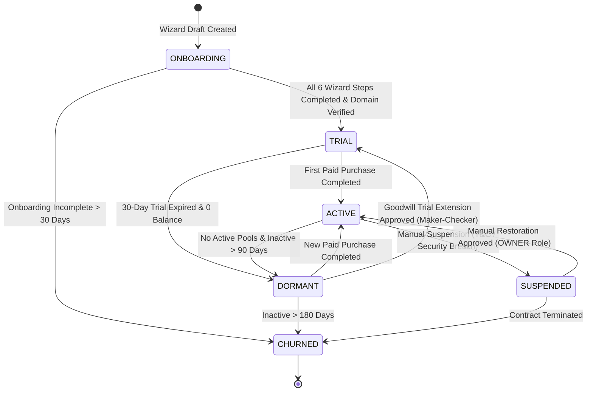
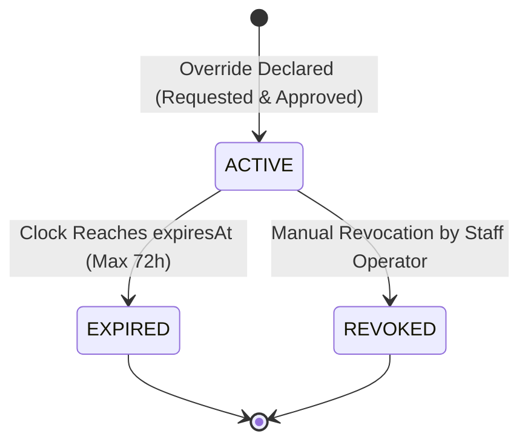

# Artifact 06 (Half 1): State Machines, Permission Matrix & Audit Mapping

**Document:** `docs/super-admin/design/06-half1-state-permission-and-audit-matrix.md`  
**Classification:** Formal State Transitions, Security Matrix & Audit Compliance Contract  
**System:** Proctora / CD-Recruit Platform Operations & Tenant Lifecycle  
**Authoritative Precedence:** `super-admin-intent.md` > `CD-Recruit_Super_Admin_Scope_and_Split.md`  
**Ownership:** Dev 1 (Half 1 Lead)

---

## 1. Formal State Machines

### 1.1 Tenant Lifecycle State Machine



#### State Transition Matrix:

| From State | Event / Trigger | To State | Validator / Invariant | Permitted Actions |
|---|---|---|---|---|
| `ONBOARDING` | Wizard Complete | `TRIAL` | All 6 steps validated; domain verified. | Edit wizard draft, verify domain. |
| `TRIAL` | Paid Purchase | `ACTIVE` | Half 2 `Payment` completed; credits minted. | Create drives, invite candidates, run tests. |
| `TRIAL` | Expiry Sweeper | `DORMANT` | Trial pool expired and balance = 0. | Read-only tenant admin; cannot create drives. |
| `ACTIVE` | Manual Suspend | `SUSPENDED` | Operator ticket ref; reason provided. | Blocks new drives/invites; in-flight tests finish. |
| `SUSPENDED` | Manual Restore | `ACTIVE` | `OWNER` role; ticket ref logged. | Restores full drive creation capability. |
| `DORMANT` | Paid Top-up | `ACTIVE` | Half 2 purchase executed. | Restores active status. |

---

### 1.2 Operational Overrides State Machine



---

## 2. Staff Role Permission Matrix (RBAC)

Platform operations are restricted to three explicit staff roles:
- **`SUPPORT`:** Customer Support & Relationship Management.
- **`FINANCE`:** Financial Operations & Pricing Governance.
- **`OWNER`:** Executive Platform Administrator & Security Lead.

| Functional Capability | `SUPPORT` | `FINANCE` | `OWNER` | Enforcement Layer |
|---|---|---|---|---|
| **View Platform Overview & Health** | ✅ | ✅ | ✅ | `PlatformAuthGuard` |
| **Search & View Tenants List** | ✅ | ✅ | ✅ | `PlatformAuthGuard` |
| **View Tenant 360 Detail** | ✅ | ✅ | ✅ | `PlatformAuthGuard` |
| **Execute Tenant Onboarding Wizard** | ✅ | ❌ | ✅ | `@Roles(SUPPORT, OWNER)` |
| **Suspend / Restore Tenant** | ✅ | ❌ | ✅ | `@Roles(SUPPORT, OWNER)` |
| **Update Tenant Licensing Tier** | ❌ | ❌ | ✅ | `@Roles(OWNER)` |
| **Update Data Retention Appeal Window**| ✅ | ❌ | ✅ | `@Roles(SUPPORT, OWNER)` |
| **Initiate Tenant Impersonation (30m)** | ✅ | ❌ | ✅ | `@Roles(SUPPORT, OWNER)` |
| **Relax Proctoring Sensitivity** | ✅ | ❌ | ✅ | `@Roles(SUPPORT, OWNER)` |
| **Extend Drive Schedule Window** | ✅ | ❌ | ✅ | `@Roles(SUPPORT, OWNER)` |
| **Version & Fix Question Mid-Drive** | ❌ | ❌ | ✅ | `@Roles(OWNER)` |
| **Override Invite Bloat-Guard Ratio** | ✅ | ❌ | ✅ | `@Roles(SUPPORT, OWNER)` |
| **View Billing Accounts & Pools (H2)**| ✅ (Read) | ✅ (Full) | ✅ (Full) | `PlatformAuthGuard` |
| **Create Manual Billing Request (H2)** | ✅ (Requester)| ✅ (Requester)| ✅ (Requester)| Half 2 Controller |
| **Approve Maker-Checker Request (H2)** | ❌ | ✅ (Approver) | ✅ (Approver) | Half 2 Controller |
| **Publish Price Book Changes (H2)** | ❌ | ✅ | ✅ | Half 2 Controller |
| **Record Enterprise PO Payment (H2)** | ❌ | ✅ | ✅ | Half 2 Controller |
| **View Unified Audit Log** | ✅ | ✅ | ✅ | `PlatformAuthGuard` |
| **Export Audit Log CSV** | ❌ | ✅ | ✅ | `@Roles(FINANCE, OWNER)` |
| **Manage Platform Staff & Disable Accounts**| ❌ | ❌ | ✅ | `@Roles(OWNER)` |

---

## 3. Dual-Actor Impersonation Security Matrix

When a staff operator initiates an Impersonation session, access context changes across all layers:

```
┌────────────────────────────────────────────────────────────────────────────────────────┐
│                        IMPERSONATION SECURITY BOUNDARY                                 │
├──────────────────────────────────────┬─────────────────────────────────────────────────┤
│ Context Dimension                    │ Enforced Security Policy                        │
├──────────────────────────────────────┼─────────────────────────────────────────────────┤
│ **Maximum Token Lifespan**           │ 30 minutes hard ceiling; zero renewal/refresh.  │
│ **Allowed Target Roles**             │ Tenant `RECRUITER`, `HR_ASSOCIATE`.             │
│ **Forbidden Target Roles**           │ Platform staff roles; root identities.          │
│ **Platform Route Access**            │ Structurally blocked (`PlatformAuthGuard`).     │
│ **Financial Mutation Authority**     │ Zero platform financial authority.              │
│ **Candidate PII Exposure Boundary**  │ Audited access to specific tenant candidates.   │
│ **Audit Log Attribution**            │ Dual-logged: `operator_id` + `tenant_user_id`.  │
│ **UI Watermark**                     │ Persistent red top bar with live timer.         │
└──────────────────────────────────────┴─────────────────────────────────────────────────┘
```

---

## 4. Platform Audit Event Taxonomy & Compliance Mapping

All events write to `platform.platform_audit_event` via `AuditService.record()`:

| Event Action | Subject Type | Required Context Fields | Compliance Significance |
|---|---|---|---|
| `STAFF_LOGIN` | `STAFF` | `actorId`, `ipAddress`, `userAgent` | Access Monitoring / ISO 27001 |
| `STAFF_MFA_ENABLED` | `STAFF` | `actorId`, `ipAddress` | Credential Hardening |
| `TENANT_ONBOARDED` | `TENANT` | `organizationId`, `slug`, `domain`, `plan` | Commercial Ingress |
| `TENANT_SUSPENDED` | `TENANT` | `organizationId`, `reason`, `ticketRef` | Service Restriction |
| `TENANT_RESTORED` | `TENANT` | `organizationId`, `ticketRef` | Service Restoration |
| `LICENSING_UPDATED` | `TENANT` | `organizationId`, `licenseTier`, `entitlements` | Contract Governance |
| `RETENTION_OVERRIDDEN`| `TENANT` | `organizationId`, `oldDays`, `newDays`, `ticketRef` | GDPR / Privacy Compliance |
| `OVERRIDE_PROCTORING` | `OVERRIDE` | `driveId`, `beforeState`, `afterState`, `ticketRef` | Evidentiary Integrity |
| `OVERRIDE_SCHEDULE` | `OVERRIDE` | `driveId`, `extendedEndAt`, `ticketRef` | Schedule Audit |
| `OVERRIDE_QUESTION` | `OVERRIDE` | `driveId`, `oldQuestionId`, `newQuestionId`, `ticketRef` | Evidentiary Question Snapshot |
| `IMPERSONATION_START` | `IMPERSONATION`| `staffId`, `organizationId`, `targetUserId`, `ticketRef` | PII Access Authorization |
| `IMPERSONATION_STOP` | `IMPERSONATION`| `sessionId`, `terminationReason` | Session Cleanup |
