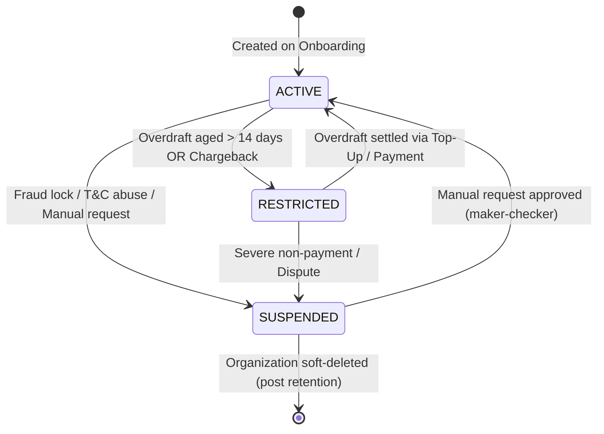
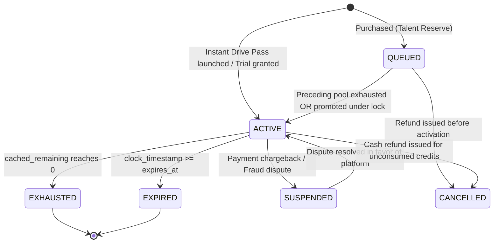
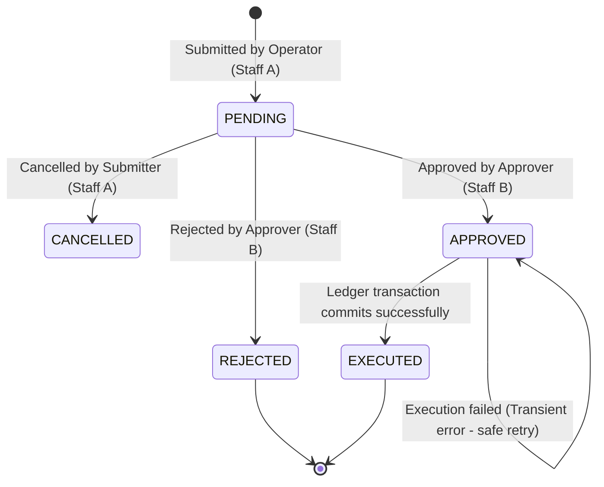
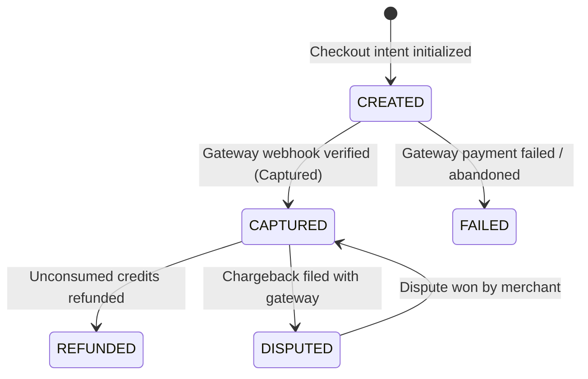

# Artifact 06: State Machines, Permission Matrix & Audit Specification

**Document:** `docs/super-admin/design/06-half2-state-permission-and-audit-matrix.md`  
**Classification:** State Architecture, Security & Governance Contract  
**System:** Proctora / CD-Recruit Platform Ops & Billing Engine  
**Authoritative Precedence:** `PRICING_AND_CREDIT_POOL_SPECIFICATION.md` v3 > `super-admin-intent.md`  

---

## 1. State Machine Specifications

---

### 1.1 `BillingAccount` State Machine



| Current State | Event / Action | Actor | Pre-Conditions | Next State | Side Effects & Invariants | Audit Event | Invalid Transitions |
|---|---|---|---|---|---|---|---|
| **ACTIVE** | `OVERDRAFT_AGED_OUT` | `system` (Daily Worker) | `overdraft_used > 0` AND oldest un-settled overdraft $>14$ days | **RESTRICTED** | Blocks creation/scheduling of new drives and candidate link dispatch. Running sessions continue unaffected. | `ACCOUNT_STATUS_CHANGE` | Cannot move to `RESTRICTED` if `overdraft_used == 0`. |
| **RESTRICTED** | `SETTLE_OVERDRAFT` | `LedgerService` | `overdraft_used` reduced to 0 via payment or grant | **ACTIVE** | Unblocks drive creation and scheduling immediately. | `ACCOUNT_STATUS_CHANGE` | Cannot return to `ACTIVE` while `overdraft_used > 0`. |
| **ACTIVE** | `SUSPEND_ACCOUNT` | `SUPER_ADMIN` | Approved `ManualBillingRequest` (kind: `ACCOUNT_STATUS`) | **SUSPENDED** | Blocks all drive scheduling, invitations, and new session starts. Candidate in-flight sessions complete safely. | `ACCOUNT_STATUS_CHANGE` | Direct mutation without request is blocked by DB check. |
| **SUSPENDED** | `RESTORE_ACCOUNT` | `SUPER_ADMIN` | Approved `ManualBillingRequest` with ticket ref | **ACTIVE** | Restores tenant platform privileges. | `ACCOUNT_STATUS_CHANGE` | Cannot restore without maker-checker approval. |

---

### 1.2 `CreditPool` State Machine



| Current State | Event / Action | Actor | Pre-Conditions | Next State | Side Effects & Invariants | Audit Event | Invalid Transitions |
|---|---|---|---|---|---|---|---|
| **[*]** | `PURCHASE_TALENT_RESERVE` | `system` / Payment | Captured payment or contract PO | **QUEUED** | Queue order assigned under account lock. Total credits set immutably. | `POOL_CREATED` | Cannot start in `EXPIRED` or `EXHAUSTED`. |
| **[*]** | `PURCHASE_DRIVE_PASS` | `system` / Payment | Step 6 Drive Launch completed | **ACTIVE** | `drive_id` bound immutably; `expires_at = drive.schedule_end + 7 days`. | `POOL_CREATED` | Cannot create Drive Pass without valid `drive_id`. |
| **QUEUED** | `PROMOTE_TO_ACTIVE` | `LedgerService` | Preceding active pool exhausted/expired; account lock held | **ACTIVE** | Sets `activated_at = now()`. If floating clock not started, sets `clock_started_at = now()` and calculates `expires_at`. | `POOL_ACTIVATED` | Cannot promote if another general pool is `ACTIVE`. |
| **ACTIVE** | `CREDITS_DEPLETED` | `LedgerService` | `cached_remaining == 0` | **EXHAUSTED** | Triggers slow-path check to promote next queued pool or evaluate fallthrough. | `POOL_EXHAUSTED` | Cannot transition if `cached_remaining > 0`. |
| **ACTIVE** | `EXPIRY_REACHED` | `system` (Daily Sweeper) | `clock_timestamp() >= expires_at` | **EXPIRED** | Remaining credits expired via `EXPIRE` ledger entry. Leftover Drive Pass credits lapse. | `POOL_EXPIRED` | Cannot expire before `expires_at`. |
| **ACTIVE** | `EXTEND_EXPIRY` | `SUPER_ADMIN` | Approved `ManualBillingRequest` (kind: `EXPIRY_EXTEND`) | **ACTIVE** | Sets new `expires_at`. Enforced by DB trigger `guard_credit_pool_mutation`. | `POOL_UPDATE` | Rejected if `proctora.request_id` not set. |
| **ACTIVE** | `CHARGEBACK_DISPUTE` | `PaymentWebhookService` | Gateway dispute webhook received | **SUSPENDED** | Pool locked from candidate claims. | `POOL_SUSPENDED` | Cannot suspend an already `EXPIRED` pool. |

---

### 1.3 `ManualBillingRequest` Maker-Checker State Machine



| Current State | Event / Action | Actor | Pre-Conditions | Next State | Side Effects & Invariants | Audit Event | Invalid Transitions |
|---|---|---|---|---|---|---|---|
| **[*]** | `SUBMIT_REQUEST` | `ADMIN` / `SUPER_ADMIN` | Valid non-PII payload, ticket ref present, valid reason | **PENDING** | Emits notification to `SUPER_ADMIN` queue. | `REQUEST_SUBMITTED` | Missing ticket ref throws 400 Bad Request. |
| **PENDING** | `APPROVE_REQUEST` | `SUPER_ADMIN` | `actor.id != request.requested_by_id` | **APPROVED** $\rightarrow$ **EXECUTED** | Sets `proctora.request_id = request.id`. Executes ledger mutation via `LedgerService`. Sets `executed_at = now()`. | `REQUEST_EXECUTED` | **Self-approval strictly rejected** by DB check constraint `chk_maker_checker`. |
| **PENDING** | `REJECT_REQUEST` | `SUPER_ADMIN` | `rejection_reason` provided (min 10 chars) | **REJECTED** | Sets `decided_at = now()`. No money moves. | `REQUEST_REJECTED` | Cannot reject without reason note. |
| **PENDING** | `CANCEL_REQUEST` | Submitter (`requested_by_id`) | Must be original submitter | **CANCELLED** | Request archived. | `REQUEST_CANCELLED` | Approver cannot cancel (must reject). |
| **APPROVED** | `EXECUTION_FAILED` | `LedgerService` | DB lock timeout or connection glitch | **APPROVED** (Retains state) | Error saved in `execution_error`. Retries use deterministic idempotency key. | `REQUEST_EXECUTION_FAILED` | Never reverts to `PENDING`. |
| **APPROVED** | `RETRY_EXECUTION` | `SUPER_ADMIN` | Request in `APPROVED` with `executed_at IS NULL` | **EXECUTED** | Safe idempotent re-execution. | `REQUEST_RETRY_SUCCESS` | Re-executing an already `EXECUTED` request is rejected. |

---

### 1.4 `Payment` & `PaymentEvent` State Machines



| Current State | Event / Action | Actor | Pre-Conditions | Next State | Side Effects & Invariants | Audit Event |
|---|---|---|---|---|---|---|
| **[*]** | `WEBHOOK_RECEIVED` | `PaymentWebhookService` | Valid signature header | `payment_event: PENDING` | Inserted into inbox table; BullMQ job enqueued. | `WEBHOOK_INGESTED` |
| `payment_event: PENDING` | `PROCESS_EVENT` | BullMQ Worker | Valid payload | `payment_event: PROCESSED` | Creates `Payment` (CAPTURED), mints `CreditPool`, writes `GRANT` entry. | `PAYMENT_CAPTURED` |
| **CAPTURED** | `ISSUE_REFUND` | `SUPER_ADMIN` | `cached_remaining >= refund_credits` | **REFUNDED** | Writes `REFUND` ledger entry, cancels pool, calls gateway refund API. | `PAYMENT_REFUNDED` |

---

## 2. Frontend Application State Matrix

Defines UI behavior across all standard async states for every Half 2 screen.

| Page / Component | Initial | Loading | Loaded | Empty | Submitting | Success | API Failure / Error | Forbidden (403) |
|---|---|---|---|---|---|---|---|---|
| **H2.1 Billing Accounts** | Empty grid | Skeleton table (10 rows) | Table with account cards & badges | "No accounts matching search" | N/A | Row updated | Error toast + retry button | "Insufficient permissions to view billing accounts" |
| **H2.2 Credit Pool Detail** | Blank canvas | Card skeletons | 3 diagnostic cards + ledger table | "No ledger entries for this pool" | N/A | Expiry updated | Error alert banner | "Forbidden" redirect |
| **H2.3 Ledger Explorer** | Filter defaults | Shimmer table | Paginated transactions | "Zero transactions in selected window" | N/A | CSV download started | Red error banner | "Staff role required" |
| **H2.4 Maker-Checker Queue** | Tab: Awaiting | Tab spinner | Request cards with SLA timers | "All caught up! Zero pending approvals" | Action button spinner | Card animates out; toast: "Executed" | Toast error + retry prompt | Disabled Approve button with tooltip |
| **H2.5 Price Book** | Country: IN | Table skeleton | Versioned SKUs with active tags | "No pricing catalog for country" | Modal submit disabled | Modal closes; new version active | Modal error alert | "Finance role required to publish" |
| **H2.6 Payments Console** | Tab: Payments | Table skeleton | Transactions list + webhook logs | "No payments recorded yet" | PO submit spinner | PO recorded; pool minted | Payment error alert | "Finance role required" |
| **H2.7 Finance Dashboard** | Filter: 30D | 4 card skeletons | Metric cards + margin alarms | "Awaiting data" (Honest R9) | N/A | CSV exported | "Telemetry service unavailable" | "Restricted to Finance Executive" |
| **H2.8 Integrity & Incidents** | Tab: Recon | Diagnostic spinner | 7 check status rows + logs | "Zero drift detected" | Trigger button spinner | Audit run refreshed | "Audit execution timeout" | "Finance role required" |

---

## 3. Platform Permission Matrix

### 3.1 Role Definition (Locked per ADR-002: Scope & Split Model)
Platform staff are an isolated identity population residing in `platform.platform_staff` with the dedicated enum `PlatformStaffRole`:

```
┌────────────────────────────────────────────────────────────────────────────────────────┐
│                              PLATFORM STAFF ROLES                                      │
├──────────────────────┬─────────────────────────────────────────────────────────────────┤
│ Platform Role        │ Scope & Authority                                               │
├──────────────────────┼─────────────────────────────────────────────────────────────────┤
│ SUPPORT              │ Platform Support: Read accounts, view pseudonymous ledger,      │
│                      │ file manual billing requests, initiate time-boxed impersonation.│
│                      │ CANNOT approve money, publish prices, or declare incidents.     │
├──────────────────────┼─────────────────────────────────────────────────────────────────┤
│ FINANCE              │ Platform Finance: Approve manual billing requests, publish      │
│                      │ versioned prices, record PO payments, declare incident windows, │
│                      │ run manual reconciliation, replay webhooks.                     │
├──────────────────────┼─────────────────────────────────────────────────────────────────┤
│ OWNER                │ Platform Executive / Lead: Full platform operational access,    │
│                      │ platform staff administration, compliance retention overrides.  │
└──────────────────────┴─────────────────────────────────────────────────────────────────┘
```

### 3.2 Granular RBAC Matrix

| Capability / Resource Action | Client RECRUITER | Client BILLING_ADMIN | Platform SUPPORT | Platform FINANCE | Platform OWNER |
|---|---|---|---|---|---|
| **View Credit Badge on Drive** | ✅ (Read-only) | ✅ (Read-only) | ✅ | ✅ | ✅ |
| **View Tenant Ledger** | ❌ | ✅ (Own account only) | ✅ (Platform-wide) | ✅ (Platform-wide) | ✅ (Platform-wide) |
| **Purchase Credit Packs (Self-Serve)**| ❌ | ✅ (Step 6 Checkout) | ❌ | ❌ | ❌ |
| **Download Billing CSV** | ❌ | ✅ (Pseudonymous) | ✅ (Pseudonymous) | ✅ (Pseudonymous) | ✅ (Pseudonymous) |
| **Approve Courtesy Waiver ($\le 5\%$)**| ✅ (Automatic) | ✅ (Manual review) | ❌ (Client concern) | ❌ (Client concern) | ❌ (Client concern) |
| **Create Manual Billing Request** | ❌ | ❌ | ✅ (Mandatory ticket ref)| ✅ (Mandatory ticket ref)| ✅ (Mandatory ticket ref)|
| **Approve Manual Billing Request**| ❌ | ❌ | ❌ (Maker-checker stop) | ✅ ($\text{approver} \ne \text{requester}$) | ✅ ($\text{approver} \ne \text{requester}$) |
| **Publish Price Book Entry** | ❌ | ❌ | ❌ | ✅ | ✅ |
| **Record Offline PO Invoice** | ❌ | ❌ | ❌ | ✅ | ✅ |
| **Declare Incident Window** | ❌ | ❌ | ❌ | ✅ | ✅ |
| **Trigger Manual Reconciliation** | ❌ | ❌ | ❌ | ✅ | ✅ |
| **Replay Failed Webhook Event** | ❌ | ❌ | ❌ | ✅ | ✅ |
| **Initiate Tenant Impersonation** | ❌ | ❌ | ✅ (Ticket ref mandatory) | ✅ (Ticket ref mandatory) | ✅ (Ticket ref mandatory) |
| **Override Data Retention Days** | ❌ | ❌ | ✅ (14–90 days) | ✅ (14–90 days) | ✅ (14–365 days) |
| **Manage Platform Staff Accounts** | ❌ | ❌ | ❌ | ❌ | ✅ |

---

## 4. Audit Trail & Governance Requirements

### 4.1 Audit Specifications
Every state change or administrative action writes an immutable audit record.

| Audit Field | Type | Description |
|---|---|---|
| `id` | `uuid` | Unique audit record identifier |
| `timestamp` | `timestamptz` | Exact execution time (`clock_timestamp()`) |
| `actor_id` | `varchar(128)` | Staff user ID or `'system'` |
| `actor_role` | `varchar(32)` | Role held at execution (`ADMIN`, `SUPER_ADMIN`) |
| `subject_type` | `varchar(32)` | Entity affected (`ACCOUNT`, `POOL`, `REQUEST`, `PAYMENT`, `OVERRIDE`) |
| `subject_id` | `uuid` | Primary key of subject entity |
| `action` | `varchar(64)` | Standardized verb (`REQUEST_APPROVED`, `POOL_EXTENDED`, `OVERDRAFT_SET`) |
| `before` | `jsonb` | State snapshot prior to mutation |
| `after` | `jsonb` | State snapshot following mutation |
| `reason` | `text` | Operator justification |
| `ticket_ref` | `varchar(64)` | Mandatory CRM / Support ticket reference |
| `impersonation_context` | `jsonb` | Contains `{ impersonatingStaffId, tenantId }` if performed under F10 |
| `request_id` | `uuid` | Backlink to `ManualBillingRequest` if applicable |
| `execution_result` | `varchar(16)` | `SUCCESS` or `FAILED` with error code |

### 4.2 Append-Only Guarantee
- All audit tables (`billing.billing_audit_event`, `platform.platform_audit_event`, `platform.override_action`) have PostgreSQL database triggers revoking `UPDATE`, `DELETE`, and `TRUNCATE`.
- Nightly WORM export dumps audit rows to MinIO with S3 Object Lock in Compliance Mode.
