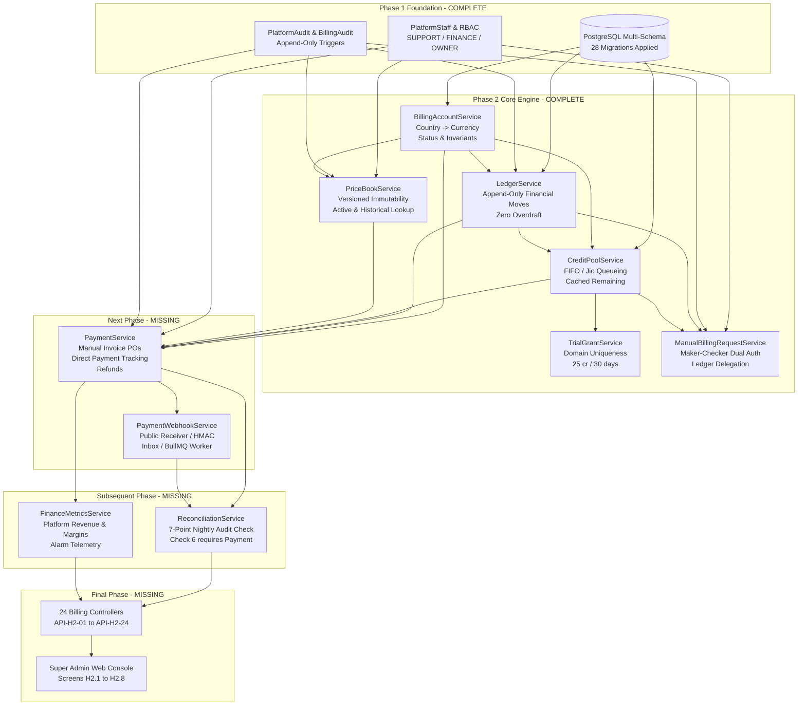

# Phase 2 Billing Engine — Current-State Re-Audit

**Audit Date:** 2026-09-30  
**Audit Scope:** Read-Only Audit of CD-Recruit / Proctora Billing Engine & Super Admin Platform Ops  
**Audit Branch:** `feature/RA/billing-engine`  
**Workspace:** `d:/Projects/cd-recruit/codebase`  
**Execution Mode:** STRICTLY READ-ONLY (Zero source code modifications)

---

## 1. Executive Summary

A comprehensive, read-only architectural and codebase audit was conducted across the CD-Recruit repository. The findings establish the exact implementation state of the Phase 2 Billing Engine:

1. **Foundational & Ledger Infrastructure (Stages 2.1 – 2.6): COMPLETE & HARDENED**
   * Six core domain services are fully implemented: `LedgerService`, `BillingAccountService`, `CreditPoolService`, `TrialGrantService`, `ManualBillingRequestService`, and `PriceBookService`.
   * Each service is covered by an exhaustive, isolated characterization and concurrency test suite with 100% passing status (**262 / 262 total tests passing** across 9 test suites).
   * Key database invariants are actively enforced: ADR-004 permanent zero-overdraft policy, append-only triggers on financial tables, maker-checker dual-authorization constraint (`chk_maker_checker`), pool non-negative constraint (`chk_pool_nonneg`), sequential pool queueing (The Jio Model), and atomic session acquisition (`billing.billing_begin()`).
2. **Database Persistence & Multi-Schema: COMPLETE & UP TO DATE**
   * Multi-schema PostgreSQL architecture (`public`, `billing`, `platform`) is active and verified across 28 applied Prisma migrations with **0 schema drift**.
   * All 10 billing tables and 3 platform tables required by the design already exist in the database and Prisma schema.
3. **Commercial Ingress, Webhooks & Automated Audit: MISSING / NOT STARTED**
   * `PaymentService` is **MISSING** (file does not exist; no manual invoice recording or gateway payment tracking logic implemented).
   * `PaymentWebhookService` is **MISSING** (no public webhook receiver, no HMAC verification, no payment-event BullMQ processor, no replay handler).
   * `ReconciliationService` is **MISSING** (the 7-point nightly audit check is specified in the design, but no service, cron, or manual trigger logic exists).
   * `FinanceMetricsService` is **MISSING** (no financial aggregation or margin alarm service exists).
4. **API Controllers & Super Admin UI: MISSING / DEFERRED**
   * Zero HTTP controllers exist for the 24 platform billing APIs (`API-H2-01` through `API-H2-24`). All implemented services operate as headless domain services.
   * Super Admin frontend (`frontend/admin-web`) contains recruiter tenant pages only; zero billing or platform operations views exist.
5. **Architectural Dependency Reality:**
   * `PaymentService` is the exact, indispensable next component. Check 6 of `ReconciliationService` ("Payment Proof") and `FinanceMetricsService` directly depend on captured `Payment` records.

---

## 2. Source Documents Reviewed

The following authoritative specifications and records were re-read and audited against the active codebase:

### 2.1 Core Architectural & Design Artifacts
* `docs/super-admin/design/01-half2-domain-and-scope.md`: Half 2 Commercial Engine domain boundaries, core data models (`BillingAccount`, `CreditPool`, `CreditLedgerEntry`, `Payment`, `PriceBookEntry`, `ManualBillingRequest`, `SessionBillingEvidence`, `ReconciliationRun`).
* `docs/super-admin/design/02-half2-business-rules-and-invariants.md`: 10 authoritative business rules and invariants, including versioned immutability (§7.1), country anchoring (§7.2), trial uniqueness (§8.2), emergency overdraft elimination (§9.1), and candidate PII-blindness (§10.1).
* `docs/super-admin/design/03-half2-database-schema.md`: PostgreSQL schema specification, table columns, constraints, database triggers (`forbid_mutation`, `guard_credit_pool_mutation`), and stored procedure `billing.billing_begin()`.
* `docs/super-admin/design/04-half2-services-and-api-contracts.md`: Service method contracts and DTOs for `LedgerService`, `BillingAccountService`, `CreditPoolService`, `ManualBillingRequestService`, `PriceBookService`, `PaymentService`, `PaymentWebhookService`, and `ReconciliationService`.
* `docs/super-admin/design/05-half2-api-catalogue-and-page-specifications.md`: API catalogue (`API-H2-01` through `API-H2-24`) and Super Admin console screen specifications (H2.1 through H2.8).
* `docs/super-admin/design/06-half2-state-permission-and-audit-matrix.md`: State machines (`CreditPool`, `ManualBillingRequest`, `Payment`, `PaymentEvent`), Granular RBAC matrix (`SUPPORT`, `FINANCE`, `OWNER`), and audit logging requirements.
* `docs/super-admin/design/07-half1-half2-integration-contract.md`: Cross-team integration contracts (`BillingAccountService.createForOrganization`, `TrialGrantService.grantTrial`, currency policies).

### 2.2 Decision Logs & Architectural Readiness
* `docs/super-admin/design/DESIGN-DECISIONS.md`: ADR-001 (Monolith deployment), ADR-002 (PlatformStaff split), ADR-003 (Multi-schema), ADR-004 (Overdraft elimination), ADR-006 (PII-blind boundary), ADR-007 (₹50 India Drive Pass seed baseline).
* `docs/super-admin/design/DESIGN-OPEN-QUESTIONS.md`: Resolution of all 14 architectural open questions (OQ-01 through OQ-14).
* `docs/super-admin/design/DESIGN-READINESS-REPORT.md`: Pre-implementation gating readiness assessment.

### 2.3 Historical Implementation Reports
* `docs/super-admin/implementation/PHASE-2.3-CREDIT-POOL-SERVICE-REPORT.md`: Stage 2.3 verification.
* `docs/super-admin/implementation/PHASE-2.4-TRIAL-GRANT-SERVICE-REPORT.md`: Stage 2.4 verification.
* `docs/super-admin/implementation/PHASE-2.5-MANUAL-BILLING-REQUEST-SERVICE-REPORT.md`: Stage 2.5 verification.
* `docs/super-admin/implementation/PHASE-2.6-PRICE-BOOK-SERVICE-REPORT.md`: Stage 2.6 verification.

---

## 3. Current Implementation Matrix

| Component | Design Requirement | Current Code Implementation | Status | Evidence | Gaps |
|---|---|---|---|---|---|
| **LedgerService** | Append-only double-entry financial ledger; GRANT, CONSUME, REVERSE, REFUND, EXPIRE, ADJUST; overdraft=0 policy; database-enforced immutability. | `backend/api/src/billing/ledger/ledger.service.ts` | **DONE** | Service (720 lines), Types (115 lines), Spec (32/32 tests pass). | None. |
| **BillingAccountService** | Provision 1:1 account per organization; country $\rightarrow$ currency policy (`IN`/`US`/`MY`); legal entity tax ID; financial summary. | `backend/api/src/billing/account/billing-account.service.ts` | **DONE** | Service (439 lines), Types (132 lines), Spec (29/29 tests pass). | None. |
| **CreditPoolService** | FIFO credit pool lifecycle; sequential queueing (Jio Model); Drive Pass priority & 7-day makeup window; cached remaining calculation; topology invariant. | `backend/api/src/billing/pool/credit-pool.service.ts` | **DONE** | Service (900 lines), Types (120 lines), Spec (31/31 tests pass). | None. |
| **TrialGrantService** | Automatic 25 credits, 30-day validity, TRIAL source, unique per corporate email domain (`trial_domain` constraint), system actor. | `backend/api/src/billing/trial/trial-grant.service.ts` | **DONE** | Service (272 lines), Types (46 lines), Spec (22/22 tests pass). | None. |
| **ManualBillingRequestService** | Maker-checker dual authorization; DB check `chk_maker_checker`; SUPPORT/FINANCE/OWNER roles; create, approve, reject, cancel, retry; executes via LedgerService. | `backend/api/src/billing/manual-request/manual-billing-request.service.ts` | **DONE** | Service (1101 lines), Types (89 lines), Spec (47/47 tests pass). | None. |
| **PriceBookService** | Versioned immutable catalog; active and historical price lookup; append-only publication (`version = prior + 1`); retirement; integer minor units; audit. | `backend/api/src/billing/price/price-book.service.ts` | **DONE** | Service (547 lines), Types (88 lines), Spec (47/47 tests pass). | None. |
| **PaymentService** | Record offline PO payments (`recordManualInvoicePayment`); checkout intent initialization; cash refunds (`issueRefund`); mints `PURCHASE`/`CONTRACT` credits. | Database model `Payment` exists in schema. Prisma client generated. Zero service logic. | **MISSING** | `prisma/schema.prisma` lines 828–854. No directory `src/billing/payment/`. | Service class, types, DTOs, module, tests, integration with Ledger/Pool. |
| **PaymentWebhookService** | Public gateway webhook receiver (`/billing/webhooks/:provider`); HMAC verification (Razorpay/Stripe); inbox idempotency (`payment_event`); BullMQ worker; dispute freeze. | Database model `PaymentWebhookInbox` (`payment_event`) exists in schema. Zero service or worker code. | **MISSING** | `prisma/schema.prisma` lines 945–959. No webhook controller or worker. | Public receiver endpoint, HMAC guard, inbox handler, BullMQ queue/worker, replay endpoint. |
| **ReconciliationService** | Automated 7-point nightly audit check; ledger replay; pool drift detection; manual audit trigger (`triggerManualAudit`); discrepancy reporting. | Database model `ReconciliationRun` exists in schema. Zero service logic. | **MISSING** | `prisma/schema.prisma` lines 961–975. No directory `src/billing/reconciliation/`. | 7-point check algorithms, cron runner, manual trigger method, drift reporter. |
| **FinanceMetricsService** | Platform-wide financial aggregates; margin alarm telemetry (AI costs $> 25\%$ credit price); uncollateralized debt; cash burn metrics. | None. No model, service, or query logic exists. | **MISSING** | Artifact 04 §1, Artifact 05 API-H2-20. Zero files in codebase. | Complete service, calculation algorithms, aggregation queries, tests. |
| **Billing Controllers** | HTTP controllers exposing API-H2-01 through API-H2-24 on `/api/v1/platform/billing/*` and `/api/v1/billing/*`. | None. Zero billing controllers exist. | **MISSING** | Grep `@Controller` across `backend/api/src` yields 0 billing controllers. | All NestJS controller classes, route decorators, validation pipes, Swagger docs. |
| **Platform Controllers** | Platform Auth, Platform Audit, Overrides, Impersonation, Incidents. | Platform Auth (`platform-auth.controller.ts`) and Audit (`platform-audit.controller.ts`) exist. | **PARTIAL** | `src/platform/auth/`, `src/platform/audit/`. | Overrides controller, Impersonation controller, Incident window controller. |
| **BullMQ Workers** | Asynchronous workers for execution pipeline, payment webhooks, nightly reconciliation, and WORM exports. | Execution workers (`execution-inbound`, `execution-outbound`, `heartbeat-monitor`, `grace-window`) exist. Billing workers missing. | **PARTIAL** | `src/queue/` directory contains runtime workers. Zero billing processors. | Payment webhook processor, reconciliation cron processor, WORM export job. |
| **Platform API Monolith Entrypoint** | Dedicated container entrypoint (`main.platform.ts`) per ADR-001. | `main.ts` exists. `main.platform.ts` does not exist. | **MISSING** | `src/main.ts` only. | `main.platform.ts`, separate platform module configuration. |
| **Super Admin UI** | Frontend pages H2.1 through H2.8 for accounts, pools, ledger explorer, maker-checker queue, price book, payments, finance, integrity. | None. `frontend/admin-web` contains tenant recruiter pages only. | **MISSING** | `frontend/admin-web/src/routes/` has zero `/billing/*` or `/platform/*` routes. | All 8 Super Admin console pages, TanStack router routes, components, API clients. |

---

## 4. Completed Components — Verified

Each of the six completed billing domain services was inspected in the active codebase and cross-verified against design invariants:

### 4.1 `LedgerService` (`src/billing/ledger/ledger.service.ts`)
* **Grant Operations:** `grantCredits` inserts immutable `GRANT` entry, increments `credit_pool.cached_remaining`, validates positive amounts, rejects non-platform actors.
* **Consumption Operations:** `consumeCredit` delegates to `billing.billing_begin()`, writes `CONSUME` entry (`amount = -1`), updates `balance_after`, decrements pool cached balance.
* **Reversal Operations:** `reverseCredit` restores balance (+1), enforces single-reversal invariant via `related_entry_id`, and marks `reversed_by`.
* **Refund Operations:** `refundCredits` writes `REFUND` entry (`amount = -N`), asserts `cached_remaining >= amount`, prevents balance from becoming negative.
* **Expiry Drawdown:** `expireCredits` writes `EXPIRE` entry zeroing pool balance.
* **Manual Adjustments:** `executeManualAdjustment` requires approved `ManualBillingRequest` and `proctora.request_id` context. Enforces floor protection (`cachedRemaining + amount >= 0`).
* **Overdraft Elimination (ADR-004):** Verified active. Zero overdraft debt permitted; accounts remain permanently at `overdraft_limit = 0` and `overdraft_used = 0`.
* **Test Status:** 32 / 32 tests passing in `src/billing/ledger/ledger.spec.ts`.

### 4.2 `BillingAccountService` (`src/billing/account/billing-account.service.ts`)
* **Account Provisioning:** `createForOrganization` creates 1:1 `BillingAccount` linked to `Organization.billing_account_id`.
* **Country $\rightarrow$ Currency Policy:** Enforces `IN` $\rightarrow$ `INR`, `US` $\rightarrow$ `USD`, `MY` $\rightarrow$ `MYR`. Rejects mismatched currencies (e.g. `IN` with `USD`) with `BadRequestException`.
* **Legal Entity Anchoring:** Stores `legalEntityName` and `taxId` (GSTIN/EIN).
* **Financial Summary:** `getAccountSummary` accurately computes total available credits, pool breakdown, and zero overdraft.
* **Idempotency & Concurrency:** Row-level locking on `public.organization` prevents duplicate accounts under concurrent onboarding calls.
* **Test Status:** 29 / 29 tests passing in `src/billing/account/billing-account.spec.ts`.

### 4.3 `CreditPoolService` (`src/billing/pool/credit-pool.service.ts`)
* **Pool Types & Creation:** Supports `DRIVE_PASS`, `TALENT_RESERVE`, `ENTERPRISE`.
* **Drive Pass Priority:** `DRIVE_PASS` tied to `driveId` with 7-day makeup window expiry.
* **Sequential Queueing (The Jio Model):** Max 1 `ACTIVE` general pool per billing account. Additional general pools placed in `QUEUED` status with sequential `queueOrder`. When active pool is exhausted, lowest `queueOrder` pool is promoted to `ACTIVE`.
* **Cached Balance Integrity:** `reconcilePoolBalance` proves `cached_remaining == total_credits + SUM(ledger amounts)`.
* **Database Trigger Protection:** Verified trigger `guard_credit_pool_mutation` blocks direct SQL updates to commercial columns unless `proctora.request_id` is set.
* **Test Status:** 31 / 31 tests passing in `src/billing/pool/credit-pool.spec.ts`.

### 4.4 `TrialGrantService` (`src/billing/trial/trial-grant.service.ts`)
* **Policy Parameters:** 25 credits, 30 days validity, `TRIAL` source, `TALENT_RESERVE` pool type.
* **One Trial Per Domain (INV-TNT-02):** Enforces domain uniqueness via unique database index on `billing_account.trial_domain`. Rejects second trial attempts.
* **System Actor:** Operations executed under authoritative actor `system`.
* **Idempotent Replay:** Exact retry for already-granted domain returns canonical trial grant without duplicate pools or credits.
* **Test Status:** 22 / 22 tests passing in `src/billing/trial/trial-grant.spec.ts`.

### 4.5 `ManualBillingRequestService` (`src/billing/manual-request/manual-billing-request.service.ts`)
* **Maker-Checker Rule (Rule R8):** Requester (`requested_by_id`) strictly cannot approve own request. Enforced at both application layer and by PostgreSQL check constraint `chk_maker_checker`.
* **Role Segregation:** `SUPPORT`, `FINANCE`, and `OWNER` can submit requests; only `FINANCE` or `OWNER` can approve, reject, or retry.
* **Request Lifecycle:** Complete state machine (`PENDING` $\rightarrow$ `APPROVED` $\rightarrow$ `EXECUTED`, `REJECTED`, `CANCELLED`).
* **Ledger Delegation:** Approvals execute ledger mutations via `LedgerService` within a transaction setting `SET LOCAL proctora.request_id = request.id`.
* **Audit Trail:** Transactionally records `REQUEST_SUBMITTED`, `REQUEST_APPROVED`, `REQUEST_EXECUTED`, `REQUEST_REJECTED`, and `REQUEST_CANCELLED` in `billing.billing_audit_event`.
* **Test Status:** 47 / 47 tests passing in `src/billing/manual-request/manual-billing-request.spec.ts`.

### 4.6 `PriceBookService` (`src/billing/price/price-book.service.ts`)
* **Append-Only Immutability:** Prices are never overwritten in place. Publishing creates new row with `version = prior.version + 1` and updates prior active version's `effective_to = new.effectiveFrom`.
* **Deterministic Historical Lookups:** `getHistoricalPrice(sku, country, asOf)` deterministically retrieves the exact version effective at timestamp $T$.
* **Monetary Precision:** Unit prices stored as strictly positive integer minor units (`unitPriceMinor`), eliminating floating-point errors.
* **Role Authorization:** Only `FINANCE` and `OWNER` can publish or retire prices. `SUPPORT` and recruiter roles strictly rejected (403 Forbidden).
* **Concurrency Safety:** Advisory transaction locking (`pg_advisory_xact_lock`) eliminates version race conditions and unique constraint collisions.
* **Test Status:** 47 / 47 tests passing in `src/billing/price/price-book.spec.ts`.

---

## 5. Partial Components

1. **Platform Controllers (`backend/api/src/platform/`):**
   * Implemented: `PlatformAuthController` (`/platform/auth`) and `PlatformAuditController` (`/platform/audit`).
   * Missing: Overrides controller, Impersonation controller, Incidents controller.
2. **BullMQ Worker Infrastructure (`backend/api/src/queue/`):**
   * Implemented: Execution inbound/outbound processors, heartbeat monitor, grace window processor.
   * Missing: Payment webhook processor, reconciliation cron processor, WORM compliance export processor.

---

## 6. Missing Components

1. **`PaymentService` (`src/billing/payment/payment.service.ts`)**
2. **`PaymentWebhookService` (`src/billing/payment/payment-webhook.service.ts`)**
3. **`ReconciliationService` (`src/billing/reconciliation/reconciliation.service.ts`)**
4. **`FinanceMetricsService` (`src/billing/metrics/finance-metrics.service.ts`)**
5. **All 24 Platform Billing HTTP Controllers (`API-H2-01` through `API-H2-24`)**
6. **Dual Entrypoint `main.platform.ts`**
7. **All 8 Super Admin Console UI Pages in `frontend/admin-web`**

---

## 7. Database Reality

### 7.1 Schema and Migration Status
* **Total Migrations:** 28 applied migrations in `backend/prisma/migrations/`.
* **Schema Drift:** **0 drift**. `npx prisma migrate status` reports database schema is 100% up to date.
* **Validation:** `npx prisma validate` reports schema at `backend/prisma/schema.prisma` is valid.

### 7.2 Tables Implemented vs Design Specification

| Schema | Table Name | Status | Design Spec Reference | Current Columns / Constraints |
|---|---|---|---|---|
| `billing` | `billing_account` | **EXISTS** | Artifact 03 §2.1.1 | `id`, `organization_id`, `name`, `legal_entity_name`, `billing_country`, `currency`, `tax_id`, `status`, `overdraft_limit` (0), `overdraft_used` (0), `has_paid_purchase`, `trial_domain` (UNIQUE), `trial_granted_at`, `created_at`, `updated_at`. |
| `billing` | `credit_pool` | **EXISTS** | Artifact 03 §2.1.2 | `id`, `billing_account_id`, `pool_type`, `name`, `source`, `total_credits`, `cached_remaining`, `drive_id`, `validity_days`, `queue_order`, `status`, `payment_id`, `unit_price_minor`, `currency`, `created_at`, `expires_at`, `updated_at`. Constraint `chk_pool_nonneg`. Trigger `guard_credit_pool_mutation`. |
| `billing` | `credit_ledger_entry` | **EXISTS** | Artifact 03 §2.1.3 | `id`, `billing_account_id`, `organization_id`, `credit_pool_id`, `entry_type`, `amount`, `balance_after`, `session_id`, `drive_id`, `idempotency_key` (UNIQUE), `actor_id`, `reason`, `ticket_ref`, `request_id`, `payment_id`, `related_entry_id`, `reversed_by`, `shadow`, `created_at`. Trigger `forbid_mutation`. |
| `billing` | `manual_billing_request` | **EXISTS** | Artifact 03 §2.1.4 | `id`, `billing_account_id`, `kind`, `payload`, `reason`, `ticket_ref`, `requested_by_id`, `approved_by_id`, `status`, `rejection_reason`, `execution_error`, `decided_at`, `executed_at`, `created_at`. Constraint `chk_maker_checker`. |
| `billing` | `payment` | **EXISTS** | Artifact 03 §2.1.5 | `id`, `billing_account_id`, `provider`, `provider_payment_id`, `provider_order_id`, `status`, `price_book_entry_id`, `quantity_credits`, `unit_price_minor`, `amount_minor`, `tax_minor`, `currency`, `invoice_number`, `captured_at`, `created_at`. Unique `(provider, provider_payment_id)`. |
| `billing` | `payment_event` | **EXISTS** | Artifact 03 §2.1.6 | `id`, `provider`, `event_id`, `event_type`, `payload`, `status`, `error_message`, `received_at`, `processed_at`. Unique `(provider, event_id)`. |
| `billing` | `price_book_entry` | **EXISTS** | Artifact 03 §2.1.7 | `id`, `sku`, `pool_type`, `credits`, `validity_days`, `billing_country`, `currency`, `unit_price_minor`, `version`, `effective_from`, `effective_to`. Unique `(sku, billing_country, version)`. |
| `billing` | `billing_audit_event` | **EXISTS** | Artifact 03 §2.1.9 | `id`, `timestamp`, `actor_id`, `actor_role`, `subject_type`, `subject_id`, `action`, `before`, `after`, `reason`, `ticket_ref`, `impersonation_context`, `request_id`, `execution_result`. Trigger `forbid_mutation`. |
| `billing` | `session_billing_evidence` | **EXISTS** | Artifact 03 §2.1.8 | `session_id` (PK), `billing_account_id`, `drive_id`, `kind`, `started_at`, `first_content_rendered_at`, `last_heartbeat_at`, `ended_at`, `end_reason`, `event_count`, `modules_reached`, `cv_mode`, `infra_flags`, `created_at`. Trigger `forbid_mutation`. |
| `billing` | `reconciliation_run` | **EXISTS** | Artifact 03 §2.1.10 | `id`, `run_type`, `status`, `check_results`, `drift_detected`, `discrepancy_details`, `executed_by`, `started_at`, `completed_at`. |
| `platform` | `platform_staff` | **EXISTS** | Artifact 03 §2.2.1 | `id`, `email` (UNIQUE), `name`, `role`, `password_hash`, `refresh_token_hash`, `totp_secret_encrypted`, `mfa_enabled`, `is_active`, `created_at`. |
| `platform` | `platform_audit_event` | **EXISTS** | Artifact 03 §2.2.2 | `id`, `timestamp`, `actor_id`, `actor_role`, `subject_type`, `subject_id`, `action`, `before`, `after`, `reason`, `ticket_ref`, `impersonation_context`, `request_id`, `execution_result`. Trigger `forbid_mutation`. |
| `platform` | `incident_window` | **EXISTS** | Artifact 03 §2.2.4 | `id`, `title`, `reason`, `ticket_ref`, `started_at`, `ended_at`, `affected_drives`, `reversal_status`, `created_by`, `created_at`. |

### 7.3 Database Reality vs Design Discrepancies
* **ZERO missing tables or columns:** Every table, foreign key, index, trigger, and check constraint specified in Artifact 03 has already been migrated.
* **No migrations required for Payment or Reconciliation:** The persistence layer was completed in Phase 1 multi-schema migrations (`20260928170000_init_billing_and_platform_schemas` and `20260928183000_billing_database_invariants`).

---

## 8. API Reality

A rigorous audit of the 24 APIs defined in Artifact 05 against actual NestJS controllers was performed:

| API ID | Method | Route | Description | Service Exists? | Controller Exists? | Actual Route Status |
|---|---|---|---|---|---|---|
| **API-H2-01** | `GET` | `/platform/billing/accounts` | Paginated billing accounts list | `BillingAccountService` ✅ | ❌ MISSING | **UNEXPOSED** |
| **API-H2-02** | `GET` | `/platform/billing/accounts/:id` | Single billing account detail | `BillingAccountService` ✅ | ❌ MISSING | **UNEXPOSED** |
| **API-H2-03** | `GET` | `/platform/billing/accounts/:id/summary` | Financial snapshot for 360 | `BillingAccountService` ✅ | ❌ MISSING | **UNEXPOSED** |
| **API-H2-04** | `GET` | `/platform/billing/accounts/:id/pools` | List all credit pools for account | `CreditPoolService` ✅ | ❌ MISSING | **UNEXPOSED** |
| **API-H2-05** | `GET` | `/platform/billing/pools/:id` | Deep inspection of single pool | `CreditPoolService` ✅ | ❌ MISSING | **UNEXPOSED** |
| **API-H2-06** | `GET` | `/platform/billing/ledger` | Searchable pseudonymous ledger | `LedgerService` ✅ | ❌ MISSING | **UNEXPOSED** |
| **API-H2-07** | `GET` | `/platform/billing/ledger/export` | Download billing CSV | `LedgerService` ✅ | ❌ MISSING | **UNEXPOSED** |
| **API-H2-08** | `GET` | `/platform/billing/requests` | List maker-checker requests | `ManualBillingRequestService` ✅ | ❌ MISSING | **UNEXPOSED** |
| **API-H2-09** | `POST` | `/platform/billing/requests` | Create manual billing request | `ManualBillingRequestService` ✅ | ❌ MISSING | **UNEXPOSED** |
| **API-H2-10** | `POST` | `/platform/billing/requests/:id/approve` | Approve and execute request | `ManualBillingRequestService` ✅ | ❌ MISSING | **UNEXPOSED** |
| **API-H2-11** | `POST` | `/platform/billing/requests/:id/reject` | Reject request with reason | `ManualBillingRequestService` ✅ | ❌ MISSING | **UNEXPOSED** |
| **API-H2-12** | `POST` | `/platform/billing/requests/:id/cancel` | Cancel own pending request | `ManualBillingRequestService` ✅ | ❌ MISSING | **UNEXPOSED** |
| **API-H2-13** | `POST` | `/platform/billing/requests/:id/retry` | Safe retry of approved request | `ManualBillingRequestService` ✅ | ❌ MISSING | **UNEXPOSED** |
| **API-H2-14** | `GET` | `/platform/billing/pricing` | View price book catalog | `PriceBookService` ✅ | ❌ MISSING | **UNEXPOSED** |
| **API-H2-15** | `POST` | `/platform/billing/pricing` | Publish price book version | `PriceBookService` ✅ | ❌ MISSING | **UNEXPOSED** |
| **API-H2-16** | `GET` | `/platform/billing/payments` | Paginated payments list | ❌ MISSING | ❌ MISSING | **NOT IMPLEMENTED** |
| **API-H2-17** | `POST` | `/platform/billing/payments/manual-invoice` | Record offline PO payment | ❌ MISSING | ❌ MISSING | **NOT IMPLEMENTED** |
| **API-H2-18** | `POST` | `/billing/webhooks/:provider` | Public gateway webhook receiver | ❌ MISSING | ❌ MISSING | **NOT IMPLEMENTED** |
| **API-H2-19** | `POST` | `/platform/billing/payments/replay-webhook` | Replay webhook from inbox | ❌ MISSING | ❌ MISSING | **NOT IMPLEMENTED** |
| **API-H2-20** | `GET` | `/platform/finance/metrics` | Platform finance dashboard | ❌ MISSING | ❌ MISSING | **NOT IMPLEMENTED** |
| **API-H2-21** | `GET` | `/platform/billing/reconciliation/latest` | Latest reconciliation run results | ❌ MISSING | ❌ MISSING | **NOT IMPLEMENTED** |
| **API-H2-22** | `POST` | `/platform/billing/reconciliation/run` | Manually trigger reconciliation | ❌ MISSING | ❌ MISSING | **NOT IMPLEMENTED** |
| **API-H2-23** | `GET` | `/platform/billing/incidents` | List declared incident windows | `PrismaService` only | ❌ MISSING | **UNEXPOSED** |
| **API-H2-24** | `POST` | `/platform/billing/incidents` | Declare incident window | `PrismaService` + `LedgerService` | ❌ MISSING | **UNEXPOSED** |

**Summary of API Reality:**  
15 of the 24 endpoints have their underlying business logic **100% complete and tested in service classes**, but have not yet been exposed via HTTP controller decorators. The remaining 9 endpoints lack both domain service logic and controllers.

---

## 9. `PaymentService` Gap Analysis

### 9.1 Design Requirements (Artifact 04 §1.5 & Artifact 06 §1.4)
`PaymentService` is responsible for:
1. **Offline Enterprise PO Invoicing (`recordManualInvoicePayment`):**
   * Authorized to `SUPER_ADMIN` (Finance) / `PlatformStaffRole.FINANCE` or `OWNER`.
   * Validates target `BillingAccount` (must be `ACTIVE`).
   * Validates `PriceBookEntry` (resolves SKU, country, currency, unit price).
   * Validates `currency` matches `BillingAccount` commercial policy.
   * Inserts `Payment` record with `provider = 'MANUAL_INVOICE'`, `status = 'CAPTURED'`, `invoiceNumber`, `capturedAt = now()`.
   * Calls `CreditPoolService.createPool` with `source = 'CONTRACT'`, linking `paymentId`.
   * Calls `LedgerService.grantCredits` with `paymentId`, writing `GRANT` entry.
   * Sets `BillingAccount.hasPaidPurchase = true`.
   * Writes `PAYMENT_CAPTURED` audit event.
2. **Direct Payment Record (`createPaymentRecord` / checkout support):**
   * Stores payment intents and captured transactions with gateway IDs (`provider_payment_id`, `provider_order_id`).
3. **Cash Refunds (`issueRefund`):**
   * Enforces unconsumed-only cash refund boundaries (`cachedRemaining >= refundCredits`).
   * Calls `LedgerService.refundCredits`.
   * Transitions `CreditPool` to `CANCELLED` or decrements balance.
   * Updates `Payment.status = 'REFUNDED'` or `'PARTIALLY_REFUNDED'`.

### 9.2 Current Code Reality
* **Database Model:** `Payment` model exists in `schema.prisma`.
* **Prisma Relations:** `billingAccount`, `priceBookEntry`, `creditPools`, `ledgerEntries` relations are already configured.
* **Service Files:** **NONE.** No `payment.service.ts`, `payment.types.ts`, `payment.module.ts`, or `payment.spec.ts`.
* **Integration Hooks:** `CreditPoolService.createPool` and `LedgerService.grantCredits` already accept `paymentId: string`.

---

## 10. `PaymentWebhookService` Gap Analysis

### 10.1 Design Requirements (Artifact 04 §1.5 & Artifact 06 §1.4)
`PaymentWebhookService` is responsible for:
1. **Public Webhook Ingress (`/billing/webhooks/:provider`):**
   * Exposed on public app process (`main.ts`).
   * Provider detection (`razorpay`, `stripe`).
   * Cryptographic HMAC verification using webhook secret (`X-Razorpay-Signature`, `Stripe-Signature`).
   * Raw buffer payload processing.
2. **Inbox Idempotency (`payment_event`):**
   * Inserts raw event into `billing.payment_event` with `status = 'PENDING'`.
   * Database constraint `UNIQUE (provider, event_id)` rejects duplicates cleanly.
3. **Asynchronous BullMQ Pipeline:**
   * Enqueues job to BullMQ queue `payment-webhook`.
   * Worker processes event: transitions `Payment` to `CAPTURED`, calls `PaymentService`, mints credits via `LedgerService`.
4. **Dispute / Chargeback Freeze:**
   * On dispute webhook: suspends target `CreditPool` (`status = SUSPENDED`), preventing further candidate session claims.
5. **Replay Endpoint:**
   * `POST /platform/billing/payments/replay-webhook`: Allows Finance staff to idempotently re-process failed inbox events.

### 10.2 Current Code Reality
* **Database Model:** `PaymentWebhookInbox` (`payment_event`) exists in `schema.prisma`.
* **Webhook Receiver:** **MISSING.**
* **HMAC Verification:** **MISSING** (only Judge0 HMAC exists in `src/integrations/judge0/`).
* **BullMQ Queue / Worker:** **MISSING** in `src/queue/`.
* **Replay Logic:** **MISSING.**

---

## 11. `ReconciliationService` Gap Analysis

The 7-point nightly audit check specified in `PRICING_AND_CREDIT_POOL_SPECIFICATION.md` §9.2 and Artifact 04 §1.7 was audited check-by-check:

| Check # | Check Name | Formal Invariant | Dependencies | Implementation Status |
|---|---|---|---|---|
| **Check 1** | **Pool Integrity** | $\forall p \in \text{Pool}: p.\text{cached\_remaining} = p.\text{total\_credits} + \sum_{e \in \text{Ledger}(p)} e.\text{amount}$ | `CreditPool`, `CreditLedgerEntry` | **PARTIAL** (Algorithm implemented in `CreditPoolService.reconcilePoolBalance`, but no automated platform-wide runner exists). |
| **Check 2** | **Overdraft Integrity** | $\forall a \in \text{Account}: a.\text{overdraft\_used} = 0 \land a.\text{overdraft\_limit} = 0$ (per ADR-004) | `BillingAccount`, `CreditLedgerEntry` | **PARTIAL** (Overdraft=0 enforced in services; automated nightly sweeper runner missing). |
| **Check 3** | **Session Acquisition 1:1** | $\forall s \in \text{Session}_{\text{LIVE}}: \exists! e \in \text{Ledger}: e.\text{session\_id} = s.\text{id} \land \exists! b \in \text{Evidence}: b.\text{session\_id} = s.\text{id}$ | `Session`, `CreditLedgerEntry`, `SessionBillingEvidence` | **MISSING** (No query compares live session table with evidence and ledger). |
| **Check 4** | **Expiry Sweeper** | $|\{ p \in \text{Pool} \mid p.\text{status} = \text{'ACTIVE'} \land p.\text{expires\_at} < \text{now}() - 5\text{m} \}| = 0$ | `CreditPool`, `LedgerService.expireCredits` | **MISSING** (No automated cron sweeps expired pools across all tenants). |
| **Check 5** | **Topology Invariant** | $\forall a \in \text{Account}: |\{ p \in \text{GeneralPools}(a) \mid p.\text{status} = \text{'ACTIVE'} \}| \le 1$ | `CreditPool` | **PARTIAL** (Enforced on creation in `CreditPoolService`; nightly audit query missing). |
| **Check 6** | **Payment Proof** | $\forall e \in \text{Ledger}_{\text{PURCHASE}}: \exists! py \in \text{Payment}_{\text{CAPTURED}}: py.\text{id} = e.\text{payment\_id} \land py.\text{quantity} = e.\text{amount}$ | `CreditLedgerEntry`, `Payment` | **BLOCKED by PaymentService** (Cannot be built or tested until `Payment` records are created by `PaymentService`). |
| **Check 7** | **WORM Backup Verification** | $\text{SHA256}(\text{Export}_{\text{nightly}}) == \text{Live Ledger Checksum}$ | `CreditLedgerEntry`, MinIO S3 Object Lock | **MISSING** (Export script and checksum comparison logic do not exist). |

### Reconciliation Summary
`ReconciliationService` cannot be fully implemented or verified without `PaymentService`, because Check 6 ("Payment Proof") mathematically requires captured `Payment` records to exist in the database.

---

## 12. `FinanceMetricsService` Gap Analysis

### 12.1 Design Requirements (Artifact 04 §1, Artifact 05 API-H2-20)
`FinanceMetricsService` is responsible for:
1. Platform-wide financial aggregates: Total Revenue, Gross Margin, Net Credit Balance, Outstanding Debt ($=0$).
2. Margin Alarms (OQ-11 / Intent §Telemetry): Real-time alert when infrastructure LLM/token cost for a session exceeds 25% of unit credit price.
3. Uncollateralized Debt Exposure: Asserted as zero under ADR-004.
4. Filter by date range (7D, 30D, 90D, YTD, All).

### 12.2 Current Code Reality
* **Status:** **MISSING.** Zero files exist in the codebase.
* **Dependencies:** Depends on `Payment` (revenue), `PriceBookEntry` (unit price), `CreditLedgerEntry` (usage), and `Session` (telemetry).

---

## 13. Test & Build Verification

The complete regression suite was executed in the active environment:

```text
================================================================================
TEST SUITE REGRESSION RESULTS
================================================================================
1. PriceBookService           (price-book.spec.ts):              47 / 47 PASS
2. ManualBillingRequestService (manual-billing-request.spec.ts):  47 / 47 PASS
3. TrialGrantService          (trial-grant.spec.ts):             22 / 22 PASS
4. CreditPoolService          (credit-pool.spec.ts):             31 / 31 PASS
5. LedgerService              (ledger.spec.ts):                  32 / 32 PASS
6. BillingAccountService      (billing-account.spec.ts):         29 / 29 PASS
7. Foundation Gate            (step1-7-foundation-gate.spec.ts): 20 / 20 PASS
8. Platform Authentication    (platform-auth.spec.ts):           17 / 17 PASS
9. Platform Audit Boundary    (platform-audit.spec.ts):          17 / 17 PASS
--------------------------------------------------------------------------------
TOTAL:                                                          262 / 262 PASS (100%)
================================================================================
```

### Build & Environment Results
* `npm run build:shared`: **PASS** (Exit code: 0)
* `npm run build` (`backend/api` via `nest build`): **PASS** (Exit code: 0)
* `npx prisma validate`: **PASS** (`The schema at prisma\schema.prisma is valid 🚀`)
* `npx prisma migrate status`: **PASS** (`28 migrations found. Database schema is up to date! 0 drift.`)

---

## 14. Documentation vs Code Contradictions

During this audit, five distinct contradictions between documentation, schema, and active code were detected:

### Contradiction 1: Overdraft Debt Buffer in Legacy Specs vs ADR-004
* **Source A:** `docs/architecture/PRICING_AND_CREDIT_POOL_SPECIFICATION.md` §3 references a -20% overdraft threshold and debt replay formulas.
* **Source B:** `docs/super-admin/design/DESIGN-DECISIONS.md` ADR-004 ("Overdraft Elimination") permanently locks `overdraft_limit = 0` and eliminates emergency overdraft buttons.
* **Actual Code:** `BillingAccountService`, `CreditPoolService`, and `LedgerService` enforce strict zero-overdraft invariants.
* **Recommended Interpretation:** **ADR-004 is authoritative.** The legacy specification references must be treated as superseded historical text.

### Contradiction 2: API Catalogue vs Headless Domain Service Reality
* **Source A:** Artifact 05 lists 24 HTTP endpoints (`API-H2-01` through `API-H2-24`).
* **Source B:** Phase 2 implementation plans (Stages 2.1–2.6) mandate strictly gated domain service implementation before HTTP controllers.
* **Actual Code:** Zero billing HTTP controllers exist. All 6 completed services are tested via rigorous direct service integration harnesses (`.spec.ts`).
* **Recommended Interpretation:** This is deliberate staging. Domain services and database invariants are built and hardened first; HTTP controllers will be introduced in a dedicated API layer stage.

### Contradiction 3: Method Name in Artifact 04 §1.6 vs DTO in §2
* **Source A:** Artifact 04 §1.6 line 114 lists `publishNewVersion(actor: StaffUser, dto: PublishPriceDto)`.
* **Source B:** Artifact 04 §2 line 417 defines class `PublishPriceBookEntryDto`.
* **Actual Code:** `PriceBookService` implements `PublishPriceBookEntryDto`.
* **Recommended Interpretation:** `PublishPriceBookEntryDto` is authoritative as it matches the table and model name `PriceBookEntry`.

### Contradiction 4: Role Terminology in Artifact 05 vs PlatformStaffRole
* **Source A:** Artifact 05 table headers specify `ADMIN` and `SUPER_ADMIN`.
* **Source B:** ADR-002, Artifact 06 §3.1, and Prisma schema define `PlatformStaffRole` as `SUPPORT`, `FINANCE`, `OWNER`.
* **Actual Code:** All billing services strictly enforce `PlatformStaffRole` (`SUPPORT`, `FINANCE`, `OWNER`), preventing recruiter client roles (`ADMIN`, `HR_LEAD`) from accessing billing mutations.
* **Recommended Interpretation:** `PlatformStaffRole` (`SUPPORT`, `FINANCE`, `OWNER`) is authoritative. Artifact 05's `ADMIN` maps to `SUPPORT` and `SUPER_ADMIN` maps to `FINANCE`/`OWNER`.

### Contradiction 5: Webhook Receiver Architecture Boundary
* **Source A:** Artifact 04 §1.5 declares: *"Forbidden Responsibilities: Never runs inside private platform process; webhook receiver is exposed on public API."*
* **Source B:** Artifact 05 lists offline PO recording (`API-H2-17`) and webhook replay (`API-H2-19`) under `/platform/billing/*`.
* **Actual Code:** Neither exists yet.
* **Recommended Interpretation:** When implemented, the public webhook ingress endpoint (`/api/v1/billing/webhooks/:provider`) must reside in the public application module (`main.ts`), while administrative management (`manual-invoice`, `replay-webhook`) must reside in the platform module.

---

## 15. Dependency Graph

The mathematical and domain dependency graph across Half 2 components is:



---

## 16. Recommended Implementation Order

Based strictly on topological dependency ordering:

1. **Stage 2.7 — `PaymentService`:**
   * Direct dependency on `BillingAccountService`, `PriceBookService`, `LedgerService`, `CreditPoolService`.
   * Implements offline PO recording (`recordManualInvoicePayment`), checkout payment intent/capture tracking, and cash refunds (`issueRefund`).
   * Unlocks `Payment` entity lifecycle and sets `hasPaidPurchase = true`.
2. **Stage 2.8 — `PaymentWebhookService`:**
   * Depends on `PaymentService` and BullMQ.
   * Implements public webhook ingress (`/billing/webhooks/:provider`), HMAC verification (Razorpay/Stripe), inbox idempotency (`payment_event`), BullMQ async processing worker, dispute freeze, and replay endpoint.
3. **Stage 2.9 — `ReconciliationService`:**
   * Depends on `LedgerService`, `CreditPoolService`, `BillingAccountService`, and `PaymentService` (for Check 6 Payment Proof).
   * Implements all 7 automated audit checks, nightly cron execution, drift detection, and manual trigger (`triggerManualAudit`).
4. **Stage 2.10 — `FinanceMetricsService`:**
   * Depends on aggregated data across accounts, ledger, payments, and price books.
   * Computes platform revenue, gross margin, burn telemetry, and margin alarms.
5. **Stage 2.11 — Platform Billing HTTP Controllers (`API-H2-01` – `API-H2-24`):**
   * Exposes all 24 verified services over REST endpoints with JWT guards, RBAC guards, and Swagger decorators.
6. **Stage 2.12 — Super Admin Console Frontend (Screens H2.1 – H2.8):**
   * Implements TanStack router pages, diagnostic cards, and maker-checker queue in `frontend/admin-web`.

---

## 17. Exact Next Step

The next implementation target is:

### **Stage 2.7 — `PaymentService`**

#### Reason:
1. `PriceBookService` (Stage 2.6) is complete and verified.
2. `PaymentService` is the foundational prerequisite for all commercial payment records, offline invoices, and credit purchases.
3. `ReconciliationService` cannot be verified without `PaymentService` because Check 6 ("Payment Proof") mathematically requires captured `Payment` records to reconcile against ledger purchase grants.
4. `PaymentWebhookService` delegates payment capture and credit minting directly to `PaymentService`.

#### Prerequisites Already Satisfied:
* `Prisma` model `Payment` with all fields and foreign keys migrated and ready.
* `BillingAccountService` complete (`hasPaidPurchase` flag, payer details).
* `PriceBookService` complete (`getActivePrice`, version resolution, minor-unit prices).
* `LedgerService` complete (`grantCredits` accepts `paymentId`, writes `GRANT` entry).
* `CreditPoolService` complete (`createPool` accepts `paymentId`, mints `PURCHASE`/`CONTRACT` pool).
* `PlatformStaff` authentication and RBAC guards active (`FINANCE` / `OWNER` authorization).
* `billing.billing_audit_event` active for `PAYMENT_CAPTURED` and `PAYMENT_REFUNDED` audit events.

#### Remaining Prerequisites:
* None. All dependencies for `PaymentService` are fully implemented and verified.

#### Expected Files / Modules to Create:
* `codebase/backend/api/src/billing/payment/payment.types.ts`
* `codebase/backend/api/src/billing/payment/payment.service.ts`
* `codebase/backend/api/src/billing/payment/payment.module.ts`
* `codebase/backend/api/src/billing/payment/payment.spec.ts`

#### Expected Test Coverage:
* Offline manual invoice creation (`recordManualInvoicePayment`) with valid PO, tax ID, and invoice number.
* Verification of `Payment` record with `provider = 'MANUAL_INVOICE'` and `status = 'CAPTURED'`.
* Minting of `CreditPool` with `source = 'CONTRACT'` and linked `paymentId`.
* Writing immutable `GRANT` entry in `credit_ledger_entry` with `paymentId`.
* Currency matching validation against `BillingAccount` and `PriceBookEntry`.
* Authorization enforcement (`FINANCE` and `OWNER` allowed; `SUPPORT` and recruiter identities rejected).
* Unconsumed refund boundary validation (`cachedRemaining >= refundCredits`).
* Zero overdraft preservation.
* Concurrency testing on concurrent invoice submissions.

---

## 18. Explicit STOP

```text
================================================================================
EXPLICIT STOP
================================================================================
This audit is complete. Zero source code modifications were made.

The current codebase is healthy:
- 262 / 262 tests passing across all 9 existing test suites.
- 28 Prisma migrations applied, 0 schema drift.
- Shared and backend builds pass with 0 errors.

Awaiting user approval before proceeding to:
Stage 2.7 — PaymentService
================================================================================
```
